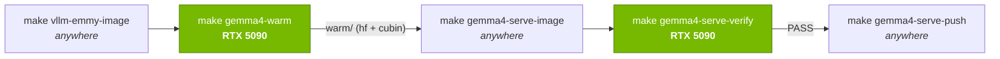

# vllm-emmy-gemma4 — the prebuilt gemma-4-12B serving image

A release image for one model on one GPU: **gemma-4-12B served by `EmmyGenModel` on an RTX 5090**, with the compiled
CUDA kernels (**cubins**), the **HF model snapshot**, and the **execution-plan pack**
(`emmy/compiler/backend/pack.py`) baked in. Cold-start pays zero `nvcc` compiles, zero HF downloads, and — on a
pack hit — none of the compiler frontend either (no trace / pass pipeline / fork resolution / codegen; boot
collapses from ~25 min to ~weight-load time) — `docker run --gpus all --ipc=host -p 8000:8000
cloudriftai/vllm-emmy-gemma4:TAG` serves with no `HF_TOKEN` and no network dependency on HuggingFace
(`HF_HUB_OFFLINE=1` is baked). The plain
[`vllm-emmy`](../vllm-emmy/) image stays the general-purpose base (any model, compile-on-boot); this image trades a
~35 GB pull (~24 GB of weights on the ~10 GB base) for a deterministic, tokenless boot.

## Why a "warm" step exists: the cache-key parity contract

**Why not just cross-compile?** `nvcc` targets `sm_120` from any machine (that's exactly what the preflight script
does), but the cache is **content-addressed, not searched**: at boot the server generates each kernel's source,
computes `sha1(source, name, arch, toolkit_tag, flags)` (see `emmy/compiler/backend/cuda/nvcc.py`), and looks up
that exact file. A cubin built from source that differs by one character has a different hash and is simply never
found — locally-produced cubins aren't "slightly worse", they're invisible. So the image doesn't need "kernels that
run on a 5090"; it needs **the exact kernels the released server will ask for**, and two of the hash inputs can't be
reproduced off the card:

- the kernel **source** — the compiler picks each kernel's schedule partly from the **live-probed** GPU features; a
  memorized-spec cross-compile can drift on any feature that steers a pick, changing the source text and the hash;
- the kernel **set** — the programs are enumerated by an actual `emmy serve --generate` boot (48 layers × symbolic +
  decode twins at the pinned config), which must load the ~24 GB model — a serving run, not a compile.

Hence the warm: one real serving run on the target card, inside the image. The full contract it satisfies:

- `source` — live-probed 5090 featurization + the real program enumeration (above).
- `toolkit_tag` is the compiling nvcc — the warm must run **inside the image**, not on the host toolchain.
- `flags` — production `-O3`: never warm with `EMMY_NVCC_FLAGS` set (tune's `-Xcicc -O1` would poison the key).
- The serving config (model / dtype / max-model-len / max-num-batched-tokens / decode bucket) changes **which
  programs exist and their shapes** — warm and release must use identical values.

The preflight script is the flip side: the *toolchain acceptance* question ("does this nvcc compile every gemma-4
kernel family for `sm_120`?") IS answerable by cross-compilation, so that part runs anywhere, before the rental.

The machinery enforces the last two points structurally: **`config.env` is the single source** of the serving config
(make passes it to both the warm run and the bake), and **`serve.sh` is the single serve invocation** — the warm run
bind-mounts it into the plain image and the baked image ships it, so the warmed and released servers execute
literally the same script with the same env.

**The warm runs to a fixpoint under the release environment.** One online boot is not enough: the shipped image
serves offline (`HF_HUB_OFFLINE=1`, the model resolved to its snapshot path), and a handful of kernels only
materialize on an offline boot; independently, a fork pick can flip between boots, selecting between two stable
kernel variants (2026-07 5090 session: 6 offline-only kernels + 2 bimodal ones on gemma-4-12B — each variant's
source is byte-stable, so the union converges). After the online pass, `warm.sh` re-boots offline against the
accumulated cache until a boot compiles nothing new (max 5 passes); **non-convergence after 5 passes is a hard
failure** (`warm.sh` exits 1 — with the cubin set still growing, verify's single boot passing is a coin flip and
customer boots would recompile at runtime). The boot-to-boot pick flip is a real compiler bug (fork resolution
should be deterministic across processes); the fixpoint warm contains it but does not excuse it.

**The pack changes the fixpoint's role.** The online pass also writes the execution-plan pack (`warm/pack`, keyed
on the model **config hash** + serving shape — not the id/path, precisely so the offline boots share it), and every
subsequent boot — the offline fixpoint passes, verify, customer boots — loads it: fork picks are frozen in the
artifact, so the bimodal-pick class vanishes and the fixpoint converges immediately whenever the pack takes. The
loop stays as a safety net for the case where the pack write was skipped (a weight outside the pack vocabulary) or
the load falls back — then the old cubin-union behavior is exactly what runs.

## Files

- `config.env` — the pinned serving config. Every value is cache-key-relevant; it must be **final before warming**
  (re-measure memory headroom on the card first — see the workflow). Make-includable `VAR=value` syntax.
- `serve.sh` — the frozen generative serve invocation (the arg set `emmy serve --generate` builds: `--runner
  generate --enforce-eager --dtype float16 --hf-overrides EmmyGenModel` + the `GEMMA4_*` config).
- `warm.sh` — runs the **plain** `vllm-emmy` image on the target GPU with `./warm` mounted at `/opt/emmy`, waits for
  `/health`, issues one completion (covers prefill + decode kernels), stops. Result: `warm/hf` (the model snapshot —
  the gated download happens here, once, via `HF_TOKEN`), `warm/cubin` (every compiled kernel), and `warm/pack`
  (the execution-plan pack the first boot writes).
- `Dockerfile` — `FROM` the plain image, `COPY warm/hf` + `COPY warm/cubin` + `COPY warm/pack` to `/opt/emmy`, bakes
  the config env, `EMMY_PACK_DIR` and `HF_HUB_OFFLINE=1`, entrypoint `serve.sh`. The caches live at **`/opt/emmy`**
  on purpose: compose/recipes bind-mount the host HF cache over `/root/.cache/huggingface`, which would shadow
  anything baked there.
- `verify.sh` — cold-starts the **baked** image with no token, issues one completion, and diffs the cubin file set
  before/after: an empty diff proves 100% cache hit (zero compiles), and the offline boot proves zero downloads.
  When a pack is baked, it also asserts the boot **hit** it (a silent fallback to the full compile would still pass
  the cubin check while re-paying the frontend on every customer boot).
- `warm/` — gitignored; the warm output that the bake copies in.

## Workflow

Only the highlighted steps need the physical 5090; the bake and push are GPU-free (but see the note below on where
to run them):



The `release-gemma4-image` skill (`.claude/skills/release-gemma4-image/`) automates this whole session — rental or
local mode, abort gates per step, a human approval pause before the push, guaranteed teardown. The manual steps:

The full release session on a rented 5090 (each step from the repo checkout; host prereqs for steps 3–4:
`make setup` + `pip install -e ".[serving]"` + cupy + `export HF_TOKEN=…`):

1. Build the base image the warm will compile inside of:

   ```bash
   make wheel && make vllm-emmy-image        # or: docker pull cloudriftai/vllm-emmy:TAG
   ```

   A pulled tag must come from the SAME commit you release from (the wheel is part of the cubin `source`); when in
   doubt, build on the rental. To pin a non-default tag for every later target: `make VLLM_EMMY_TAG=… <target>`.
2. Preflight the toolchain with the **image's** nvcc — mount just the script; it needs no repo or GPU in-container
   (the emmy wheel + nvcc are in the image; it hides CUDA and resolves goldens off-GPU):

   ```bash
   docker run --rm --entrypoint bash -v "$PWD/scripts/preflight_gemma4_sm120.sh":/preflight.sh \
       cloudriftai/vllm-emmy:TAG /preflight.sh          # expect: 34 OK, 0 FAIL
   ```

3. **Re-measure memory headroom** and finalize `config.env` — the config seals the cache key, so it cannot change
   after this point without re-warming. Step `--max-model-len` / `--max-num-batched-tokens` up from the old floor
   (256) with the decode bucket ON, watching for OOM, e.g.:

   ```bash
   ./venv/bin/emmy serve --generate google/gemma-4-12B --bench \
       --max-model-len 2048 --max-num-batched-tokens 2048 --gpu-memory-utilization 0.97
   ```

   Write the largest passing values into `config.env`.
4. Correctness gate at the pinned config (A/B vs HF eager; the Phase-A exit check):

   ```bash
   ./venv/bin/python scripts/validate_gemma4_serve.py --model google/gemma-4-12B \
       --max-model-len <pinned> --max-num-batched-tokens <pinned> --gpu-mem-util <pinned>
   ```

5. `HF_TOKEN=… make gemma4-warm` — fills `warm/` (first boot downloads the model + compiles all layers; minutes).
6. `make gemma4-serve-image` → `make gemma4-serve-verify` (expect `PASS — served offline with zero new cubins`) →
   `make gemma4-serve-push`.
7. Point the gemma-4 recipes at the new tag; tear down the rental.

**Where to run bake/push:** although `gemma4-serve-image` and `-push` are GPU-free, run them on the rental anyway —
moving `warm/` off-datacenter means a ~24 GB download plus a ~35 GB Docker Hub upload from a home link, and the
verify step needs the card between bake and push regardless. Never "top up" the cache on a non-5090: any kernel
compiled elsewhere is a dead cache entry the real card never hits.

### Running it locally (a 5090 in the box)

The steps are identical — the machinery doesn't care where the card lives; steps 1–7 run as written, minus the
rental/teardown. The local-only deltas:

- **Pin the GPU on a multi-GPU box.** `warm.sh` / `verify.sh` default to `--gpus all` and vLLM takes device 0 — on
  a box that also holds another card, set `GPU_DEVICE=<index>` (both scripts, and `make` passes env through:
  `GPU_DEVICE=1 make gemma4-warm`). Warming on the wrong card produces a dead cache: wrong arch, wrong
  featurization, zero hits on a 5090.
- **Skip the 24 GB download by pre-seeding the snapshot.** If the model is already in the local HF cache, copy it
  into the warm dir before warming — the hub client finds it and downloads nothing, and `HF_TOKEN` becomes
  unnecessary (`warm.sh` only requires the token when the snapshot is absent):

  ```bash
  mkdir -p docker/vllm-emmy-gemma4/warm/hf/hub
  cp -r ~/.cache/huggingface/hub/models--google--gemma-4-12B docker/vllm-emmy-gemma4/warm/hf/hub/
  ```

- **Disk budget: ~100 GB free** (measured, not the earlier ~60 GB estimate): base images (~21 GB unpacked) +
  `warm/` (~24 GB) + the baked weight layer (~24 GB) + BuildKit's transient context copy of `warm/` during the bake
  (another ~24 GB) + the host venv/HF cache if present. Freeing the venv before the bake is safe — nothing after
  the warm needs it.
- **The push is the slow part.** `gemma4-serve-push` uploads ~35 GB over your uplink — hours on a residential
  connection vs minutes from a datacenter. It's the main reason the rental flow exists; locally, just let it run.
- **The snapshot ships re-sharded, as four image layers.** Docker Hub rejects blobs past ~10 GB (upload initiation
  503s forever), and gemma-4-12B ships ONE consolidated 23 GB `model.safetensors` — a single file cannot be split
  across layers by COPY. `make gemma4-serve-image` therefore first runs `reshard_snapshot.py` (inside the base
  image), rewriting the consolidated file as standard HF shards + `model.safetensors.index.json` — per-tensor
  bytes identical, loader-transparent — then `split_hf.sh` balances the tree into four hardlinked sub-10 GB parts
  that the Dockerfile COPYs back into `/opt/emmy/hf` (the split asserts completeness — every source file lands in
  exactly one part — and that each part stays under the ~10 GB blob cap). Kernel cache-key parity is unaffected
  (weights are runtime constants, not source). The reshard verifies every tensor byte-identical against the
  consolidated source BEFORE deleting it — the post-bake verify gate only proves the shards load and the cubin set
  is closed, not that the weights survived.

## Licensing

gemma-4 is **Apache 2.0** — public redistribution of the weights in a Docker Hub tag is permitted. The bake copies
the HF snapshot (resharded, per-tensor identical — see above), which carries its LICENSE/NOTICE files — keep them
(that is the attribution obligation), and don't imply Google endorsement in the tag name or description.

