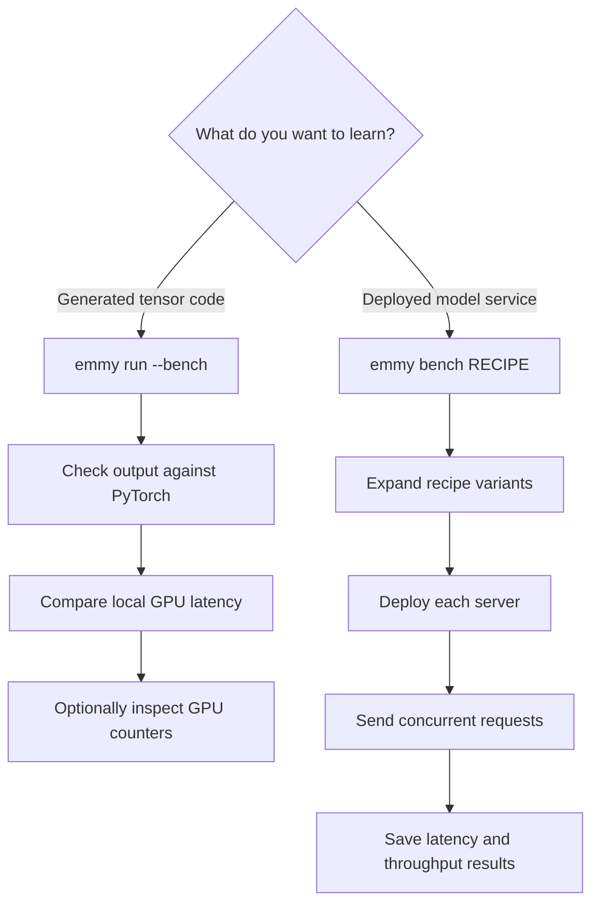

# Benchmarking and comparing Emmy

A benchmark is a controlled experiment that measures how quickly a program performs a particular workload. Emmy has
two benchmarking workflows because “is this generated GPU program fast?” and “can this model server handle many
users?” are different questions:

| Question | Command | What is measured |
|---|---|---|
| Is Emmy's compiled tensor program faster than PyTorch? | `emmy run --bench` | Local GPU execution time |
| How does a deployed model configuration behave under request load? | `emmy bench RECIPE` | Server latency and throughput |

Use the first workflow while developing the compiler. Use the second while comparing models, serving engines,
hardware, or deployment settings. A fast isolated kernel does not automatically make a fast model server: request
batching, model loading, communication, and many operations outside that kernel also affect serving performance.



:::info Benchmarking versus profiling
A **benchmark** tells you *how long* work takes. A **profile** collects evidence about *why* it takes that long—for
example, whether a kernel is limited by GPU computation, memory traffic, or low hardware use. Benchmark first; profile
only after you know which case deserves investigation.
:::

## Part 1 — Compare generated tensor programs

This workflow needs an NVIDIA GPU with CUDA support. It starts with PyTorch code, lowers that code through Emmy's
compiler, runs the result, and checks the answer before reporting speed.

### Step 1: prove correctness first

Begin without `--bench`:

```bash
./venv/bin/emmy run \
  --code "nn.RMSNorm(256)(torch.randn(4, 256, device='cuda', dtype=torch.float16))"
```

Emmy compares its output with the same operation executed by eager PyTorch. If the numerical difference exceeds the
allowed tolerance, the command reports an accuracy failure instead of treating a fast but incorrect kernel as a win.

**Eager PyTorch** means normal PyTorch execution: Python asks PyTorch to execute operations one at a time. Those
operations usually dispatch prebuilt GPU kernels from libraries such as ATen, cuBLAS, or cuDNN. Eager does not mean
“unoptimized Python,” and it is unrelated to `model.eval()`, which changes the behavior of training-specific layers.

### Step 2: compare the three execution backends

Add controlled warmup and measurement iterations:

```bash
./venv/bin/emmy run \
  --code "nn.RMSNorm(256)(torch.randn(4, 256, device='cuda', dtype=torch.float16))" \
  --bench \
  --bench-backends eager,tcompile,emmy \
  --warmup 10 \
  --iters 100
```

The backends are:

| Backend | Meaning |
|---|---|
| `eager` | Execute the original operation through normal PyTorch dispatch |
| `tcompile` | Execute a version optimized by `torch.compile`, normally through PyTorch Inductor |
| `emmy` | Execute the CUDA program generated by Emmy |

`torch.compile` is optional and is not in `emmy run --bench`'s default backend set. Its one-time compilation cost is
kept outside the timed execution window, so the comparison answers “how fast is the compiled program after setup?”
rather than “how long did the first call take?” Include `tcompile` explicitly when that is the baseline you need.

A **warmup iteration** runs the program before timing it. Warmup allows lazy initialization, compilation, cache
population, and GPU clock changes to settle. A **measurement iteration** is one timed repetition after warmup. The
defaults are 10 warmups and 100 measurements; smaller values are useful for a quick smoke test, not for a final claim.

### How to read the timing output

The main table reports end-to-end latency, normally in microseconds (`us`), plus performance relative to eager
PyTorch. **Latency** is the elapsed time required for one execution. Lower latency is better.

For a program containing several CUDA launches, Emmy also prints a per-kernel table. Read the two levels differently:

| Measurement | Includes | Best use |
|---|---|---|
| Whole-program | All launches in real order, preferably replayed as one captured CUDA graph | Compare user-visible execution time |
| Per-kernel | Repeated timing of one kernel position | Find an expensive kernel or compare schedules for that kernel |

A **CUDA graph** is a recorded sequence of GPU launches that can be replayed with less CPU launch overhead. The sum of
isolated per-kernel times need not equal whole-program time: isolation changes cache state, removes interactions
between adjacent kernels, and changes launch overhead. Use the whole-program number for the overall winner.

:::tip Why there may not be one matching PyTorch kernel
Emmy may **fuse** several tensor operations into one kernel. PyTorch may dispatch several library kernels, while
`torch.compile` may produce a different fusion. Compare the complete operation first. Kernel-by-kernel comparison is
diagnostic evidence, not necessarily a one-to-one contest.
:::

### Step 3: save reproducible evidence

Use `--json` for a machine-readable comparison and `--dump-dir` for compiler artifacts:

```bash
./venv/bin/emmy run \
  --code "nn.RMSNorm(256)(torch.randn(4, 256, device='cuda', dtype=torch.float16))" \
  --bench \
  --bench-backends eager,tcompile,emmy \
  --warmup 10 \
  --iters 100 \
  --json /tmp/emmy-rmsnorm-benchmark.json \
  --dump-dir /tmp/emmy-rmsnorm-dump
```

The JSON records the backend comparison, per-kernel measurements, selected schedule knobs, A/B rows when present, and
important run flags. The dump directory contains compiler-stage artifacts; its benchmark comparison is also written
as `60_bench_compare.json`. Keep the command, JSON, generated CUDA, GPU identity, software revision, shapes, and data
type together when sharing a result.

Generated CUDA can also be inspected without timing it:

```bash
./venv/bin/emmy compile \
  --code "nn.RMSNorm(256)(torch.randn(4, 256))" \
  --ir cuda \
  --target sm_80
```

Eager PyTorch normally selects existing ATen, cuBLAS, or cuDNN kernels rather than generating one comparable CUDA
source file. To discover what PyTorch actually launches, use profiling and kernel names instead of expecting source
code with the same structure.

### Step 4: profile the GPU work

`--profile` implies `--bench` and invokes NVIDIA Nsight Compute's `ncu` command when it is installed and the current
user has permission to read GPU performance counters:

```bash
./venv/bin/emmy run \
  --code "nn.RMSNorm(256)(torch.randn(4, 256, device='cuda', dtype=torch.float16))" \
  --profile \
  --dump-dir /tmp/emmy-rmsnorm-profile
```

The report places Emmy kernels beside the eager PyTorch reference kernels and can include:

| Counter | Plain-language question it helps answer |
|---|---|
| Duration | Which launch consumes the most time? |
| Occupancy | How many of the GPU's possible active thread groups are being used? |
| SM utilization | How busy are the GPU's compute units? |
| DRAM utilization | How heavily is off-chip GPU memory being used? |
| FMA utilization | How much multiply-and-add computation is occurring? |
| Shared-memory conflicts | Are threads contending for the same shared-memory banks? |
| Registers | Does each thread require enough registers to restrict parallel work? |

`ncu` may serialize and replay kernels, so profiling is slower and its duration is not the benchmark result to publish.
The reference side is eager PyTorch; the profile does not claim to show `torch.compile` kernels. Emmy writes the raw
profile data into the dump directory as `61_ncu_metrics.csv` and `61_ncu_metrics.json`.

### Optional: compare two Emmy schedules

The `--ab` option pins named compiler knobs and re-lowers the operation. It is useful when tuning suggests an
alternative schedule:

```bash
./venv/bin/emmy run \
  --code "nn.RMSNorm(256)(torch.randn(4, 256, device='cuda', dtype=torch.float16))" \
  --bench --warmup 10 --iters 100 \
  --ab "REDUCE=b256,VECTORIZE_LOADS=true" \
  --json /tmp/emmy-rmsnorm-ab.json
```

The knob names above are illustrative: valid choices depend on the operation, shape, compiler version, and GPU. An A/B
row is trustworthy only if its JSON says that the requested knobs were realized and the result passed correctness and
plausibility checks. The complete workflow is in
[How Emmy Chooses Fast GPU Schedules](./prior_and_goldens).

### A fair local comparison checklist

Before drawing a conclusion, verify that every backend used:

- the same operation, tensor shapes, data type, and input values;
- the same physical GPU with no unrelated heavy workload;
- the same static or dynamic-shape regime;
- enough warmup and measurement iterations;
- deployable compiler settings rather than tune-time shortcuts; and
- a numerically correct result.

Repeat important measurements. GPU temperature, power limits, clock changes, and other processes can create noise.
Record both absolute latency and the ratio to a named baseline. “1.2x faster” becomes meaningless if the reader cannot
identify the baseline, shape, or hardware.

Common misleading comparisons include:

- timing the first `torch.compile` call against already-compiled Emmy execution;
- comparing different shapes or numeric formats;
- adding isolated kernel times and calling the result end-to-end latency;
- assuming similarly named kernels implement the same fused work;
- using an IR JSON file as a full correctness comparison—fully lowered IR has no original PyTorch model to run; and
- reporting one unusually good sample without retaining the complete benchmark record.

## Part 2 — Benchmark a deployed model service

`emmy bench` is an orchestration command. It reads one or more recipe directories, expands each recipe's matrix into
variants, obtains suitable hosts, deploys a serving engine, performs a smoke test, sends a request workload, saves
results, and cleans up resources.


Unlike `emmy run --bench`, this command does not automatically compare eager PyTorch, `torch.compile`, and Emmy. It
compares the variants described by the recipe—for example, stock vLLM versus a vLLM image using Emmy's compiled-kernel
plugin, or one GPU model versus another.

### Step 1: preview the plan safely

Always begin with `--dry-run`:

```bash
./venv/bin/emmy bench recipes/Qwen3-Embedding-0.6B --dry-run
```

The preview still parses the recipe, expands variants, plans execution groups, and shows intended commands and result
paths, but it does not create a paid cloud machine or run the workload. Check the number of tasks, requested GPU types
and counts, model, container images, workload sizes, and cleanup behavior.

Use repeatable `--filter KEY=PATTERN` arguments to select matrix values. Multiple filters are combined with AND:

```bash
./venv/bin/emmy bench recipes/Qwen3-Embedding-0.6B \
  --filter "deploy.gpu=*5090*" \
  --filter "benchmark.random_input_len=32" \
  --dry-run
```

Quote patterns containing `*` so the shell does not expand them as filenames.

### Step 2: choose where it runs

After reviewing the dry run, choose one host mode:

```bash
# Use the current machine. Its installed GPU must satisfy the recipe.
./venv/bin/emmy bench recipes/Qwen3-Embedding-0.6B --local

# Use an existing remote GPU machine over SSH.
./venv/bin/emmy bench recipes/Qwen3-Embedding-0.6B \
  --ssh gpu-user@gpu-host.example:22

# With neither --local nor --ssh, Emmy provisions cloud infrastructure.
./venv/bin/emmy bench recipes/Qwen3-Embedding-0.6B
```

:::warning Cloud runs can cost money
The last command may create cloud GPU machines. Confirm credentials, provider selection, task count, expected runtime,
quota, and teardown behavior first. `--no-teardown` intentionally leaves cloud machines running for investigation;
the run directory then contains `instances.json`, and you must later run `emmy teardown RUN_DIR`.
:::

`--max-workers` limits how many planned execution groups run simultaneously. `--gpu-concurrency` splits a logical
group across more machines so its tasks finish sooner. Recipe field `benchmark.max_concurrency` is different again: it
controls how many client requests the measured server handles concurrently. The first two affect orchestration, cost,
and total experiment duration; the recipe field affects the workload being measured.

### Step 3: understand serving metrics

The exact metrics depend on whether the recipe generates text or embeddings. A generation benchmark commonly records:

| Metric | Meaning | Better direction |
|---|---|---|
| Successful/failed requests | Number of requests that completed or failed | More success, zero failures |
| Request throughput | Completed requests per second | Higher |
| Output/total token throughput | Generated or processed tokens per second | Higher |
| TTFT | Time to first token: delay before the first generated token arrives | Lower |
| TPOT | Time per output token after generation starts | Lower |
| ITL | Inter-token latency: gap between successive streamed tokens | Lower |
| E2EL | End-to-end latency: total request time | Lower |

A **token** is a short piece of text processed by a language model. **Throughput** measures how much work finishes per
unit of time. Latency and throughput interact: raising concurrency may increase total throughput while making each
request wait longer. Therefore, compare latency percentiles and throughput at the same offered load rather than
choosing only the largest throughput number.

`mean` is the arithmetic average, `median` is the middle observation, and `p99` is a high-tail value: 99 percent of
observations are no slower than it. Tail measurements such as p99 matter because an average can hide a small number of
very slow user requests. Embedding workloads do not generate streamed output tokens, so output-token and inter-token
metrics may be absent or not meaningful.

The result also distinguishes two kinds of duration:

- The workload tool's benchmark duration describes the measured request window.
- Emmy's phase timing describes wall-clock orchestration work such as provisioning, deployment, benchmarking, and
  teardown.

Do not use total provisioning time as model latency, and do not ignore provisioning time when the experiment is about
operational startup cost.

### Step 4: find and compare the results

Each invocation prints its run directory. Emmy creates a timestamped directory inside the recipe directory, with a
short code hash in its name. It contains:

| Artifact | Purpose |
|---|---|
| `recipe.yaml` | Exact copied recipe used for the run |
| `tasks.json` | Stable identities and expected files for all expanded tasks |
| `*_benchmark.json` | Structured workload metrics, recipe, system information, command, and phase timing |
| `*_benchmark.txt` | Human-readable benchmark output |
| `benchmark.log` and group logs | Execution and failure details |
| `report.md` | Optional aggregate report when the recipe defines `aggregate` |

The JSON system section records evidence such as GPU, CUDA and driver versions, CPU, memory, and container setup. Use
that information when deciding whether two files are comparable.

For an apples-to-apples recipe comparison, keep these constant unless they are the intended experiment variable:

- model revision and task;
- serving engine version and image;
- GPU type and count;
- tensor and pipeline parallel settings;
- context length and memory settings;
- input/output lengths, prompt count, random seed, and concurrency; and
- warmup, smoke-test, and benchmark client behavior.

Change one main factor at a time. Recipe matrices make changes repeatable, but a matrix that changes GPU, engine,
input length, and concurrency together cannot tell you which change caused the result.

## Which command should I use?

| Goal | Start with |
|---|---|
| Verify that Emmy computes the same tensor result as PyTorch | `emmy run --code ...` |
| Compare eager PyTorch, `torch.compile`, and Emmy execution | `emmy run --bench --bench-backends eager,tcompile,emmy` |
| Explain a slow generated kernel | `emmy run --profile --dump-dir ...` |
| Compare two Emmy schedule choices | `emmy run --bench --ab ... --json ...` |
| Preview recipe variants and infrastructure | `emmy bench RECIPE --dry-run` |
| Load-test a deployed recipe on the current GPU host | `emmy bench RECIPE --local` |
| Compare serving engines, images, GPUs, or workload settings | Put them in a recipe matrix, then use `emmy bench` |

The lower-level [Running Benchmarks](../benchmarking/running-benchmarks) reference lists the serving metrics. The
[compiler deep dive](./compiler_deep_dive#14-benchmarking-semantics) explains how Emmy's per-kernel and whole-program
timers work internally.

For a direct, local A/B through the `emmy serve` wrapper—including generated vLLM commands, embedding and generation
endpoints, correctness gates, and the `--stock` workflow—see
[Integrating Emmy with vLLM](./vllm_integration#8-benchmark-emmy-against-stock-vllm).

## Practice labs

### CPU-safe lab — inspect a service experiment

```bash
./venv/bin/emmy bench recipes/Qwen3-Embedding-0.6B \
  --filter "deploy.gpu=*5090*" \
  --filter "benchmark.random_input_len=32" \
  --dry-run
```

Before reading the output, predict the number of variants selected. Then identify the model, both serving images, GPU
count, prompt count, request concurrency, and result directory. No server or cloud resource is created.

### GPU lab — build one local evidence bundle

Run the RMSNorm example with all three backends, JSON output, and compiler dumps. Record:

1. whether the correctness check passed;
2. whole-program latency for every backend;
3. Emmy's speed relative to eager PyTorch;
4. the number of generated Emmy kernels and, if you profile, the reference launches; and
5. the exact GPU, shapes, data type, warmup count, iteration count, and code revision.

Repeat it three times. If the winner changes, investigate measurement noise before changing compiler code.
