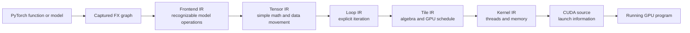
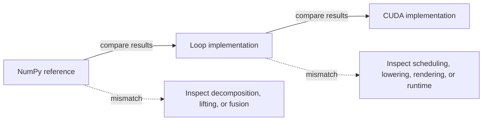
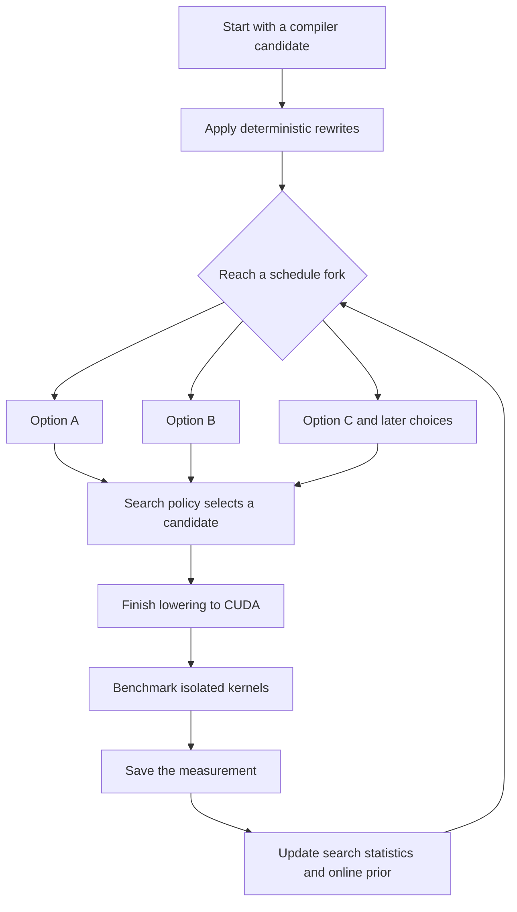

# How the Emmy compiler works

This chapter is the implementation companion to lessons 6–12 of the project course. It answers one question in detail:
what happens between a PyTorch expression and a running CUDA kernel?

You do not need prior compiler experience, but this chapter moves more slowly if the following mental model is new.
A **compiler** is a translator. PyTorch describes *what* mathematical result the model needs; CUDA describes *how*
NVIDIA GPU threads should calculate it. Emmy uses several intermediate forms because translating that whole distance in
one step would be difficult to understand, optimize, and test.

:::info Recommended preparation
Read lessons 6–12 in [Learn Emmy: A Code-First Course](./project_course) first. Keep the [Emmy Course Glossary](./glossary) open for quick
definitions. Every stage below preserves the intended answer; it only changes how explicitly the computation is
described.
:::

Start with [Learn Emmy from the code](./project_course) if you have not yet covered the repository and CLI architecture.
After this chapter, [How Emmy Chooses Fast GPU Schedules](./prior_and_goldens) explains the schedule decision system in full:
evidence precedence, offline and online priors, MCTS labels, golden matching, and recording integrity.

The short answer is this pipeline. Read it from left to right: recognizable model operations gradually become explicit
GPU instructions.



An **IR**, or intermediate representation, is a compiler's internal description of a program. A **schedule** is the
plan that maps correct mathematics to GPU threads and memory. A **kernel** is a function executed by many GPU threads.

The important part is not memorizing the number of stages. It is understanding the job of each stage:

- Tracing preserves recognizable model operations.
- Decomposition reduces the operation vocabulary.
- Loop IR states exactly what is computed.
- Tile IR separates the computation's algebra from its GPU schedule.
- Kernel IR states exactly how threads and memory implement that schedule.
- CUDA IR is source text plus everything the runtime needs to launch it.

## 1. The end-to-end call path

A **call path** is the sequence of functions invoked to complete an action. Start with a small command rather than the
entire compiler:

```bash
./venv/bin/emmy compile \
  -c "nn.RMSNorm(16)(torch.randn(2, 8, 16))" \
  --ir cuda --target sm_80
```

The call path below uses exact source-code names. At a high level it means: parse the command, capture PyTorch, choose
the requested compiler passes, repeatedly rewrite the graph, and print the chosen stage.

```text
emmy.emmy.main
  -> commands.compile.handle_compile
     -> load_or_trace
        -> commands.trace.graph_from_code
           -> compiler.trace.torch.trace_module
     -> resolve_passes
     -> Pipeline.build(passes)
     -> Pipeline.run(graph, db=...)
        -> Run.resolve
           -> match rule
           -> choose rewrite or fork option
           -> splice/rebind graph
           -> continue until every pass is complete
     -> format_stage
```

Here, a **driver** is code that coordinates other components. `handle_compile` is an inspection-oriented driver.
`CudaBackend.compile` uses the same compiler through
`Pipeline.build(CUDA_PASSES).run(...)`. The distinction is what happens afterward: `compile` formats an IR for a human,
while the backend passes the lowered graph to the CUDA runtime.

In other words, `emmy trace` stops after PyTorch capture and FX-to-Emmy conversion. `emmy compile` traces when necessary,
then applies lowering passes and prints the selected IR. Despite its name, the `compile` CLI does not invoke `nvcc` or
execute the program; `emmy run` and the CUDA runtime do that.

The canonical pass lists live in `emmy/compiler/pipeline/__init__.py`:

```python
TENSOR_PASSES = ["frontend/decomposition", "frontend/optimization"]
LOOP_PASSES = [*TENSOR_PASSES, "loop/lifting", "loop/fusion", "loop/stamp"]
TILE_PASSES = [*LOOP_PASSES, "lowering/tile"]
KERNEL_PASSES = [*TILE_PASSES, "lowering/kernel"]
CUDA_PASSES = [*KERNEL_PASSES, "lowering/cuda"]
```

You do not need to memorize these lists. Use them as a map: when one representation is correct and the next is wrong,
the pass between them is the first place to investigate.

### Small example — watch detail appear

For a simple expression, each stage answers a different question:

```python
# PyTorch: what result does the user want?
output = torch.relu(x + bias)
```

```text
Tensor IR: which primitive tensor operations are needed?
    biased = add(x, broadcast(bias))
    output = maximum(biased, 0)

Loop IR: which elements are read and written?
    for row, column:
        output[row, column] = max(x[row, column] + bias[column], 0)

Kernel IR: which GPU workers and memory operations implement the loop?
    assign output elements to threads
    load x and bias
    calculate add and maximum
    store output

CUDA: what source and launch configuration will the GPU runtime receive?
```

This example is intentionally schematic. The real printed IR uses Emmy's operation and statement classes, but the
questions remain the same when the operation is much larger.

## Guided example — one PyTorch operation through every IR

The sections later in this chapter explain each representation independently. This vertical slice puts them next to
one another so you can see exactly what each compiler boundary adds or removes.

We will compile:

```python
nn.RMSNorm(16)(torch.randn(2, 8, 16))
```

`RMSNorm(16)` normalizes the last dimension, which contains 16 values. The input has `2 × 8 = 16` independent rows.
For every row, the operation computes approximately:

```python
mean_square = sum(x * x) / 16
scale = reciprocal_sqrt(mean_square + 1e-6)
output = x * scale * weight
```

This operation is useful for learning because it contains elementwise arithmetic, a reduction, broadcasting, and a
learned weight, but still produces short IR listings.

### Generate the complete artifacts

Run this from the repository root. `--target sm_80` makes GPU scheduling decisions reproducible without requiring the
inspection commands to probe a live GPU:

```bash
for stage in torch tensor loop tile kernel cuda; do
  ./venv/bin/emmy compile \
    --code "nn.RMSNorm(16)(torch.randn(2, 8, 16))" \
    --ir "$stage" \
    --target sm_80 \
    --output "/tmp/emmy-rmsnorm-$stage.txt"
done
```

The filenames now form a timeline:

```text
/tmp/emmy-rmsnorm-torch.txt
/tmp/emmy-rmsnorm-tensor.txt
/tmp/emmy-rmsnorm-loop.txt
/tmp/emmy-rmsnorm-tile.txt
/tmp/emmy-rmsnorm-kernel.txt
/tmp/emmy-rmsnorm-cuda.txt
```

The excerpts below are generated from the current compiler. Cosmetic node names and kernel hash suffixes may change as
the implementation evolves; generate the files locally when exact output matters.

### Stage 1 — frontend Graph IR preserves RMSNorm

```bash
sed -n '1,120p' /tmp/emmy-rmsnorm-torch.txt
```

```text
# Graph: 3 nodes, 1 inputs, 1 outputs

inputs:
  x: (2, 8, 16) f32

constants:
  p_weight: (16,) f32

rms_norm = rmsnorm(x, p_weight, eps=1e-06) -> (2, 8, 16) f32

outputs:
  rms_norm: (2, 8, 16) f32
```

At this boundary, `torch.export` and Emmy's FX walker have captured the program, but decomposition has not run. The
single `RmsNormOp` is valuable: diagnostics can still name the model operation, and one rewrite rule can reason about
the whole normalization.

### Stage 2 — Tensor IR decomposes RMSNorm

```bash
sed -n '1,160p' /tmp/emmy-rmsnorm-tensor.txt
```

```text
constants:
  p_weight: (16,) f32
  rms_norm_eps: (1,) f32 = 1e-06
  rms_norm_mean_count: (1,) f32 = 16.0

p_weight_bc             = p_weight[k]                                       -> (2, 8, 16)
rms_norm_sq             = multiply(x, x)                                    -> (2, 8, 16)
rms_norm_mean_sum       = sum(rms_norm_sq, axis=-1)                         -> (2, 8, 1)
rms_norm_mean           = divide(rms_norm_mean_sum, rms_norm_mean_count_bc) -> (2, 8, 1)
rms_norm_add_eps        = add(rms_norm_mean, rms_norm_eps_bc)               -> (2, 8, 1)
rms_norm_rsq            = rsqrt(rms_norm_add_eps)                           -> (2, 8, 1)
rms_norm_rsq_bc         = rms_norm_rsq[i, j, na]                            -> (2, 8, 16)
rms_norm_norm           = multiply(x, rms_norm_rsq_bc)                      -> (2, 8, 16)
rms_norm                = multiply(rms_norm_norm, p_weight_bc)              -> (2, 8, 16)
```

The compound `RmsNormOp` has disappeared. In its place are tensor primitives:

- `multiply` and `add` perform elementwise arithmetic;
- `sum(..., axis=-1)` reduces the last dimension;
- `divide` forms the mean;
- `rsqrt` computes reciprocal square root; and
- the `[k]` and `[i, j, na]` expressions explicitly broadcast smaller tensors.

The graph temporarily has more nodes because the mathematics is now explicit. These nodes describe *what* each whole
tensor operation computes; they do not yet say which loops or GPU threads perform it.

### Stage 3 — Loop IR makes iteration explicit and fuses operations

```bash
sed -n '1,160p' /tmp/emmy-rmsnorm-loop.txt
```

```text
=== 0: k_rms_norm_<hash> ===
    v0 = reciprocal(16)
    for a0 in 0..2
        for a1 in 0..8
            for a2 in 0..16
                in2 = load x[a0, a1, a2]
                v1 = multiply(in2, in2)
                acc0 <- add(acc0, v1)
            v2 = multiply(acc0, v0)
            v3 = add(1e-06, v2)
            v4 = rsqrt(v3)
            for a3 in 0..16
                in3 = load x[a0, a1, a3]
                v5 = multiply(in3, v4)
                in4 = load p_weight[a3]
                v6 = multiply(in4, v5)
                rms_norm[a0, a1, a3] = v6
```

Loop lifting first gives tensor operations explicit statement bodies. Fusion then combines compatible `LoopOp` graph
nodes into the one body shown here. Notice what disappeared: there are no global temporary tensors for the square,
mean, or scale. Their values stay inside the fused computation.

The axes have distinct roles:

- `a0` and `a1` choose one of the 16 independent rows;
- `a2` visits the 16 values being reduced; and
- `a3` revisits the row to apply the computed scale and weight.

This representation is still hardware-independent. It says which iteration and arithmetic must happen, not how CUDA
blocks and threads should cooperate.

### Stage 4 — Tile IR recognizes algebra and attaches a schedule

```bash
sed -n '1,160p' /tmp/emmy-rmsnorm-tile.txt
```

```text
=== 0: k_rms_norm_<hash> ===
    Reduction[a2] planar
        for a2 in 0..16
            in2 = load x[a0, a1, a2]
            v1 = multiply(in2, in2)
            acc0 <- add(acc0, v1)
    v0 = reciprocal(16)
    v2 = multiply(acc0, v0)
    v3 = add(1e-06, v2)
    v4 = rsqrt(v3)
    for a3 in 0..16
        in3 = load x[a0, a1, a3]
        in4 = load p_weight[a3]
        rms_norm[a0, a1, a3] = multiply(in4, multiply(in3, v4))
```

The important new fact is `Reduction[a2] planar`. Recognition has recovered the algebraic role of the `a2` loop: it
is an ordinary reduction whose partial sums may be combined. Tile IR keeps that mathematical structure separate from
the chosen realization so alternative valid schedules can be compared.

### Stage 5 — Kernel IR materializes GPU mechanisms

```bash
sed -n '1,160p' /tmp/emmy-rmsnorm-kernel.txt
```

```text
=== 0: k_rms_norm_<hash> ===
    Tile[a0, a1, a2_co] (N=256)
        for a2 in a2_co..16:16
            in2 = load x[a0, a1, a2]
            f32 v1 = multiply(in2, in2)
            f32 acc0 <- add(acc0, v1)
        WarpShuffle(acc0, length=16)
        f32 v2 = multiply(acc0, reciprocal(16))
        f32 v3 = add(1e-06, v2)
        f32 v4 = rsqrt(v3)
        for a3 in a2_co..16:16
            in3 = load x[a0, a1, a3]
            in4 = load p_weight[a3]
            f32 v6 = multiply(in4, multiply(in3, v4))
            rms_norm[a0, a1, a3] = v6
```

Kernel IR commits to hardware-oriented details:

- `a2_co` is the cooperative worker coordinate;
- the strided loops divide row elements among workers;
- `WarpShuffle` combines their partial sums without a global temporary; and
- `f32` makes scalar temporary types explicit.

At this point the schedule has become concrete. CUDA lowering should mostly render these decisions rather than invent a
new algorithm.

### Stage 6 — CUDA IR renders source and launch metadata

```bash
sed -n '1,220p' /tmp/emmy-rmsnorm-cuda.txt
```

The generated source is short enough to recognize the Kernel IR structure:

```c
extern "C" __global__
__launch_bounds__(16) void k_rms_norm_<hash>(
    const float* x,
    const float* mean_count,
    const float* eps,
    const float* weight,
    float* output) {
    int lane = threadIdx.x & 31;
    int gid = blockIdx.x * blockDim.x + threadIdx.x;
    int row0 = gid / 128;
    int row1 = (gid / 16) % 8;
    int worker = gid % 16;

    float acc = 0.0f;
    for (int k = worker; k < 16; k += 16) {
        float value = x[row0 * 128 + row1 * 16 + k];
        acc += value * value;
    }

    acc += __shfl_xor_sync(__activemask(), acc, 8);
    acc += __shfl_xor_sync(__activemask(), acc, 4);
    acc += __shfl_xor_sync(__activemask(), acc, 2);
    acc += __shfl_xor_sync(__activemask(), acc, 1);

    float scale = rsqrtf(eps[0] + acc * (1.0f / mean_count[0]));
    for (int k = worker; k < 16; k += 16) {
        int index = row0 * 128 + row1 * 16 + k;
        output[index] = weight[k] * (x[index] * scale);
    }
}
```

This listing is lightly renamed and formatted for teaching; `/tmp/emmy-rmsnorm-cuda.txt` contains the exact emitted
source. The internal `CudaOp` also carries argument order, grid and block expressions, dynamic shared-memory size,
zeroing requirements, and symbolic runtime arguments needed to launch the function.

### What changed at each boundary?

| Boundary | Information removed | Information added |
|---|---|---|
| PyTorch → frontend | Python control structure and module syntax | Stable graph data flow, ATen-derived operation, shape, and dtype |
| Frontend → Tensor | Compound name `RMSNorm` | Explicit primitive mathematics and broadcasts |
| Tensor → Loop | Whole-tensor operation notation and most intermediates | Loads, scalar values, iteration, accumulation, and writes |
| Loop → Tile | Unclassified loop nest | Algebraic reduction structure and schedule choices |
| Tile → Kernel | Abstract schedule | Cooperative workers, typed temporaries, and warp reduction |
| Kernel → CUDA | Hardware-neutral statements | CUDA syntax, pointer arithmetic, built-ins, and launch metadata |

Each stage should compute the same tensor. The compiler is changing representation and implementation detail, not the
meaning of RMSNorm.

### `compile` inspects; `run` executes

All commands above use `emmy compile`. They trace and lower the graph, then print the requested representation. Even at
`--ir cuda`, the CLI does not invoke `nvcc` or launch the generated kernel.

On a supported NVIDIA GPU, use `emmy run` to continue through runtime compilation, allocation, execution, accuracy
comparison, and timing:

```bash
./venv/bin/emmy run \
  --code "nn.RMSNorm(16)(torch.randn(2, 8, 16, device='cuda'))" \
  --bench --warmup 5 --iters 20
```

This tiny shape is useful for correctness and learning, not serious performance conclusions: launch overhead is large
relative to its arithmetic. Lesson 11 explains runtime compilation and benchmarking; larger golden shapes are used for
meaningful performance work.

### Exercises for this vertical slice

1. In Tensor IR, underline the nodes whose output shape is `(2, 8, 1)`. Explain why the reduction result must be
   broadcast before it can multiply the `(2, 8, 16)` input.
2. In Loop IR, identify where the `a2` accumulator becomes available to the later `a3` loop.
3. In Kernel IR, match `WarpShuffle` to the four `__shfl_xor_sync` calls in CUDA.
4. Change `RMSNorm(16)` and the input's last dimension to `32`. Regenerate every stage and find which constants, loop
   bounds, schedule choices, and CUDA instructions change.
5. Add `-vv --color never` to one compile command and locate the exact rewrite that removes `RmsNormOp`.

## 2. One graph container survives every stage

The permanent program container is `compiler.graph.Graph`. A graph is a network of operations connected by the values
they produce and consume. It owns:

```text
nodes:    node id -> Node
inputs:   ordered graph input node ids
outputs:  ordered graph output node ids
hints:    graph-level metadata
_users:   producer id -> consumer ids
```

A `Node` represents one item in that network. It has four important pieces:

```text
id       stable buffer/dataflow identity
op       the operation from the current IR dialect
inputs   producer node ids
output   Tensor(name, shape, dtype)
hints    metadata such as provenance and scheduling features
```

The operation does not own output shape. Shape lives on `node.output`. This matters because a rewrite may replace an
operation while retaining the same dataflow identity and tensor contract.

Graph boundary nodes are special:

- `InputOp` obtains a value from the caller.
- `ConstantOp` represents scalars, weights, or buffers. A loadable constant can carry the path used to find its value
  in a module or safetensors checkpoint.
- All other nodes are compute nodes and eventually become kernels or disappear through fusion.

### Graph mutation has two forms

Functional rewrites build a fragment and call `Graph.splice`. Fragment `InputOp` nodes alias existing producers. New
fragment compute nodes are inserted, consumers are rewired to the fragment output, the consumed nodes are removed, and
orphaned boundaries are cleaned up.

Lowering rules usually perform a one-for-one operation rebind. The node id stays fixed while its operation changes:

```text
LoopOp -> TileOp -> KernelOp -> CudaOp
```

This is necessary because generated loads, writes, and kernel arguments use graph node ids as buffer names. Replacing
the id during lowering would break those bindings.

### The graph is mutable, statements are not

Graph topology and node operations are mutable because passes rewrite them. Nested Loop, Tile, and Kernel statements
are frozen dataclasses. A statement transformation returns a replacement tree, often using `dataclasses.replace`.
This gives statement bodies stable equality and hashing while keeping whole-graph rewriting practical.

### Structural identity

`Graph.structural_key()` creates a digest: a compact fingerprint of meaningful graph structure. “Merkle-style” means
that each part's fingerprint incorporates the fingerprints of the parts it depends on. The key includes operation structure, tensor shape and dtype, input
relationships, and graph inputs/outputs. It excludes cosmetic node and tensor names, hints, and mutable internal ids.

The key is recomputed rather than cached because the graph is mutable. It is used to deduplicate compiler candidates
whose spelling differs but whose generated computation and dataflow are equivalent.

## 3. Shapes are expressions, not merely integers

A tensor's **shape** lists the size of each dimension. Emmy allows a size to be known at compile time, such as `32`, or
supplied later, such as the request's `seq_len`. Every extent is therefore a `Dim` that wraps an expression:

```text
Dim(32)          -> Literal(32)
Dim("seq_len")   -> Var("seq_len")
Dim("S") * 2     -> BinaryExpr("*", Var("S"), Literal(2))
```

Static arithmetic folds immediately. Symbolic arithmetic remains an expression that can be substituted, simplified,
serialized, rendered into conditions, or evaluated at runtime.

The explicit accessors prevent accidental specialization:

- `as_static()` requires a literal dimension.
- `as_atom_name()` requires one symbolic variable.
- `expr.eval(sym_env)` handles literal, atomic symbolic, and composite dimensions uniformly.

An atomic symbolic dimension also carries a size hint. The hint influences tile selection and no-input benchmarking,
but is excluded from equality and structural keys. It is an expected scheduling size, not the runtime value.

At launch, `Graph.symbolic_bindings()` tells the runtime which input axis supplies each symbol. For example,
`seq_len@x:1` means the second axis of runtime input `x` binds `seq_len`. Composite output shapes then evaluate using
the resulting environment.

## 4. Tracing: PyTorch to frontend Graph IR

**Tracing** here is the complete capture boundary. PyTorch's `torch.export.export` discovers the operations and produces
an FX graph. Emmy's `trace_module` wrapper calls that API and converts the FX nodes into an Emmy `Graph`; the `emmy
trace` CLI is the user-facing command around the same path. This is not `torch.jit.trace`.

Tracing happens before **decomposition**, which breaks compound operations into simpler math. The capture boundary's
job is to preserve the operation PyTorch expressed, not to decide how to implement it.

`trace_module` in `compiler/trace/torch.py`:

1. Calls `torch.export.export(module, args, kwargs, dynamic_shapes=...)`.
2. Walks the exported FX graph in order.
3. Resolves each supported ATen target to a handler.
4. Creates an Emmy frontend or primitive operation.
5. Copies shape and dtype metadata into the output `Tensor`.
6. Records graph inputs, constants, and outputs.

**RMSNorm** (root mean square normalization) rescales each row based on the average of its squared values. It is common
inside language models. For the RMSNorm example, the frontend graph is only three nodes:

```text
inputs:
  x: (2, 8, 16) f32

constants:
  p_weight: (16,) f32

rms_norm = rmsnorm(x, p_weight, eps=1e-06) -> (2, 8, 16) f32
```

This is useful because diagnostics can still say “RMSNorm” and decomposition can reason about the whole operation.

### Why HuggingFace needs wrappers

Transformer model code often constructs masks, positions, and rotary embeddings dynamically. Exporting that literally
would produce large graphs of mask-building operations and can lose non-persistent rotary buffers.

`compiler/trace/huggingface.py` builds trace-friendly wrappers that:

- Present a simple full-model or single-layer forward signature.
- Precompute causal masks and position ids where appropriate.
- Replace rotary embedding with static or symbolic-slice-friendly buffers.
- Support dynamic sequence length through `torch.export.Dim`.
- Restore sliding-window metadata that an isolated layer trace cannot preserve reliably.

The output is still frontend Graph IR. HuggingFace-specific knowledge ends at this boundary.

## 5. Decomposition: frontend operations to tensor primitives

A **primitive** is a simple building-block operation. Frontend decomposition rules live under
`pipeline/passes/frontend/decomposition`. Each file exposes a `PATTERN` and a
`rewrite` function. The RMSNorm rule matches one `RmsNormOp`, builds a graph fragment, and returns it for splicing.

Conceptually, it expands:

```text
rmsnorm(x, weight, eps)
```

into:

```text
sq       = x * x
mean     = sum(sq, axis=-1, keepdim=True) / count
scaled   = rsqrt(mean + eps)
norm     = x * broadcast(scaled)
out      = norm * broadcast(weight)
```

The actual Tensor IR makes constants and broadcasts explicit:

```text
p_weight_bc             = p_weight[k]                                       -> (2, 8, 16)
rms_norm_sq             = multiply(x, x)                                    -> (2, 8, 16)
rms_norm_eps_bc         = rms_norm_eps[k]                                   -> (2, 8, 1)
rms_norm_mean_count_bc  = rms_norm_mean_count[k]                            -> (2, 8, 1)
rms_norm_mean_sum       = sum(rms_norm_sq, axis=-1)                         -> (2, 8, 1)
rms_norm_mean           = divide(rms_norm_mean_sum, rms_norm_mean_count_bc) -> (2, 8, 1)
rms_norm_add_eps        = add(rms_norm_mean, rms_norm_eps_bc)               -> (2, 8, 1)
rms_norm_rsq            = rsqrt(rms_norm_add_eps)                           -> (2, 8, 1)
rms_norm_rsq_bc         = rms_norm_rsq[i, j, na]                            -> (2, 8, 16)
rms_norm_norm           = multiply(x, rms_norm_rsq_bc)                      -> (2, 8, 16)
rms_norm                = multiply(rms_norm_norm, p_weight_bc)              -> (2, 8, 16)
```

The small vocabulary is the compiler's first major simplification:

- `ElementwiseOp` independently performs the same scalar calculation at each position.
- `ReduceOp` combines values along an axis, for example by summing them.
- `IndexMapOp` describes how coordinates move during broadcast, transpose, reshape, or slice operations.
- `GatherOp`, `ScatterOp`, and `ScanOp` cover less regular data motion or recurrence.

### Broadcasting is not implicit

Elementwise inputs must already have the output shape. The decomposition helpers insert `IndexMapOp` nodes for
broadcasts. Later passes therefore do not need PyTorch's complete broadcasting semantics; they see explicit coordinate
maps.

### Recursive decomposition

The first RMSNorm rewrite creates a `MeanOp`, which is itself a frontend operation. Because the pipeline restarts rule
matching after a functional rewrite, the mean rule subsequently expands it into sum and count/divide primitives.
Rules must therefore be idempotent: their output must no longer match them, or they must explicitly decline it.

### Frontend optimization

The optimization pass follows decomposition. It performs representation-level simplifications such as composing
adjacent index maps or separating casts from remaps. It is still hardware-independent.

## 6. Loop lifting: tensor graph to explicit iteration

**Lifting** here means translating whole-tensor primitives into explicit iteration. It converts tensor operations into
statement bodies. **SSA** (static single assignment), mentioned below, means that each temporary value is assigned once.
The main statement forms are:

The outer container remains the same `Graph`. Each Tensor IR graph node is replaced by a node whose operation is a
`LoopOp`. The `Loop`, `Load`, `Assign`, `Accum`, and `Write` objects nested in `LoopOp.body` are statement-tree objects,
not additional Graph nodes. Fusion later merges compatible `LoopOp` graph nodes and combines their statement bodies.

- `Load`: read a graph buffer at an index.
- `Assign`: bind an SSA value using an elementwise implementation.
- `Accum`: update reduction state using an associative fold.
- `Init`: declare an explicit carrier state identity.
- `Loop`: serial iteration over an `Axis`.
- `StridedLoop`: iteration with explicit start and step.
- `Cond`: conditional control flow.
- `Write`: store a value to a graph buffer.

An elementwise operation becomes nested loops over its output axes, loads, an assignment, and a write. A reduction
becomes free-axis loops around a reduce-axis loop containing an accumulator.

Before fusion, neighboring tensor nodes have separate `LoopOp` bodies. Fusion combines compatible producer and
consumer bodies, substitutes coordinates, deduplicates loads, and removes intermediate graph buffers.

After fusion, the whole RMSNorm is one `LoopOp`:

```text
for a0 in 0..2
    for a1 in 0..8
        for a2 in 0..16
            in2 = load x[a0, a1, a2]
            v1 = multiply(in2, in2)
            acc0 <- add(acc0, v1)
        v2 = multiply(acc0, reciprocal(16))
        v3 = add(1e-06, v2)
        v4 = rsqrt(v3)
        for a3 in 0..16
            in3 = load x[a0, a1, a3]
            v5 = multiply(in3, v4)
            in4 = load p_weight[a3]
            v6 = multiply(in4, v5)
            rms_norm[a0, a1, a3] = v6
```

The loop body now states the entire kernel's semantics. Axes `a0` and `a1` identify independent rows. Axis `a2` is the
reduction. Axis `a3` is the post-reduction projection sweep.

### Why `LoopOp.forward()` matters

`LoopOp.forward` renders the statement body to C++ and JIT-compiles it through cppyy/Cling. The shared `Backend.run`
can therefore interpret both unfused graphs and fused loop graphs.

This separates **fault domains**, the regions in which a bug could live:



That distinction should drive compiler debugging. A CUDA mismatch is not evidence that the decomposition rule is
wrong if the loop backend already agrees with numpy or PyTorch.

## 7. The rewrite engine in detail

A **rewrite** replaces one representation with an equivalent one. A **pass** is an ordered group of rewrite rules.
`Pass.load` finds `NNN_name.py` files and sorts them by their numeric
prefix. Helper files beginning with `_` are not loaded as rules.

A rule contains:

```python
PATTERN = [Pattern("root", SomeOp)]

def rewrite(graph, match, root, ctx):
    ...
```

The dispatcher binds requested parameters by name. A rule only declares the graph objects or context it needs.

### Pattern matching

A `Pattern` specifies an operation type and optional field constraints. A list of patterns describes a producer to
consumer chain. Intermediate nodes in a multi-node chain must have one consumer so replacing the chain cannot silently
change a fan-out branch.

`Pipeline.match` walks nodes in topological order. A `Match` retains the rule, matched nodes, consumed node ids, and
output being replaced. Matches are checked again before application because an earlier rewrite may have invalidated
them.

### Rewrite result shapes

A rewrite can return:

1. A `Graph` fragment. The engine calls `Graph.splice` and changes graph topology.
2. An `Op`. The engine rebinds the matched node in place.
3. Several alternatives or a lazy fork. The engine exposes a decision point to greedy resolution or tuning.

If no option is valid for the current `Context`, the rule is rejected and the reason is recorded. A final graph that
still contains an operation that should have lowered raises `LoweringError`; the backend is not allowed to execute a
partially lowered program as if it were complete.

### Cursor behavior

The pipeline cursor walks rules within a pass. If a functional rewrite applies, scanning restarts so earlier rules can
match newly introduced structure. A pass advances only after a complete scan applies nothing. Dump hooks run at that
boundary, which is why post-pass artifacts correspond to stable fixed points rather than a half-finished scan.

### Source chains and provenance are different

An in-place operation rebind sets `new_op.source` to the previous operation. A final `CudaOp` can therefore point back
through `KernelOp`, `TileOp`, and `LoopOp`. Tuning uses this rewrite ancestry to attribute measurements.

Provenance is separate metadata in `Node.hints["prov"]`. It maps fused kernels to original frontend operations and
their decomposition pieces. Decomposition mints pieces, fusion aggregates piece sets, and in-place lowering leaves
the hint attached. Provenance determines human-readable kernel names and dumped PyTorch reproducers; it is excluded
from structural identities.

## 8. Tile recognition: recover the algebra

**Algebra** here means the mathematical structure of the work—for example, whether a loop is a sum, a pointwise map,
or matrix multiplication. Loop IR says what iterations and arithmetic occur, but not what high-level algebra they form. `lowering/tile` analyzes
the statement tree and creates structural nodes:

- `Map`: pointwise work or a projection around another structural node.
- `Reduction`: a planar or twisted fold with an axis, per-element partial, carrier, and reduction schedule.
- `Contraction`: distributive lift-and-fold work with bound operands and output axes.

The RMSNorm loop becomes a planar reduction wrapped in a projection map:

```text
Reduction[a2] planar
    for a2 in 0..16
        in2 = load x[a0, a1, a2]
        v1 = multiply(in2, in2)
        acc0 <- add(acc0, v1)
reciprocal count
mean, epsilon, rsqrt
for a3 in 0..16
    scale x and weight
    write rms_norm
```

The reduction owns the fold. The wrapping map owns the work performed after the fold. This corresponds to:

```text
project(reduce(map(input)))
```

### Axis roles

Recognition annotates reduction structure with an `AxisRole`:

- `PLANAR`: ordinary sum, max, mean, or a reduction that does not meet contraction rules.
- `TWISTED`: online softmax or flash-attention state whose stable combine rescales previous state.
- `CONTRACTION`: a distributive product-like lift followed by an additive fold.
- `FREE`: non-reduction iteration.

The dispatch is algebraic, not shape-specific. A rule must not say “this is matmul because the dimensions are 4096 by
4096.” It recognizes that the lift distributes over the fold and that at least two distinct operand buffers are
contracted.

### Carriers

A `Carrier` describes the temporary state accumulated by a reduction and how two partial results combine. The combine
must be **associative**, meaning that changing parentheses does not change the mathematical answer. This property lets
different GPU workers combine partial results in parallel.

For a sum:

```text
state:     acc
identity:  0
merge:     acc + value
combine:   left_acc + right_acc
```

For stable online softmax, the state may contain pivot, denominator, and weighted expectation. The combine shifts both
partials to a common maximum before adding them. Emmy represents this as a twisted carrier and generates the merge
program from the carrier specification rather than hand-coding a separate cooperative implementation.

This abstraction is what lets the same partition machinery combine a scalar sum, a multi-component online softmax,
or flash-attention state.

### Contraction recognition

The simple matmul:

```text
for m
    for n
        for k
            a = load A[m, k]
            b = load B[k, n]
            product = multiply(a, b)
            acc <- add(acc, product)
        C[m, n] = acc
```

is recognized as a contraction because multiply distributes over add and the `k`-indexed loads come from two distinct
buffers. A squared reduction `sum(x * x)` is not classified as a contraction merely because it has two loads in the
expression; both operands refer to the same buffer.

Recognition binds the contraction's M, N, and K roles once. Later passes consume those roles instead of repeatedly
guessing operand meaning from indices.

## 9. Scheduling: choose a valid GPU realization

A **schedule** chooses how the already-correct mathematics uses GPU threads, blocks, and memory. Tile IR keeps algebra
and schedule separate. Structural nodes hold computation-specific schedule slices:

- `Placement` maps independent axes to the CUDA grid, the full collection of thread blocks for one launch.
- `ReducePlan` chooses grid-split, cooperative-block, or register-local reduction behavior.
- `TilePlan` describes contraction tiles, units, register cells, and hardware atom.
- `Stage` describes movement from large GPU global memory into faster per-block shared memory and its pipeline depth.
- `WarpSpec` describes warp-specialized roles when used.

The compilation `Context` supplies hardware facts and **code generation** context—the information needed to emit code:

- Compute capability.
- Static and opt-in dynamic shared-memory limits.
- Maximum threads per CTA and warp size.
- SM count and other live or memorized device features.
- Compiler flags such as the nvcc optimization level.

Rules validate options against this context. A configuration that exceeds shared memory or threads is not a slow
kernel; it is an invalid kernel and must be filtered before launch.

### Deterministic defaults versus forks

Some scheduling decisions are deterministic. Others return multiple valid choices. The concrete tuning dimensions and
enumeration grids live in `pipeline/search/space.py`, not scattered through rule modules.

Each option has named knob values. For example, a choice may encode output tile geometry, a reduction partition, a
staging transport, or warp specialization. The encoding serves three purposes:

1. It gives the compiler a reproducible identity for the choice.
2. It lets a user force a configuration for debugging or A/B tests.
3. It gives the tuning database and prior structured features.

### Structural choices can change kernel count

A schedule fork is not always a different implementation of one kernel. Split-K can replace one matmul with a partial
contraction and a second combine kernel:

```text
k_matmul__partial:
    Contraction over a K slice
    write partial[ksplit, m, n]

k_matmul:
    reduce partial across ksplit
    write output[m, n]
```

The graph fragment returned by that option changes the kernel set. Greedy resolution prices structural alternatives
by resolving and estimating their kernel slices rather than comparing one raw option score.

## 10. Kernel materialization: schedule to hardware statements

**Materialization** turns an abstract schedule into concrete hardware-oriented statements. `lowering/kernel` consumes
the scheduled structural tree. Its first major rule, `010_materialize`, recursively walks
`Map`, `Reduction`, and `Contraction` nodes and emits a `KernelOp` body.

The kernel statement vocabulary adds hardware mechanisms to the Loop statements:

- `Tile` binds logical axes to block and thread coordinates. A block is a cooperating group of GPU threads.
- `Smem` declares shared-memory storage.
- `Sync` emits CTA, warp, or named barriers.
- `CpAsyncCopy` and TMA-related statements move tiles asynchronously.
- `WarpShuffle` and reduction machinery combine lane-local partials. A warp is a group of 32 NVIDIA GPU threads that
  execute together; a lane is one thread's position inside that warp.
- Tensor-core statements use specialized matrix hardware. MMA means multiply-matrix-accumulate, the small matrix
  instruction executed by that hardware.

### Scalar materialization

For the small RMSNorm example, the default schedule assigns one logical row per linear GPU thread. Kernel IR is:

```text
Tile[a0, a1] (N=16)
    for a2 in 0..16
        in2 = load x[a0, a1, a2]
        f32 v1 = multiply(in2, in2)
        f32 acc0 <- add(acc0, v1)
    compute mean and rsqrt
    for a3 in 0..16
        load x and weight
        write rms_norm
```

For a wider reduction, a `ReducePlan` can instead add a cooperative lane axis. Each lane folds a strided portion, then
the carrier-generic combine uses shuffles or shared memory to produce the block result.

### Contraction materialization

The contraction path uses one factorizer in `_factor.py` to bind the scheduled M, N, and K geometry. `_atom.py`
selects the compute atom:

- Scalar multiply-accumulate cells for the general path.
- Warp-level MMA fragments when the target, dtype, layout, and schedule qualify.

The surrounding tiling and store logic is shared. Tensor-core support is therefore an atom strategy inside the same
contraction representation, not a separate matmul compiler.

### Operand staging

When a schedule selects shared-memory staging, `_stage.py` derives the source slab, destination layout, transport,
buffer depth, and synchronization. Depending on target and option, transport may use ordinary copies, `cp.async`, or
TMA. The scheduled `Stage` is materialized once and later rendering is mechanical.

### Twisted state realization

`_twist.py` realizes a twisted carrier when its state resides in warp fragments. It applies the carrier's generated
stable rescaling and combine program to fragment components. This keeps numerical semantics tied to the carrier rather
than duplicating softmax formulas in every hardware tier.

### Kernel peepholes

After materialization, ordered rules stamp dtypes, demote stores to the destination dtype, vectorize eligible loads and
stores, choose faster exponentials, interleave independent loads, pair fragment loads, make generated code more
readable where requested, and remove redundant synchronization.

These passes optimize an already selected schedule. They should not rediscover algebra or select a different tile.

## 11. CUDA lowering: render source and launch metadata

CUDA lowering renders one `KernelOp` into one `CudaOp`. **Launch metadata** tells the runtime how to start the generated
kernel, including its arguments, number of blocks, threads per block, and memory requirements. `CudaOp` carries:

```text
kernel_source     complete extern "C" __global__ function
kernel_name       symbol loaded from the compiled module
arg_order         graph buffer names in positional order
grid              three launch dimensions, each an expression product
block             three block dimensions
smem_bytes        dynamic shared-memory request
zero_outputs      buffers that require clearing before this launch
tma_descriptors   host-side tensor-map metadata
runtime_args      symbolic integer parameters such as seq_len
```

The small RMSNorm finally renders approximately as:

```c
extern "C" __global__
__launch_bounds__(256) void k_rms_norm(
    const float* x,
    const float* mean_count,
    const float* eps,
    const float* weight,
    float* output) {
    int gid = blockIdx.x * blockDim.x + threadIdx.x;
    if (gid < 16) {
        int row0 = gid / 8;
        int row1 = gid % 8;
        float acc = 0.0f;
        for (int k = 0; k < 16; k++)
            acc += x[row0 * 128 + row1 * 16 + k] * x[row0 * 128 + row1 * 16 + k];
        float scale = rsqrtf(eps[0] + acc / mean_count[0]);
        for (int k = 0; k < 16; k++)
            output[row0 * 128 + row1 * 16 + k] = x[row0 * 128 + row1 * 16 + k] * scale * weight[k];
    }
}
```

The exact emitted code is the authority. The shortened listing above omits generated temporary naming but preserves
the dataflow.

At this point, compilation decisions are finished. The remaining work is runtime compilation, allocation, and launch.

## 12. CUDA runtime: source to a running program

`CudaBackend.compile` runs `CUDA_PASSES` and returns the lowered graph itself. The graph is the compiled artifact until
`backend/cuda/program.py` turns its `CudaOp` nodes into a runtime plan.

### Runtime compilation

**Runtime compilation** means compiling generated CUDA after Emmy itself has started, instead of shipping a fixed GPU
binary in advance.

`program._compile` walks the graph and:

1. Classifies graph nodes as inputs, constants, outputs, or scratch buffers.
2. Compiles each unique kernel name through `backend/cuda/nvcc.py`.
3. Builds an ordered launch record with kernel, argument names, grid, block, shared memory, and zeroing requirements.

The preferred compiler path invokes offline nvcc to produce a **cubin**, a compiled CUDA binary, caches it by source, target, and flags, then loads
the symbol through cupy. If nvcc is absent or compilation fails, the runtime can fall back to cupy's NVRTC path.

`EMMY_NVCC_FLAGS` participates in both cubin and performance-context keys. Tune-time `-Xcicc -O1` measurements must not
collide with deployable `-O3` results because compiler optimization changes runtime behavior.

### Buffer roles and scratch reuse

Inputs, constants, and graph outputs remain live across the program. Intermediate scratch buffers need only live from
their producing launch to their final consuming launch.

The scratch planner computes half-open live intervals and packs compatible buffers into one slab. Two scratch tensors
may share an offset when their live intervals do not overlap. A launch's output is considered live while its inputs are
still consumed, preventing an output from aliasing one of its own inputs.

Correctness depends on a lowering invariant: ordinary kernels fully overwrite their outputs. Only declared atomic or
split-reduction outputs require explicit zeroing, and `CudaOp.zero_outputs` records those cases.

`BufferArena` extends reuse across programs that execute sequentially, such as compiled programs for transformer
layers. Constants are not pooled. The caller guarantees that arena-sharing programs do not run concurrently and that
one program's outputs are consumed before the next program overwrites shared space.

### Launch

For a normal run:

1. Resolve symbolic dimensions from supplied input shapes.
2. Materialize input, constant, output, and scratch arrays.
3. Encode TMA descriptors if needed.
4. Resolve grid and block expression products.
5. Assemble positional arguments from `arg_order`, symbolic integers, and descriptors.
6. Clear buffers in `zero_outputs`.
7. Launch `CudaOp` nodes in graph topological order.
8. Copy declared outputs to numpy and reshape them from resolved `Dim` expressions.

All launches and the eager reference callback used by accuracy checks run under the GPU lock so parallel test workers
cannot interleave work into the comparison window.

## 13. Repeated execution and CUDA graph capture

`CompiledProgram` is the persistent runtime form used when a graph runs repeatedly. **CUDA graph capture** records a
sequence of GPU launches so it can be replayed later with less CPU overhead.

`rebind(input_data)` uploads new values. Static weights stay allocated. If a symbolic shape changes allocation size,
the program reallocates affected buffers, rebuilds pointer-bearing TMA descriptors, and invalidates captured graphs.

The serving path avoids reallocating for every sequence length:

1. Build buffers at a maximum capacity.
2. Call `set_sym_values({"seq_len": S})` to set the real launch dimensions.
3. Upload the request into the contiguous prefix of capacity buffers.
4. Capture the whole ordered program at exact length `S`, or reuse the cached capture.
5. Replay with one host launch.
6. Return only the real-length prefix of output buffers.

Captures are cached per exact symbolic environment because some generated kernels cannot safely run an oversized grid
while pretending the logical extent is smaller. Exact-S capture keeps grid decoding and staged loads consistent with
the runtime dimension.

Torch and cupy serving paths exchange device arrays through DLPack and an external stream, avoiding GPU-to-host copies
for model tensors.

## 14. Benchmarking semantics

A **benchmark** measures performance under controlled conditions. Emmy reports two different kinds of timing:

- Per-launch timing replays each kernel position in a dense captured window and measures CUDA events. These numbers
  isolate kernels and are suitable for transferable tuning records.
- Whole-program timing captures all launches in program order and measures repeated complete-program replays. This
  includes cross-kernel cache effects and real ordering, so it is the end-to-end comparison value.

Adding isolated per-kernel medians is not equivalent to whole-program time. Isolated windows change cache state and
remove inter-kernel relationships.

Autotuning often executes benchmarks in a subprocess worker. A kernel that hangs or poisons its CUDA context can then
be terminated without wedging the parent compiler or preventing the sweep from continuing.

For executable examples that compare eager PyTorch, `torch.compile`, and Emmy; save JSON evidence; invoke Nsight
Compute; and distinguish this compiler workflow from recipe-based server load tests, see
[Benchmarking and Comparing Emmy](./benchmarking_emmy).

## 15. How normal compilation chooses a schedule

`Pipeline.run` performs deterministic **greedy resolution**: it chooses the currently best-looking candidate without
trying alternatives. It does not benchmark.

At a fork, greedy resolution:

1. Expands lazy branches to complete knob configurations.
2. Filters options that are invalid for the compilation context.
3. Looks for applicable measured evidence.
4. Otherwise asks the loaded prior for predicted latency.
5. Falls back to conservative emission order if no prior exists.

If a chosen tile later fails validation or leaves an operation unlowered, the pipeline blocklists it and resolves
again. Structural choices can be retired as a group. A final conservative option-zero resolution provides a bounded
last fallback. If no valid lowering exists, compilation fails loudly.

This explains an important behavior: `emmy compile` can benefit from a tuning database and prior, but it never trains
them and does not time alternatives during compilation.

## 16. How autotuning explores alternatives

**Autotuning** explores multiple valid schedules, measures them, and records what works well. `Pipeline.tune_async` uses
`Run.drive` rather than `Run.resolve`.



The tuning search uses PUCT/MCTS, a tree-search algorithm, to balance **exploitation** (revisiting choices that look
fast) with **exploration** (trying choices with less evidence). A two-level design separates
outer structural choices that change the kernel graph from inner per-kernel schedule choices.

Measurements are stored with two kinds of identity:

- An operation identity captures body and realized knob structure without cosmetic naming.
- A context identity separates target capability, backend, and compiler flags that change codegen or performance.

The online prior learns latency from hardware, shape, structural, and knob features. The offline prior supplies cold
ranking before enough local evidence exists. Golden configurations are known-good reference evidence and integrity
checks; they are not ordinary online-training samples.

This section gives the compiler-facing boundary. The full data model, score units, evidence order, CatBoost persistence,
`ShapeKey` join, A/B gates, and evaluation workflow are in [How Emmy Chooses Fast GPU Schedules](./prior_and_goldens).

## 17. Dynamic shapes through the entire pipeline

A symbolic input is introduced during export:

```bash
./venv/bin/emmy compile MODEL \
  --layer 0 \
  --dynamic seq_len@x:1 \
  --ir cuda
```

The symbol then flows through every layer:

```text
torch.export symbolic axis
  -> Tensor.shape contains Dim("seq_len")
  -> index and loop bounds contain Var("seq_len")
  -> schedule uses the dimension hint to choose tile widths
  -> overhanging free-axis tiles gain boundary conditions
  -> CudaOp.grid may contain a ceil-div Expr
  -> CudaOp.runtime_args contains "seq_len"
  -> runtime binds seq_len from the input array axis
  -> grid expressions and kernel int arguments resolve for that request
```

A symbolic reduction axis uses a runtime-bound strided loop. Idle cooperative lanes contribute the carrier identity.
A symbolic free axis uses a runtime grid expression and masked tail work.

The hint influences which schedule is selected, not whether a different runtime extent is legal. Correctness must be
tested at off-hint sizes because a kernel that works only at the hint is accidentally specialized.

## 18. Dumps, readable IR, and debugging workflow

Use the lowest failing boundary rather than reading final CUDA first.

### Inspect all stages

```bash
for stage in torch tensor loop tile kernel cuda; do
  ./venv/bin/emmy compile \
    -c "nn.RMSNorm(16)(torch.randn(2, 8, 16))" \
    --ir "$stage" --target sm_80 \
    --output "/tmp/rmsnorm-$stage.txt"
done
```

Ask one question per transition:

| Transition | Question |
|---|---|
| PyTorch -> frontend | Did tracing capture the intended operation, constants, mask, and shapes? |
| Frontend -> tensor | Is the mathematical decomposition correct and is broadcasting explicit? |
| Tensor -> loop | Are indices, accumulator identities, loop bounds, and writes correct? |
| Loop -> tile | Was the correct algebra recognized and was the right projection attached? |
| Tile -> kernel | Do thread mapping, masking, staging, reductions, and synchronization match the schedule? |
| Kernel -> CUDA | Did rendering preserve types, indices, launch metadata, and arguments? |
| CUDA -> result | Are buffers allocated, arguments ordered, dimensions resolved, and launches sequenced correctly? |

### Watch individual rewrites

```bash
./venv/bin/emmy compile \
  -c "nn.RMSNorm(16)(torch.randn(2, 8, 16))" \
  --ir kernel -vv --color never --diff-context 1
```

`-vv` prints a before/after snapshot for each applied rule. This answers “which rule introduced this structure?” more
reliably than inferring it from filenames.

### Dump machine-readable artifacts

```bash
EMMY_DUMP_DIR=/tmp/emmy-dump \
  ./venv/bin/emmy run \
  -c "nn.RMSNorm(256)(torch.randn(4, 256, device='cuda', dtype=torch.float16))"
```

Dumping records pass artifacts, generated kernels, plans, and per-kernel frontend reproducers. A `<kernel>.torch.json`
file is the provenance-selected portion of the original graph that kernel implements. Run it with `emmy run --ir` to
compare the isolated lowering against the PyTorch reference when supported.

### Fault-isolation order

Use this sequence for a wrong answer:

1. Reproduce with the smallest operation and shape that still fails.
2. Compare eager/PyTorch with `NumpyBackend` or the frontend evaluator.
3. Compare `LoopBackend` with numpy to test decomposition and fusion.
4. Inspect Tile IR to check recognition and schedule selection.
5. Inspect Kernel IR for masks, indexes, staging, and synchronization.
6. Inspect emitted CUDA and `CudaOp` launch metadata.
7. Use backend debug snapshots to find the first incorrect launch output.
8. Use compute-sanitizer for suspected out-of-bounds or synchronization errors.

Use this sequence for a performance regression:

1. Confirm accuracy before timing.
2. Compare whole-program timings with like-for-like capture semantics.
3. Inspect the realized knob configuration, not only the requested pin.
4. Compare per-kernel timings and launch count.
5. Determine whether the change is schedule, codegen, compile flags, or runtime dispatch.
6. Use NCU only after identifying the responsible kernel and comparable reference.

## 19. How to add a new supported PyTorch operation

A new frontend operation normally crosses these layers:

1. Define the frontend `Op` and its output-shape inference.
2. Add serialization-compatible dataclass fields for operation attributes.
3. Add a tracer handler for the relevant ATen target.
4. Add trace tests that verify inputs, fields, shape, and dtype.
5. Add a decomposition rule that returns existing tensor primitives.
6. Make all broadcasts and coordinate changes explicit.
7. Implement or verify numpy `forward` semantics for reference execution.
8. Add decomposition and backend-parity tests.
9. Verify the operation disappears after decomposition.
10. Inspect loop fusion and final lowering on at least one realistic shape.

Do not add a new CUDA renderer path if the operation can decompose into the existing vocabulary. The point of the
tensor and algebra layers is to let new PyTorch operations reuse fusion, scheduling, and backends.

## 20. How to add a compiler rewrite

For a deterministic rewrite:

1. Choose the pass matching the input and output dialect.
2. Create an ordered `NNN_name.py` rule module.
3. Make the pattern as narrow as semantics require, but do not match one model shape.
4. Return a fragment for topology changes or an operation for one-to-one lowering.
5. Ensure the rule is idempotent.
6. Preserve tensor shapes, dtypes, and buffer ids.
7. Add a single-pass structure test.
8. Add semantic parity through the next executable backend.

For a tunable rewrite:

1. Prove every emitted option is semantically equivalent.
2. Declare concrete knobs and enumeration values in `pipeline/search/space.py`.
3. Build lazy option trees when the cartesian space is large.
4. Attach complete, reproducible knob identities to realized operations.
5. Validate target resource constraints before benchmarking.
6. Test pinning, codec round trips, invalid-option filtering, and deterministic fallback.
7. Add accuracy coverage across representative options before collecting performance data.

The search policy must choose among correct implementations. It must never be responsible for filtering a knowingly
incorrect implementation through poor benchmark scores.

## 21. Guided implementation reading

Read one vertical slice rather than a directory at a time.

### RMSNorm slice

1. `compiler/trace/torch.py`: handler producing `RmsNormOp`.
2. `compiler/ir/frontend/ir.py`: `RmsNormOp` definition and shape contract.
3. `pipeline/passes/frontend/decomposition/080_rms_norm.py`.
4. Mean and broadcast decomposition helpers used by the fragment.
5. `pipeline/passes/loop/lifting`: elementwise, reduction, and index-map lifting.
6. `pipeline/passes/loop/fusion/010_merge_loop_ops.py`.
7. `pipeline/passes/lowering/tile/010_recognize.py`: `_lift_cell` and reduce annotation.
8. `compiler/ir/tile/ir.py`: `Reduction`, `Map`, and `ReducePlan`.
9. `pipeline/passes/lowering/kernel/010_materialize.py` and `_factor.py`.
10. `compiler/ir/kernel/render.py`.
11. `pipeline/passes/lowering/cuda/010_lower_kernelop.py`.
12. `backend/cuda/program.py`: compilation, allocation, and launch.

### Matmul slice

1. Matmul tracer and `MatmulOp`.
2. `frontend/decomposition/070_matmul.py` and its helpers.
3. Tensor multiply plus reduction output.
4. Loop fusion into multiply/accumulate form.
5. `010_recognize.py`: `_is_clean_contraction` and contraction binding.
6. Tile scheduling and `TilePlan` codec.
7. Kernel `_factor.py`, `_atom.py`, and `_stage.py`.
8. Scalar and warp-MMA coverage in `tests/compiler/e2e/test_matmul_coverage.py`.

### Softmax and attention slice

1. Softmax or SDPA frontend decomposition.
2. Loop fusion of max, exponential, denominator, and projection.
3. Carrier construction in `compiler/ir/stmt/carrier.py`.
4. Twisted recognition and structural node composition.
5. Cooperative and flash materialization through `_twist.py` and atom strategies.
6. Coverage in `test_reduce_coverage.py` and `test_attention_coverage.py`.

## 22. Practical compiler lab

Complete these steps in order.

### A. Produce every IR

```bash
for stage in torch tensor loop tile kernel cuda; do
  ./venv/bin/emmy compile \
    -c "nn.RMSNorm(16)(torch.randn(2, 8, 16))" \
    --ir "$stage" --target sm_80 \
    --output "/tmp/emmy-rms-$stage.txt"
done
```

For every file, annotate which information was introduced and which information was intentionally discarded.

### B. Compare a reduction and contraction

```bash
./venv/bin/emmy compile \
  -c "(torch.randn(8, 16) ** 2).sum(-1)" \
  --ir tile --target sm_80

./venv/bin/emmy compile \
  -c "torch.matmul(torch.randn(8, 16), torch.randn(16, 4))" \
  --ir tile --target sm_80
```

Explain why the first is planar and the second is a contraction without referring to their tensor shapes.

### C. Observe rewrite boundaries

```bash
./venv/bin/emmy compile \
  -c "torch.matmul(torch.randn(8, 16), torch.randn(16, 4))" \
  --ir kernel --target sm_80 -vv --color never
```

Find the rule that changes the kernel set, the rule that recognizes contraction algebra, and the rule that materializes
the schedule.

### D. Run semantic tests

```bash
./venv/bin/pytest \
  tests/compiler/passes/test_decompose_rules.py \
  tests/compiler/passes/test_fusion_rules.py \
  tests/compiler/passes/test_pipeline_semantics.py \
  tests/compiler/ir/tile/test_structural_reduction.py -q
```

### E. Run a GPU comparison

On a supported CUDA machine:

```bash
./venv/bin/emmy run \
  -c "nn.RMSNorm(256)(torch.randn(4, 256, device='cuda', dtype=torch.float16))" \
  --bench --warmup 5 --iters 20 --dump-dir /tmp/emmy-rms-run
```

Connect the accuracy verdict, backend table, kernel table, realized knobs, dump artifacts, and final CUDA source back
to the stages described above.

## Final model

The compiler is easiest to understand as three nested transformations:

```text
1. Meaning
   PyTorch concepts -> tensor primitives -> explicit loop semantics

2. Realization
   loop algebra -> scheduled structural nodes -> hardware statement tree

3. Execution
   CUDA source + launch metadata -> compiled functions + buffers -> ordered launches
```

Autotuning sits between meaning and realization. It chooses among schedules that must already preserve the same loop
semantics. The runtime sits after realization. It must execute the source and metadata exactly as lowered without
inventing new compiler decisions.

When those boundaries stay clear, a bug becomes local: tracing, math decomposition, loop construction, algebra
recognition, schedule selection, hardware materialization, source rendering, or runtime dispatch. That locality is the
central architectural advantage of Emmy's compiler stack.
