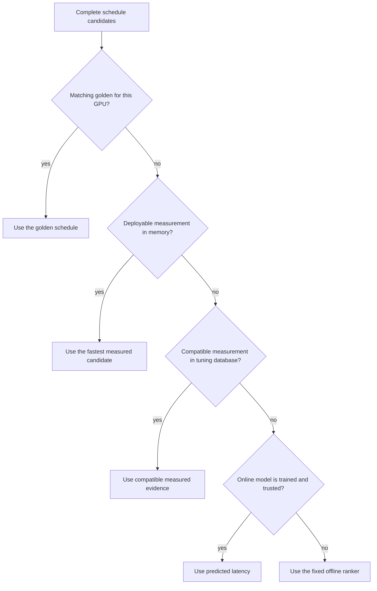
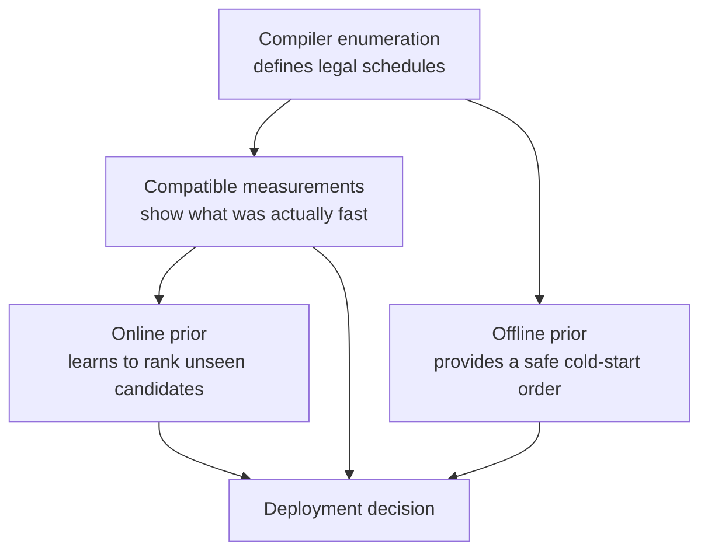

# How Emmy chooses a GPU schedule

This chapter explains how Emmy chooses among several correct ways to run the same mathematics on a GPU. These ways are
called **schedules**. A schedule decides details such as how much work each group of threads performs and how data moves
through GPU memory. Two schedules can return the same answer while one is much faster.

This is the most advanced course chapter. Read [From PyTorch to CUDA: Compiler Deep Dive](./compiler_deep_dive) first, and use the
[Course glossary](./glossary) whenever a compiler, GPU, or tuning term is unfamiliar.

If benchmark baselines, warmup, per-kernel timing, or A/B measurements are unfamiliar, read
[Benchmarking and Comparing Emmy](./benchmarking_emmy) before reproducing a golden.

:::info The central idea
Emmy prefers compatible measurements over predictions. It predicts only when it has not already measured a candidate
under conditions that are relevant to the current compilation.
:::

Lowering rules can produce many correct GPU schedules, but normal compilation cannot benchmark every alternative.
Emmy therefore combines verified reference configurations, prior measurements, and a latency model to choose a
candidate before it runs.

In this codebase, **prior does not mean a Bayesian probability distribution**. It is a ranker that estimates which
schedule will be fast before the current candidate has been measured. A **golden** is a reviewed schedule and latency
for a standard tensor shape on one specific GPU model (sometimes called a GPU card). A golden is stronger evidence than
an ordinary tuning observation because it has passed additional correctness and measurement checks.

By the end of this chapter, you should be able to explain:

- what is scored at a compiler fork;
- why offline and online prior scores have different units;
- which measurements may override a model prediction;
- how a leaf benchmark becomes a label for a partial search-tree node;
- how a golden joins a live compiler choice without relying on a kernel name;
- why goldens are used for deployment and evaluation but excluded from online-prior training;
- which integrity checks must pass before a new golden is trustworthy.

## 1. Start with one fork

A **fork** is a compiler decision point with several valid alternatives. Each alternative carries **knobs**, named
tuning choices such as tile size or memory strategy. A **candidate** is one realized set of those choices. Its data row
has four conceptual regions:

```python
{
    # Hardware and compilation context
    "H_cc_major": 12.0,
    "H_opt": 3.0,

    # Structural identity stamped on the operation
    "S_ext_free_prod": 262144.0,
    "S_ext_reduce_max": 512.0,
    "S_dtype_f16": 2.0,

    # Decisions made while descending the fork tree
    "TILE": "n16x8/f4x8",
    "REDUCE": "g2k",
    "STAGE": "d3/tma/ring",
}
```

The exact feature set evolves, so treat this as an illustrative row rather than a stable schema.

| Prefix | Meaning | Examples |
|---|---|---|
| `H_*` | Hardware and compiler context | GPU properties, capability, optimization settings |
| `S_*` | Structure of the operation or kernel | dimension sizes, data types, operation counts |
| `D_*` | Calculated geometry and interactions | estimates of hardware use, tile ratios, split-work costs |
| none | Tunable decisions | `TILE`, `REDUCE`, `STAGE`, `WSPEC`, `RASTER` |

`emmy/compiler/pipeline/search/features.py::knob_features` converts a knob row into a numeric **feature vector**, the
list of numbers consumed by a ranker. It expands compact schedule strings into physical properties and calculates
relationships that would be difficult to learn directly from a label.

Fork objects deliberately do not carry permanent heuristic scores. There is one ranking path: build candidate rows,
featurize them, consult evidence, then consult the prior if evidence cannot decide.

### Why greedy resolution flattens the tree

**Greedy resolution** chooses the candidate that currently looks best without measuring during normal compilation.
Fork alternatives can be lazy nested trees: some later choices are generated only if their parent is visited. A partial tile prefix may know `BM` and `BN` but not fragment dimensions,
so occupancy or tile area is not yet computable. `policy/greedy.py::flatten_leaves` expands a fork to complete
configurations before scoring. This makes the result independent of how rules arrange lazy levels.

Structural alternatives require another step. A choice that changes one kernel into several cannot be priced by applying
a single-kernel score to the raw graph option. Greedy recursively resolves its kernels and compares the **sum** of their
prices. Cold compilation conservatively avoids an unpriceable structural change; tuning may explore it.

## 2. The deployment decision hierarchy

For an ordinary `compile` or `run`, the path is `search/policy/greedy.py::greedy_decide`:



This is **evidence-first**. Evidence is a recorded measurement made in a compatible situation. A model must not
extrapolate—guess beyond its observations—away from a candidate the system has measured under the deployable
regime. Goldens sit above ordinary evidence because they were reproduced through the A/B integrity path and are
version-controlled with the project.

Golden and reservoir evidence only arbitrate rows whose `H_opt` is `3`. A latency measured with the tuner's fast `-O1`
compilation is useful for ranking exploration, but it is not deployable `-O3` truth.

Emission order is an emergency fallback only when the prior system itself cannot load. A normal cold start still has the
`OfflinePrior`, so it is not intended to be an option-zero policy.

### Small example — evidence beats a prediction

Suppose the compiler offers three valid candidates:

| Candidate | Measured on this GPU at `-O3` | Online prediction |
|---|---:|---:|
| A | 15 µs | 10 µs |
| B | 12 µs | 14 µs |
| C | not measured | 9 µs |

The prediction says C may be fastest, but B is the fastest candidate already measured in the deployable context. Emmy
therefore selects B. This prevents a model estimate from overruling stronger compatible evidence.

If none of the candidates had compatible measurements or goldens, Emmy would use a trustworthy online prediction and
select C. If the online model were unavailable or quarantined, the offline prior would supply the order instead.

## 3. Identities that keep evidence honest

**Latency** is the time required to finish an operation; lower is faster. A latency only means something in the context
in which it was measured. A database **join** connects records that share a matching identity. Emmy uses several
identities for different joins:

| Identity | Purpose |
|---|---|
| operation or `op_sig` | Groups equivalent pre-descent offer sites |
| context key | Separates GPU, backend, flags, and other performance regimes |
| knob/config identity | Distinguishes realized alternatives under an operation |
| `ShapeKey` | Joins a canonical golden shape to a live stamped operation |
| GPU `(gpu_name, compute_cap)` | Scopes goldens to the exact card |

Compute capability is NVIDIA's version number for a GPU instruction set and hardware features. It is not a complete card
identity: different products can support the same capability while having different numbers of streaming
multiprocessors (SMs) and different performance. Golden selection therefore uses both GPU name and capability.

### `ShapeKey`

`search/data/shape.py::ShapeKey` is a deliberately cheap arithmetic identity:

```python
ShapeKey(free_prod=..., reduce_max=..., is_warp=..., is_dyn=..., kind=...)
```

- `free_prod` is the product of static free extents.
- `reduce_max` is the dominant reduction extent.
- `is_warp` separates tensor-core and scalar regimes.
- `is_dyn` separates masked symbolic programs from static twins.
- `kind` prevents coincident extents from joining unrelated grammars: `flash`, `softmax`, `rms_norm`, or plain.

Symbolic axes are excluded from the arithmetic products, matching the operation's structural stamp. Their presence is
represented by `is_dyn`. A dynamic golden is therefore not the static shape merely evaluated at its hint.

`ShapeKey` is enough for cold grouping and golden matching. The trained online model sees the fuller `S_*` histogram,
which can distinguish operations that share extents but differ structurally.

## 4. The offline prior

`search/prior/offline.py::OfflinePrior` is the **cold-start** ranker, used before local learned evidence is trustworthy.
It is fixed, cheap to evaluate, and owns no dataset.

Its central calculation is:

```text
quality = sum(weight[feature] * feature_value) + interaction_gates
latency_proxy = exp(-scale * quality)
```

Lower is better. The exponential preserves the quality ordering. The returned number is an **ordinal latency proxy**,
not calibrated microseconds. A neutral row on which the heuristic has no opinion scores `1.0`.

There are separate static and dynamic weights. Explicit gates cover interactions that one coefficient cannot express:

- whether an atomic-free split is suitable at the realized split width;
- the cost of a scalar tile when a warp implementation is eligible;
- the workspace round trip of a deferred split-K finalize kernel.

The checked-in artifact is:

```text
emmy/compiler/pipeline/search/prior/offline_weights.json
```

It contains `weights`, `weights_dynamic`, scalar parameters, and a featurizer version. It is generated by
`scripts/golden_knob_heuristics.py`. `EMMY_OFFLINE_FILE` can point evaluation at a candidate artifact. A missing field
or incompatible feature version is a hard error; silently applying old weights to new features would be unsafe.

Because the ranker is linear plus named gates, `OfflinePrior.explain_features` returns an exact decomposition. Its terms
sum to the quality before exponentiation, showing exactly why it preferred one row.

## 5. The online prior

`search/prior/online.py::OnlinePrior` is one global CatBoost model across kernels, GPUs, and compiler settings.
**CatBoost** is a machine-learning library for predicting values from table-like data. `H_*` and
`S_*` features let the model distinguish contexts instead of keeping a separate model per kernel.

The model's **target**, the value it learns to predict, is:

```text
y = log(median latency in microseconds)
```

Inference returns `exp(prediction)`, so online scores are predicted microseconds and lower is better. Log space prevents
very slow candidates from dominating squared-error fitting.

Current defaults are 400 iterations, depth 6, learning rate 0.05, and RMSE loss. Feature columns are the sorted union of
training keys. A missing feature becomes `NaN`, not zero:

- missing means a partial prefix has not decided the feature;
- zero can mean a present, explicit OFF or false decision.

CatBoost routes missing values separately. Filling both states with zero would make an undecided branch
indistinguishable from a fully realized OFF configuration.

### Bounded, long-lived training data

The base `Prior` retains at most 100,000 rows. Once full, **reservoir sampling** keeps a statistically uniform sample of
all
rows ever seen rather than only the newest. Refit cadence is:

| Reservoir size | Refit cadence |
|---|---|
| below 1,000 | every 100 new rows |
| 1,000 to 10,000 | every 1,000 new rows |
| 10,000 and above | every 10,000 new rows |

The default fit minimum is 50 rows. Refits occur between operations, not after every benchmark within one operation.
PUCT supplies exploration while the model remains fixed and the trajectory stays interpretable.

### Value-of-position labels

Only terminal schedules can be benchmarked, but the prior ranks partial siblings. Emmy propagates the best descendant
latency upward:

```text
root
  +-- TILE=A ---------------- best descendant = 12 us
  |     +-- STAGE=1 --------- measured leaf = 18 us
  |     +-- STAGE=2 --------- measured leaf = 12 us
  |
  +-- TILE=B ---------------- best descendant = 15 us
        +-- STAGE=1 --------- measured leaf = 15 us
```

The label for `TILE=A` is 12 µs, not an average. It asks: after reaching this prefix, what is the best result reachable
below it? That matches MCTS max-reward propagation, where reward is inverse latency.

### Promotion and quarantine

A fitted model does not automatically own decisions. Emmy computes the median per-operation, in-sample Spearman
correlation between predicted and measured latency over sufficiently populated reservoir groups. The threshold is `0.5`:

```text
trustworthy = fitted and (calibration is absent or calibration >= 0.5)
```

This is a safety tripwire, not proof that the model will predict unseen data perfectly. A model unable to rank its own
rows likely has a corrupt model or mismatched feature vocabulary. A **quarantined** model continues collecting rows and
saving checkpoints, but it is not allowed to choose deployed schedules; Emmy keeps using the offline ranker.

## 6. How both priors compose

The offline and online priors return scores in different units, so Emmy needs one component to choose which source is
currently trustworthy. `search/prior/fallback.py::FallbackPrior` exposes that single policy surface:

| Call | Cold or quarantined | Trustworthy online model |
|---|---|---|
| `mean_score(s)` | offline proxy | online predicted µs |
| `pick` | evidence, then offline | evidence, then online |
| MCTS `score` | offline proxy | online µs with a bounded offline tilt |
| training/checkpoint | delegated to online | delegated to online |

There is only one reservoir: the online prior's. The wrapper does not duplicate observations.

Once online is trustworthy, MCTS selection uses:

```text
selection_latency = online_us * bounded(offline_proxy) ** W
```

`W` comes from `EMMY_OFFLINE_TILT`. The offline proxy is dimensionless and neutral at `1.0`, so it nudges online latency
without pretending to be microseconds. Greedy deployment does not use this blend; after evidence tiers it uses the
promoted online prediction directly.

## 7. How MCTS consumes the prior

MCTS, or **Monte Carlo tree search**, treats compiler forks as a decision tree. Emmy uses a selection formula called
PUCT to balance promising schedules with under-explored ones. At each fork it maximizes:

```text
Q(child) + c * P(child) * sqrt(parent_visits + 1) / (1 + child_visits)
```

- `Q` is the best measured reward below that child, scaled relative to the global best.
- `P` is the predicted reward from the prior on the same scale.
- The prior predicts latency, so MCTS converts it with `1 / predicted_latency`.
- The exploration term falls as a child receives visits.

Optional **epsilon exploration** selects a random available child with probability `EMMY_TUNE_EPS`, helping reach alternatives that
deterministic PUCT and enumeration order would skip.

Tuning normally compiles quickly at `-O1`. A near-best band is recompiled and benchmarked at deployable `-O3`; those
rows are stamped `H_opt=3` and can become direct deployment evidence. Standard and fast-math regimes remain separate.

Two-level search separates outer structural choices that alter kernel sets from inner schedule tuning per operation. The
outer reward is inverse summed best per-operation latency. Search always replays, while cached measurements avoid a GPU
benchmark when the exact context and operation are already known.

## 8. Three persistent stores, three jobs

**Persistence** means that information survives after the current process exits. Do not treat these stores as
interchangeable:

| Store | Default | Contents | Main consumer |
|---|---|---|---|
| tune database | `~/.cache/emmy/autotune.db` | operations, contexts, variants, nodes | measurements and debugging |
| online checkpoint | `~/.cache/emmy/online.json` | CatBoost blob, reservoir, counters, calibration | learned ranking |
| golden YAML | repository `search/goldens/*.yaml` | reviewed card-specific configs | deployment and regression gates |

`EMMY_TUNE_DB` and `EMMY_ONLINE_FILE` override the two cache paths. `EMMY_OFFLINE_FILE` selects an offline weights
artifact. Golden YAML is repository data and has no environment override.

The tune database is SQLite, a database stored in one file. `SearchDB` stores operation inventories, lowering
relationships, measurements, and search-tree node rows. An `ok` measurement is not
replaced by `bench_fail`. Node rows retain context, features, value, depth, visits, leaf status, measurement quality,
provenance, and feature version. Branch values are minimum descendant latency; leaves retain a quality-aware
measurement.

`run --bench` can write parentless leaf rows. It groups every launch belonging to one offer site—such as a split-K main
plus finalize—into one latency. Treating a tiny auxiliary launch as an independent winning leaf would poison training.

The online JSON embeds the native CatBoost `cbm` blob as base64 and retains the reservoir for later refits. A featurizer
version mismatch drops model and rows together. If only the blob is corrupt, rows can be salvaged and refit.

## 9. What a golden contains

A **golden configuration** is a reviewed reference schedule for a standard operation shape on one particular GPU.
`search/golden.py::GoldenConfig` is an immutable Python dataclass with shared fields:

```python
name: str
gpu_name: str
compute_cap: tuple[int, int]
knobs: dict
emmy_us: float
cublas_us: float       # generic reference field; not always literally cuBLAS
dynamic: bool
```

Subclasses add shape and dtype and define `snippet()`, `shape_key()`, dynamic specifications, and a conservative FLOP
count:

- `MatmulGoldenConfig`
- `ReduceGoldenConfig`
- `PointwiseGoldenConfig`
- `RmsNormGoldenConfig`
- `SoftmaxGoldenConfig`
- `AttentionGoldenConfig`

For matrix multiplication, the reference field is a cuBLAS-backed PyTorch operation. **cuBLAS** is NVIDIA's optimized
library of basic linear-algebra routines. Other kinds use their relevant PyTorch reference even
though the historical field name remains `cublas_us`.

```text
ratio = reference_us / emmy_us
```

One is parity and above one means Emmy is faster. The `golden` property uses a `0.95` threshold.

### YAML layout

Goldens live under `emmy/compiler/pipeline/search/goldens/`, one or more files per GPU:

```yaml
gpu_name: NVIDIA GeForce RTX 5090
compute_cap: [12, 0]
configs:
  - kernel: matmul
    name: matmul.square.512
    M: 512
    N: 512
    K: 512
    dtype: fp16
    knobs:
      TILE: n16x8/f4x8
      REDUCE: g2k
      STAGE: d3/tma/ring
      WSPEC: ""
      RASTER: ""
    emmy_us: 8.6
    cublas_us: 12.28
```

Repository values are authoritative; this example illustrates the schema.

Names are not unique. A name can recur across GPUs, and one card can keep several configurations for one shape. Standard
and fast-math winners may coexist. The regime is derived from knobs rather than duplicated in a flag that could drift.

A dynamic golden is a distinct compiled program with masks and runtime dimensions. Its symbolic axis must be recorded at
`DEFAULT_SEQ_HINT` (currently 512), and its `ShapeKey` remains dynamic. Attention has extra pinning restrictions because
its paired contractions do not all accept the same keyed spelling.

## 10. How a golden matches a live fork

Greedy selection first limits goldens to the current `(gpu_name, compute_cap)`, groups them by `ShapeKey`, and orders alternatives by recorded
Emmy latency. `_golden_pick` asks whether an offered row is prefix-consistent with a recorded configuration:

- candidate knobs already decided must agree with the golden;
- undecided descendants remain free, preserving value-of-position semantics;
- values compare through registered parsers, so aliases canonicalize;
- axis-keyed family pins are all-or-nothing;
- a bare family pin may match any same-family realization.

This joins against what the current compiler **actually offers**, rather than blindly replaying an old dictionary. If a
shape matches but no candidate realizes a recorded config, Emmy warns about enumeration drift and falls through to
weaker evidence. Fast-math entries self-exclude when that regime is not offered. Goldens only decide `H_opt=3`.

### Why goldens are not online training rows

Goldens are a held-out acceptance and deployment tier. Training CatBoost on them would make evaluation circular and
let a small curated set distort ordinary search observations.

`Dataset.from_golden` exists because evaluation normalizes golden, DB, reservoir, and node sources behind one `Sample`
interface. That does **not** mean training consumes golden samples. Online training receives tuning value-of-position
rows and eligible bench-to-node measurements; goldens remain outside that feed.

## 11. Recording a golden safely

A fast number is not enough: measurement errors and incorrect programs can also look fast. A **pinned** program is one
whose schedule knobs were explicitly requested instead of chosen automatically. It must be the requested program,
return a correct answer, and report physically plausible timing. Use
`run --bench --golden` or repeated `--ab` rows and save `--json`:

```bash
EMMY_TUNE_DB=/tmp/emmy-golden-course.db \
  ./venv/bin/emmy run \
  --golden matmul.square.512 \
  --bench --warmup 5 --iters 20 \
  --json /tmp/emmy-golden-course.json
```

An **A/B comparison** runs two alternatives under controlled conditions. Its path has three integrity gates:

1. **Realized versus pinned knobs.** A rejected pin becomes `pin_unmatched` and is not benchmarked. Otherwise a fallback
   could silently benchmark greedy under the candidate's label.
2. **Arithmetic-intensity floor.** A timing that implies throughput above the recorded hardware peak is flagged. A
   FLOP is one floating-point arithmetic operation. FLOP counts are conservative so valid kernels are not rejected.
3. **Wrong-answer check.** The pinned program runs on the greedy job's inputs and compares outputs with the reference,
   catching fast but incorrect schedules or missing finalize work.

Each benchmark job runs in a killable worker. A hung kernel becomes `bench_fail`; the parent keeps a clean CUDA context
and continues with the next row.

### Compare against the right baseline

The ordinary greedy benchmark shares an environment with PyTorch comparisons, while pinned rows use an Emmy-only
path. They are not directly comparable. When pins exist, Emmy emits `greedy (isolated)` through the pinned path. Use
that as the speedup baseline and record the pinned row's latency, never the ordinary greedy number.

### Copy `record_knobs`, not a partial diff

The JSON row contains `record_knobs`: realized knobs with every schedule family stamped, including OFF as an empty
string. Copy this map into YAML. Omitting a family lets a future planner fill it differently.

| Status or flag | Meaning | Eligible to record? |
|---|---|---|
| `ok`, no integrity flags | requested program ran cleanly | yes |
| `pin_unmatched` | requested config did not realize | no; not benchmarked |
| `bench_fail` | realized program failed or hung | no latency evidence |
| wrong-answer flag | result is incorrect | no |
| intensity-floor flag | timing is physically implausible | no |

At tune-standard quality, clean pinned rows and isolated greedy may enter the node store by default. `--no-record-nodes`
disables that feed. The `--ir` path cannot reconstruct honest source knob provenance and is not recorded.

## 12. Evaluate each layer separately

Evaluation commands answer different questions. Run the narrowest command that matches the layer you are investigating:

```bash
# Knob schema and measured interactions
./venv/bin/emmy eval knobs

# Cold ranker's golden placement
./venv/bin/emmy eval offline

# Deployed online/fallback prediction and pick
./venv/bin/emmy eval online

# Current compiler pick versus recorded configuration
./venv/bin/emmy eval golden

# Measured variants and deployed pick
./venv/bin/emmy eval variants --db /tmp/emmy-golden-course.db

# Failure clusters and shared knobs
./venv/bin/emmy eval failures --db /tmp/emmy-golden-course.db
```

Candidate artifacts can be evaluated without changing defaults:

```bash
./venv/bin/emmy eval offline --offline-file /tmp/candidate-offline.json
./venv/bin/emmy eval online --online-file /tmp/candidate-online.json
```

For search-faithful diagnostics:

```bash
./venv/bin/emmy eval online \
  --dataset nodes \
  --db /tmp/emmy-golden-course.db \
  --blame --ablate
```

Node evaluation groups sibling choices by parent and reports **regret**: the performance lost by following the prior's
choice instead of the best reachable choice. It
reachable child. It splits by card and `H_opt`. `--blame` attributes a miss to score terms; `--ablate` masks features
and measures regret change. These are diagnostics, not release gates.

Golden ranks are tie-pessimistic. If an earlier candidate ties the golden, it counts ahead because greedy's real
`argmin` chooses the earlier row. Golden evaluation reconstructs the recording card's context instead of using the host
GPU.

## 13. Failure modes

| Symptom | Likely boundary | First inspection |
|---|---|---|
| golden found but no row realizes it | enumeration drift | `_golden_matches_row`, `space.py`, `record_knobs` |
| fitted online model but offline decisions | calibration quarantine | checkpoint `calibration`, `eval online` |
| known tune result not deployed | context/`S_*` join or wrong lane | context key, `H_opt`, evidence warnings |
| static golden affects dynamic compile | `ShapeKey` construction | `is_dyn`, symbolic stamps |
| matmul golden affects a sweep | kind classification | `ShapeKey.kind` |
| candidate looks impossibly fast | measurement integrity | intensity flag and launch grouping |
| split kernel wins without finalize | grouping or accuracy | `bench_leaves`, wrong-answer gate |
| predictions collapse after compiler change | vocabulary drift | `FEATURIZER_VERSION`, checkpoint load |
| offline scores read as microseconds | unit misunderstanding | compare ordering only |

## 14. Code-reading path

Read these symbols in order:

1. `search/space.py`: knob declarations and grids.
2. `search/features.py::knob_features`: the shared feature boundary.
3. `search/policy/greedy.py::greedy_decide`: deployment hierarchy.
4. `search/prior/offline.py::OfflinePrior`: cold ranking.
5. `search/prior/online.py::OnlinePrior`: CatBoost and persistence.
6. `search/prior/fallback.py::FallbackPrior`: promotion and composition.
7. `search/prior/base.py::Prior`: reservoir, calibration, and evidence.
8. `search/policy/mcts.py::TuningSearch`: PUCT and propagation.
9. `search/two_level.py`: structural and inner search.
10. `search/db.py::SearchDB`: persistence semantics.
11. `search/data/shape.py::ShapeKey`: golden join identity.
12. `search/golden.py`: schemas, card scoping, and snippets.
13. `search/bench_record.py`: A/B measurements entering nodes.
14. `commands/run.py` and `commands/eval.py`: integrity and diagnostics.

Keep `emmy/compiler/pipeline/ARCHITECTURE.md` open beside the code. It records why safeguards such as isolated
re-benching, tie-pessimistic rank, value-of-position labels, and model quarantine exist.

## 15. Labs

### Lab A — CPU-only policy tests

```bash
./venv/bin/pytest \
  tests/compiler/pipeline/search/test_online_prior.py \
  tests/compiler/pipeline/search/test_offline_weights_file.py \
  tests/compiler/pipeline/search/test_golden_evidence_deploy.py \
  tests/compiler/pipeline/search/test_db_evidence_deploy.py \
  tests/compiler/pipeline/search/test_shape_key_kinds.py -q
```

For each test, identify which hierarchy tier it protects and what weaker evidence runs when that tier returns `None`.

### Lab B — trace a checked-in golden

```bash
./venv/bin/emmy eval knobs
./venv/bin/emmy eval offline --kernel square.512
rg -n "name: .*square.512|record_knobs|CALIBRATION_MIN" \
  emmy/compiler/pipeline/search
```

Trace one golden from YAML to its dataclass, `ShapeKey`, enumeration, offline features, and reported rank.

### Lab C — isolated caches on a GPU

```bash
EMMY_TUNE_DB=/tmp/emmy-prior-course.db \
EMMY_ONLINE_FILE=/tmp/emmy-prior-course.json \
  ./venv/bin/emmy tune \
  -c "nn.RMSNorm(256)(torch.randn(4,256,device='cuda',dtype=torch.float16))" \
  --patience 8
```

Then inspect both stores:

```bash
EMMY_TUNE_DB=/tmp/emmy-prior-course.db \
EMMY_ONLINE_FILE=/tmp/emmy-prior-course.json \
  ./venv/bin/emmy eval variants

EMMY_TUNE_DB=/tmp/emmy-prior-course.db \
EMMY_ONLINE_FILE=/tmp/emmy-prior-course.json \
  ./venv/bin/emmy eval online --dataset nodes
```

CatBoost may remain below its fit threshold. Confirm that offline ranking stays active while compatible deployable
evidence can still decide rows.

### Lab D — reproduce one golden on its card

```bash
EMMY_TUNE_DB=/tmp/emmy-prior-course.db \
  ./venv/bin/emmy run \
  --golden GOLDEN_NAME \
  --bench --warmup 5 --iters 20 \
  --json /tmp/emmy-prior-course-ab.json
```

Before proposing YAML changes, verify:

- the entry belongs to the live card name and capability;
- pinned status is `ok` with no integrity flag;
- comparison uses `greedy (isolated)`;
- YAML knobs come from `record_knobs` with explicit OFF families;
- standard and fast-math entries do not replace each other;
- a second run reproduces the pin.

## 16. Safe change recipes

### Add a feature

1. Define it in `features.py` and test missing, zero, and realized states.
2. Decide whether it belongs to `H_*`, `S_*`, or derived `D_*` identity.
3. Bump `FEATURIZER_VERSION` when persisted interpretation changes.
4. Regenerate and evaluate offline weights if they consume it.
5. Confirm old online checkpoints are deliberately rejected or migrated.
6. Run golden rank, node regret, and deploy-evidence tests.

### Add or change a knob

1. Register the family and canonical parser.
2. Ensure every realized leaf stamps it, including explicit OFF.
3. Preserve missing-as-undecided semantics for partial prefixes.
4. Test bare and axis-keyed golden matching.
5. Reproduce affected goldens; do not hide drift warnings.

### Add a golden

1. Tune the exact snippet in its intended standard or fast-math regime.
2. Re-bench promising rows at deployable `-O3`.
3. Run pinned A/B at recording-quality warmup and iterations.
4. Reject pin mismatches, failures, wrong answers, and intensity flags.
5. Copy `record_knobs` and pinned latency into the correct GPU YAML.
6. Run `eval offline`, `eval online`, and `eval golden` for the name.
7. Run focused golden-deploy and reproduction tests.

## Final mental model



A golden does not bypass the compiler. It wins only when current enumeration offers a prefix-consistent realization
for the same shape, dynamic regime, kind, GPU, and optimization lane. The online model does not replace measurement;
it fills gaps between observations. The offline prior does not predict time; it provides a useful order before
trustworthy local learning exists.
