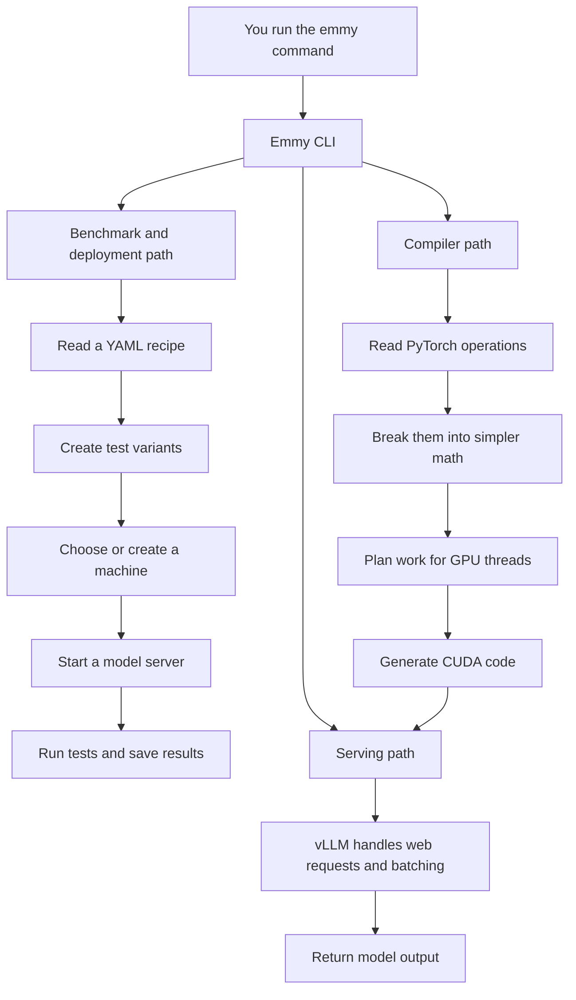
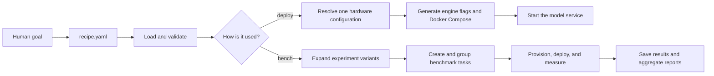
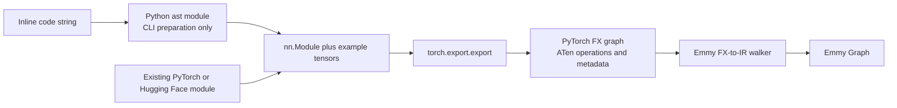
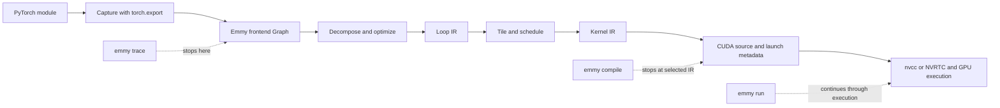
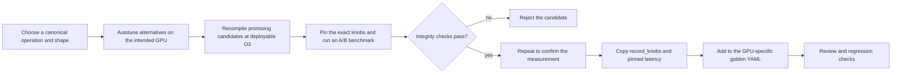
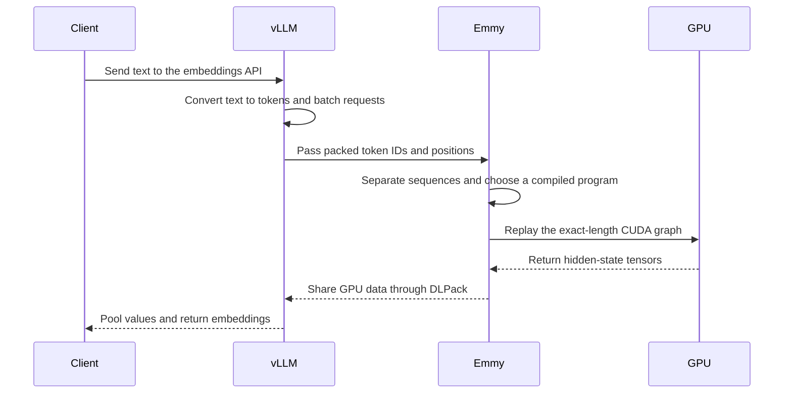

# Learn Emmy from the code

Emmy turns familiar PyTorch code into fast programs for NVIDIA graphics processors. It can also start model servers,
run repeatable speed tests, and compare different ways of executing a model. This course explains how those pieces fit
together without assuming that you already know how large language models (LLMs) or GPU compilers work.

We will follow data through the project instead of reading every source file. By the end, you should be able to explain:

- how a PyTorch operation becomes a CUDA program that runs on a GPU;
- how a small YAML recipe becomes one or more benchmark runs;
- how Emmy obtains a machine, starts a model server, and records results; and
- how Emmy connects its compiled model code to vLLM's web-serving system.

An **LLM**, or *large language model*, is a program trained on text to predict and generate language. You do not need to
know how to train one for this course. We mainly treat a model as a chain of mathematical operations that Emmy needs to
run correctly and quickly.

:::tip New to the terminology?
Technical terms are defined when they first become important. The [Course glossary](./glossary) is also available as a
quick reference. When a term is shown in `code font`, it is usually a name that appears literally in the source code.
:::

The course describes the current `emmy/` Python package—the main application code in the `emmy/` directory.
`pyproject.toml` tells Python which package to install and connects the terminal command `emmy` to the function
`emmy.emmy:main`. Folders such as `recipes/`, `experiments/`, `results/`, and `scripts/` contain inputs, examples,
outputs, and helper tools around the application.

## How to use this course

Work through the lessons in order on the first pass. Each lesson has four recurring parts:

1. **Learn** gives the mental model.
2. **Read** gives an ordered path through the code. Read symbols in that order rather than reading whole directories.
3. **Lab** turns the idea into something observable.
4. **Checkpoint** tells you what you should be able to explain before moving on.

Most lessons work without a GPU. A **GPU** (graphics processing unit) is hardware that can perform many calculations in
parallel. Labs marked **GPU** generate or execute **CUDA**, NVIDIA's programming platform for its GPUs, and can be
skipped on a laptop without a supported NVIDIA GPU. Cloud and deployment commands use `--dry-run`, which shows what a
command would do without creating paid infrastructure. Do not remove it until you have reviewed credentials, expected
cost, and cleanup behavior.

Suggested pace: fourteen sessions of 60–90 minutes. Lessons 6–11 form the compiler track; lessons 2–5 form the
deployment and benchmarking track. If your immediate goal is operations rather than compiler development, complete
lessons 0–5, 12, and 13 first.

The main course is the beginner path. For a more implementation-focused treatment of lessons 6–12, use the
[From PyTorch to CUDA: Compiler Deep Dive](./compiler_deep_dive). It follows one operation through every IR, then explains rewrite mechanics,
algebra recognition, scheduling, CUDA dispatch, dynamic shapes, autotuning, and how to extend the compiler.

For hands-on performance work, [Benchmarking and Comparing Emmy](./benchmarking_emmy) separates local compiler
benchmarks from deployed service benchmarks and explains PyTorch baselines, metrics, profiling, fair experiments, and
result files.

For the full serving path, [Integrating Emmy with vLLM](./vllm_integration) explains plugin discovery, the embedding
and generation ownership boundaries, command construction, request flow, correctness gates, A/B benchmarking, and
common failures.

For the implementation of tuning decisions, evidence precedence, offline and CatBoost priors, golden matching, A/B
integrity gates, and diagnostics, continue with [How Emmy Chooses Fast GPU Schedules](./prior_and_goldens).

## The system in one picture

The **CLI** (command-line interface) is the `emmy` command you type in a terminal. It leads to three related paths:



**PyTorch** is the Python library in which the model is originally expressed. **vLLM** is a separate system that
handles web requests, groups requests into efficient batches, and manages model-serving details. Emmy focuses on
compiling the model's mathematical work.

There are three architectural ideas to keep in mind throughout the course:

- The CLI is a thin coordination layer: it reads options and calls reusable code. Reusable behavior lives in `emmy/recipe`, `emmy/benchmark`, `emmy/deploy`,
  `emmy/provisioning`, `emmy/compiler`, and `emmy/serving`.
- The compiler keeps one editable `Graph`, a data structure that represents operations and the values flowing between
  them. A sequence of **passes** gradually replaces high-level operations with lower-level ones.
- Actions outside the Python process—starting machines, running Docker containers, compiling CUDA, or calling
  vLLM—are kept behind explicit interfaces. That makes the core logic easier and safer to test.

### What you need before starting

You should be comfortable reading basic Python and running commands in a terminal. Familiarity with dictionaries,
functions, classes, and tests is enough. The course explains the required machine-learning, compiler, cloud, and GPU
concepts as they appear.

Use this quick test when a section feels too dense: ask yourself **what data comes in, what changes, and what comes
out?** That question is more useful than memorizing class names.

## Lesson 0 — Establish the project boundary

### Learn

Before learning how the internals work, identify which files are the application and which files support it. A
**package** is a directory of Python code that can be installed and imported. `pyproject.toml` is the project's main
Python configuration: it declares the supported Python version, installable packages, optional dependencies, terminal
commands, and the vLLM plugin connection. `Makefile` gives short names to common development commands.

`README.md` is the product overview. Files named `ARCHITECTURE.md` explain the design rules, or **invariants**, of a
subsystem. An invariant is a condition the code expects to remain true—for example, “a failed cloud provider must
clean up any machine it partly created.”

The dependency groups communicate intended deployment boundaries:

- Base dependencies support recipes, orchestration, and result handling.
- `compile` adds PyTorch, Transformers, safetensors, and the loop runner's `cppyy` dependency.
- `serving` adds the compatible vLLM line.
- `visualize` adds Playwright.
- `dev` combines development and test tooling.

### Small example — locate one command

Think of the project boundary as a path from something the user types to installed Python code:

```text
terminal: emmy compile ...
    -> pyproject.toml maps "emmy" to emmy.emmy:main
    -> emmy/emmy.py selects the compile command
    -> emmy/compiler performs reusable compiler work
```

The first two steps connect the application. The last step contains the feature itself. This distinction helps you avoid
putting reusable compiler behavior inside a command handler.

### Read

1. `pyproject.toml`: `[project]`, `[project.optional-dependencies]`, `[project.scripts]`, and the vLLM entry point.
2. `Makefile`: `setup`, `test`, `lint`, `bench`, `bench-kernels`, and image-building targets.
3. `README.md`: Compile, Benchmark, Deploy, Serve, Generate, and Recipe examples.
4. `CLAUDE.md`: documentation conventions, test lanes, and contribution rules.
5. `STYLE.md`: code conventions before changing implementation files.

### Lab — local orientation

```bash
make setup
./venv/bin/emmy --help
./venv/bin/python -c "import emmy; print(emmy.__file__)"
./venv/bin/pytest tests/test_config.py tests/test_hardware.py -q
```

Use `rg --files emmy | sort` to compare the installed package with the top-level repository contents. Notice that
`recipes/`, `experiments/`, `results/`, and `scripts/` are consumers or artifacts around the package.

### Checkpoint

You can answer:

- Which Python function receives the `emmy` shell command?
- Which dependency group is needed for compiler work? Which one is needed for vLLM integration?
- Where should a reusable function live, and why should it not live in `emmy/commands`?

## Lesson 1 — Follow CLI dispatch without getting lost in argparse

### Learn

When you type `emmy compile`, the shell needs a Python function to receive that command. `emmy/emmy.py` is the
**composition root**: the small place where the application's larger parts are connected. It creates a command-line
parser, asks each command module to register its commands, configures log messages, and calls the selected handler.

The parser comes from Python's `argparse` library. A **handler** is simply the function called for a command. Some
handlers use `asyncio.run()` to call **asynchronous** code—code that can wait for slow operations, such as remote
commands, without blocking all other work.

Do not begin by reading every flag. First identify a command's registration function, its `handle_*` function, and the
library entry point it calls. This separates interface mechanics from business behavior.

### Small example — dispatch one command

This pseudocode removes most `argparse` details and shows the important control flow:

```python
parser = create_parser()
compile_command.register(parser)

arguments = parser.parse_args(["compile", "--ir", "cuda"])
arguments.func(arguments)  # Calls handle_compile(arguments)
```

The real handler then converts text options such as `"cuda"` into library objects and calls the compiler pipeline. The
handler coordinates work; it does not implement graph rewriting itself.

### Read

1. `emmy/emmy.py`: `main` and the command registration calls.
2. `emmy/commands/ARCHITECTURE.md`: Layered Design and Layers.
3. `emmy/commands/compile.py`: `register_compile_command`, `handle_compile`, `load_or_trace`, and `resolve_passes`.
4. `emmy/commands/deploy/local.py`: registration, argument handling, hardware resolution, and delegation.
5. `emmy/commands/bench/__init__.py`: `handle_bench` only; defer its collaborators until lessons 3–5.
6. `emmy/config.py` and `emmy/redact.py`: configuration ownership and secret-handling boundaries.

### Lab — build a command map

Run these and compare the displayed subcommands with `main()`:

```bash
./venv/bin/emmy --help
./venv/bin/emmy deploy --help
./venv/bin/emmy compile --help
./venv/bin/emmy bench --help
```

Then choose one command and write this four-line trace in your notes:

```text
register function -> argparse func -> handle function -> reusable library entry point
```

For `compile`, the trace ends in `Pipeline.build(...).run(...)`. For deployment commands, it ends in the deploy and
provisioning libraries rather than in the command module itself.

### Checkpoint

You can explain why `emmy/emmy.py` imports many command modules but still contains almost no domain logic, and why
`emmy/config.py` owns `EMMY_*` environment reads instead of each command reading `os.environ` independently.

## Lesson 2 — Describe repeatable work with recipes

### Learn

A recipe is Emmy's reusable plan for a deployment or benchmark. It answers questions that would otherwise be spread
across a long terminal command, a shell script, and a person's memory:

- Which Hugging Face model—or which arbitrary command—should run?
- Which serving engine and settings should be used?
- What GPU resources does the work require?
- What workload should the benchmark send?
- Which combinations should be compared?
- Which output files or aggregate report should be kept?

Recipes exist for **repeatability**. A reviewed YAML file can be committed to Git, run again by another person, and
used to compare results without reconstructing dozens of flags. It is also one shared contract between Emmy's recipe,
planning, provisioning, deployment, benchmarking, and result-reporting code.

A recipe describes desired work; it does not perform the work by itself. Different commands consume it:

```bash
# Preview the variants and planned benchmark work without creating machines.
./venv/bin/emmy bench recipes/Qwen3-Embedding-0.6B --dry-run

# Use one recipe to start a local deployment.
./venv/bin/emmy deploy local --recipe recipes/Qwen3-Embedding-0.6B

# Preview a cloud deployment without creating resources.
./venv/bin/emmy deploy cloud \
  --recipe recipes/Qwen3-Embedding-0.6B \
  --gpu "NVIDIA GeForce RTX 5090" \
  --gpu-count 1 \
  --dry-run
```

The same input therefore supports a quick deployment and a controlled multi-variant experiment. The command determines
which part of the workflow runs.



### What a recipe contains

YAML is a human-readable format for nested lists and key/value settings. Emmy's recipe sections have distinct jobs:

| Section | Question it answers | Used by |
|---|---|---|
| `model` | Which model and task should run? | deployment and serving |
| `engine` | Which server and runtime settings should be used? | engine argument and container generation |
| `benchmark` | What requests should be sent and how many? | benchmark workload generation |
| `deploy` | Which GPU resources are required? | planning and provisioning |
| `command` | Which arbitrary command should run instead of model inference? | command-workload execution |
| `matrices` | Which setting combinations should become separate runs? | variant expansion and planning |
| `aggregate` | How should results from all runs be summarized? | post-benchmark reporting |

A recipe represents either model inference (`model` plus `engine`) or an arbitrary `command`; those are different
workload types and cannot be mixed in one recipe. It contains references and settings, not model weights or CUDA code.

### How one benchmark uses a recipe

For `emmy bench`, the recipe moves through several layers:

```text
recipe path
  -> load YAML and validate fields
  -> expand matrices into concrete variants
  -> turn each variant into a BenchmarkTask
  -> group compatible tasks so they can reuse a machine and model download
  -> provision or reuse a host
  -> translate shared engine settings into vLLM or SGLang flags
  -> generate Docker Compose and start the service
  -> run a smoke test and benchmark workload
  -> save each result and run the optional aggregate command
```

The next three lessons examine task planning, execution, provisioning, and deployment separately. For now, remember
that the recipe is the version-controlled input connecting those steps.

### How matrices create comparisons

A recipe can describe several experiments at once through its `matrices` section. Each final combination is a
**variant**. Shared fields stay in the main recipe; only values that should change between runs belong in the matrix.

`cross` produces every combination, like choosing every shirt with every pair of trousers. `zip` pairs values by their
position, like pairing the first model setting with the first benchmark setting. Emmy expands those combinations before
converting the raw data into validated Python objects:


This order is important. It lets a matrix override a deeply nested field without duplicating the rest of the recipe,
while ensuring every final variant receives the same validation.

Named `LLMConfig` fields are **engine-independent**: the recipe expresses the desired behavior without using one
server's exact command-line spelling. An **engine** is the program that actually runs model inference. Emmy supports
engines such as vLLM and SGLang. `emmy/recipe/engines.py` maps shared settings to the flags understood by each engine.
`extra_args` remains an escape hatch, but validation rejects flags that would duplicate a named field. This preserves
one source of truth for GPU counts, context length, concurrency, and engine arguments.

### Small example — expand a matrix by hand

Suppose a recipe contains:

```yaml
matrices:
  cross:
    gpu: [A100, H100]
    benchmark.batch_size: [1, 8]
```

`cross` produces four flat overrides:

```text
gpu=A100, benchmark.batch_size=1
gpu=A100, benchmark.batch_size=8
gpu=H100, benchmark.batch_size=1
gpu=H100, benchmark.batch_size=8
```

Each override is merged with the recipe's shared settings and validated as a complete `Recipe`. If those two lists were
inside one `zip`, the output would contain only `(A100, 1)` and `(H100, 8)`.

### Read

1. `recipes/Qwen3-Embedding-0.6B/recipe.yaml`: a real inference recipe with `cross`, nested `zip`, and aggregation.
2. `experiments/test_command/recipe.yaml`: a generic command workload.
3. `emmy/recipe/types.py`: `Recipe`, `LLMConfig`, `ModelConfig`, `CommandConfig`, and `DeployConfig`.
4. `emmy/recipe/matrix.py`: `expand_matrix`, `_expand_cross`, `_expand_zip`, `build_override`.
5. `emmy/recipe/recipe.py`: `deep_merge`, `_validate_and_build`, `load_recipe`, `resolve_for_hardware`.
6. `emmy/recipe/engines.py`: flag maps and `build_engine_args`.
7. `emmy/recipe/ARCHITECTURE.md`: use it to resolve edge cases after reading the implementation path.

### Lab — inspect expansion directly

```bash
./venv/bin/python - <<'PY'
import yaml
from emmy.recipe.matrix import expand_matrix

with open("recipes/Qwen3-Embedding-0.6B/recipe.yaml") as f:
    raw = yaml.safe_load(f)

combinations = expand_matrix(raw["matrices"])
print("variant count:", len(combinations))
for item in combinations[:4]:
    print(item)
PY
```

Predict the count before running it: two GPUs × two input lengths × two zipped engine configurations equals eight.
Then run the tests that pin the combinator semantics:

```bash
./venv/bin/pytest tests/recipe/test_matrix.py tests/recipe/test_engines.py -q
```

### Implementation exercise

On paper, add `benchmark.max_concurrency: [8, 32]` as an independent cross axis. Determine the new variant count. Then
decide how the answer changes if it is placed inside the existing `zip` block. Do not edit the real recipe yet.

### Checkpoint

You can explain:

- Why Emmy uses a version-controlled recipe instead of asking users to reconstruct a long command for every run.
- How `emmy deploy` and `emmy bench` consume the same recipe for different workflows.
- Which recipe sections describe the model or command, engine, hardware, workload, comparisons, and aggregation.
- Why matrix expansion returns flat dot-path dictionaries before `build_override` nests them.
- Why `deep_merge` is necessary instead of a shallow dictionary update.
- How one `LLMConfig` becomes different vLLM and SGLang command-line flags.
- Why inference and command recipes are mutually exclusive.

## Lesson 3 — Turn variants into scheduled benchmark work

### Learn

After recipe expansion, Emmy must decide which tests can share a machine. A `BenchmarkTask` is one recipe variant that
can be run. An `ExecutionGroup` is a set of tasks placed on the same VM, or virtual machine. A VM is a software-created
computer, often rented from a cloud provider.

The **planner** is the code that groups tasks. It groups inference tasks by model and GPU so the same downloaded model
weights can be reused. It chooses a VM large enough for the most demanding task and runs larger tasks first. Command
recipes group by GPU because they have no model weights to reuse.

`gpu_concurrency` splits a logical group across several VMs. This can finish sooner, but it may download the same model
more than once and cost more. `max_workers` is different: it limits how many already-planned groups may run at the same
time.

### Small example — group tasks for reuse

Imagine three benchmark tasks:

```text
task A: model=Qwen, GPU=H100, gpu_count=1
task B: model=Qwen, GPU=H100, gpu_count=2
task C: model=Llama, GPU=H100, gpu_count=1
```

The default planner creates two groups:

```text
group 1: tasks A and B -> one Qwen VM sized for 2 GPUs
group 2: task C       -> one Llama VM sized for 1 GPU
```

Tasks A and B can reuse Qwen's downloaded weights. Task C cannot, even though it requests the same GPU model.

### Read

1. `emmy/benchmark/tasks.py`: `enumerate_tasks`.
2. `emmy/planner/__init__.py`: `BenchmarkTask`, `ExecutionGroup`, and `BenchmarkPlanner`.
3. `emmy/planner/variant.py`: labels and stable variant identity.
4. `emmy/planner/group_by_model_and_gpu.py`: grouping, sorting, and splitting.
5. `emmy/commands/bench/__init__.py`: from task enumeration through group planning.
6. `tests/planner/test_planner.py`: executable examples of every grouping rule.

### Lab — enumerate and plan without provisioning

```bash
./venv/bin/python - <<'PY'
from emmy.benchmark.tasks import enumerate_tasks
from emmy.planner.group_by_model_and_gpu import GroupByModelAndGpuPlanner

tasks = enumerate_tasks(["recipes/Qwen3-Embedding-0.6B"])
groups = GroupByModelAndGpuPlanner().plan(tasks)
print("tasks:", len(tasks), "groups:", len(groups))
for group in groups:
    print(group.label, len(group.tasks), group.tasks[0].model_name)
PY
```

Run the planner tests, then repeat the snippet with `GroupByModelAndGpuPlanner(gpu_concurrency=2)`:

```bash
./venv/bin/pytest tests/planner/test_planner.py -q
```

### Checkpoint

Given a list of variants, you can predict how many tasks and groups will be created, which tasks share a VM, how the
group's GPU count is chosen, and what changes when `gpu_concurrency` increases.

## Lesson 4 — Follow one benchmark execution group end to end

### Learn

The **control plane** coordinates benchmark work; it does not perform the model's mathematics. Its central function,
`run_execution_group`, receives an existing machine or provisions a cloud VM, prepares that machine, and runs every
task in the group. **Provisioning** means obtaining and preparing a machine. **Deployment** means starting the workload
on a machine that is already available.


A **smoke test** is a small request that catches obvious startup failures before a longer benchmark. **Teardown** is
the cleanup step that stops services and, when appropriate, releases the machine. Command tasks instead upload needed
files, run their command template, and retrieve the declared result files.

The same `PhaseTimer` travels through this path. Provisioning time is incurred once per group but copied into each task
result, making a task's result reflect the cost of obtaining its host. Model-load subphases are parsed from engine logs
but excluded from the top-level total to avoid double counting.

### Small example — make cleanup unavoidable

The central control flow is similar to this pseudocode:

```python
host = provision_or_reuse_host(group)
try:
    prepare(host)
    for task in group.tasks:
        deploy(task, host)
        smoke_test(task, host)
        save(benchmark(task, host))
        teardown_service(task, host)
finally:
    release_host_if_owned(host)
```

The `finally` block expresses the key guarantee: an error during a smoke test or benchmark must not skip machine
cleanup. The real implementation has more detailed failure handling and timing, but follows this shape.

### Read

1. `emmy/benchmark/execution.py`: `run_execution_group`; read one branch at a time.
2. `emmy/benchmark/workload.py`: inference benchmark command construction.
3. `emmy/benchmark/command_workload.py`: template variables, staging, and result retrieval.
4. `emmy/benchmark/results.py`: parsing and result composition.
5. `emmy/timing.py`: `PhaseTimer` and phase constants.
6. `emmy/commands/ARCHITECTURE.md`: Data Flow and Timing metrics.

### Lab — use tests as a side-effect-free execution trace

For a complete command walkthrough and definitions of TTFT, TPOT, ITL, latency, and throughput, use
[Benchmarking and Comparing Emmy](./benchmarking_emmy#part-2--benchmark-a-deployed-model-service).

```bash
./venv/bin/pytest \
  tests/benchmark/test_command_workload.py \
  tests/benchmark/test_results.py \
  tests/deploy/test_log_phases.py -q
```

Open one result manifest and compare its persisted identity with `BenchmarkTask.to_dict`:

```bash
sed -n '1,200p' results/qwen3_coder_awq_sglang_vs_vllm/manifest.json
```

### Trace exercise

Draw the failure boundary around each of these phases: VM provisioning, remote bootstrap, image pull, model download,
model warmup, smoke test, benchmark, and teardown. For each boundary, locate the function that records or propagates
failure. This is more useful than reading `execution.py` linearly because it reveals what the orchestrator guarantees.

### Checkpoint

You can narrate an `ExecutionGroup` from allocation to cleanup and distinguish benchmark duration measured by the
server from wall-clock phase timing measured by the orchestrator.

## Lesson 5 — Separate deployment from provisioning

### Learn

Provisioning obtains and prepares a machine. Deployment places a model-serving workload on a machine that already has
an address. Keeping them separate lets a laptop, an existing SSH server, and a newly created cloud VM use the same
deployment code. **SSH** is a secure protocol for running commands on another computer.

The provisioning orchestrator enumerates provider candidates from `emmy/hardware.py`, retries transient failures,
advances on capacity exhaustion, and stops on terminal errors. Provider adapters must uphold the orphan-cleanup
invariant: returning a `VMConnectionInfo` transfers ownership to the caller; raising means the provider has already
cleaned up any partially created instance.

Deployment converts a typed recipe into engine arguments and Docker Compose. **Docker** runs applications in isolated
packages called containers; **Docker Compose** describes how several containers should run together. Deployment pulls
images, obtains model data, starts services, waits for health, runs a task-aware smoke test, and exposes teardown through the same transport
abstraction. Multi-instance configurations add nginx and use a scale-out strategy.

### Small example — separate the two responsibilities

```python
# Provisioning answers: "Where can the workload run?"
connection = provision_cloud_vm(gpu="H100")

# Deployment answers: "What should run on that machine?"
run_deploy(connection, recipe)
```

The same deployment function can instead receive a local or fixed SSH connection. It should not need to know whether
the machine was just created, has existed for months, or is the developer's laptop.

### Read

1. `emmy/provisioning/ARCHITECTURE.md`: allocation model, error contract, and orphan cleanup.
2. `emmy/hardware.py`: GPU names, provider instance choices, and zones.
3. `emmy/provisioning/candidates.py`: candidate ordering.
4. `emmy/provisioning/cloud.py`: `provision_cloud_vm` and `_provision_candidate`.
5. `emmy/provisioning/host.py` and `remote.py`: existing-host command execution and bootstrap.
6. `emmy/deploy/params.py`: the data passed into deployment.
7. `emmy/deploy/compose.py`: `generate_compose` and `generate_nginx_conf`.
8. `emmy/deploy/orchestrate.py`: `run_deploy`, smoke checks, `deploy`, and `teardown`.
9. `emmy/deploy/scale_out.py`: data-parallel and replica-parallel transformation.

### Lab — inspect generated infrastructure without starting it

```bash
./venv/bin/pytest \
  tests/provisioning/test_candidates.py \
  tests/provisioning/test_provision_fallback.py \
  tests/deploy/test_compose.py \
  tests/deploy/test_scale_out.py -q
```

Then generate Compose in memory and inspect the first service:

```bash
./venv/bin/python - <<'PY'
import yaml
from emmy.deploy.compose import generate_compose
from emmy.recipe.recipe import resolve_for_hardware

recipe = resolve_for_hardware(
    "recipes/Qwen3-Embedding-0.6B",
    "NVIDIA GeForce RTX 5090",
)
text = generate_compose(recipe, "/hf_models", "example-token")
doc = yaml.safe_load(text)
name, service = next(iter(doc["services"].items()))
print(name)
print(service["image"])
print(service["command"])
PY
```

Use only a fake token in this inspection. Secret redaction protects logs, but a real credential is unnecessary here.

### Checkpoint

You can explain where provider fallback ends, who owns VM deletion after a successful create, why local deployment
cannot install drivers with sudo, and how a `Recipe` becomes a Docker Compose service.

## Lesson 6 — Understand the compiler's permanent data model

### Learn

A compiler translates a program from one form into another. Emmy translates PyTorch operations into CUDA. During this
translation it uses an **intermediate representation (IR)**—an internal description that is easier for compiler code
to analyze than the original Python.

Emmy keeps one `Graph` throughout the compiler. A graph contains **nodes** (operations) connected by data-flow edges
(values moving between operations). A **pass** is one compiler phase, and a **dialect** is the vocabulary allowed at a
particular IR stage. Passes replace or splice node operations as the dialect becomes more hardware-specific. This lets
graph structure, symbolic shapes, identity, and debugging metadata stay consistent across the compiler.

### Where the first Graph comes from

Emmy does **not** contain a handwritten parser that tries to understand arbitrary PyTorch source code. It delegates the
hard capture step to PyTorch's existing `torch.export` library:



There are therefore two different jobs:

1. **PyTorch captures the computation.** `torch.export.export` runs PyTorch's tracing and export machinery and returns
   an `ExportedProgram` containing an FX graph. FX is PyTorch's graph representation; its compute nodes normally refer
   to ATen, PyTorch's lower-level operation library. PyTorch also supplies inferred tensor shapes and data types as node
   metadata.
2. **Emmy converts the captured graph.** `trace_module_with_constants` walks the FX nodes in order. Placeholders become
   `InputOp` or `ConstantOp` nodes, recognized ATen calls become Emmy operations such as `MatmulOp` or `RmsNormOp`, and
   the FX output marks Emmy's graph outputs. A `node_map` connects each FX node name to the corresponding Emmy node ID.

The conversion loop is custom Emmy code, but it consumes a graph already produced by PyTorch. In simplified
pseudocode, it looks like this:

```python
exported = torch.export.export(module, example_inputs)
graph = Graph()
node_map = {}

for fx_node in exported.graph_module.graph.nodes:
    if fx_node.op == "placeholder":
        add_emmy_input_or_constant(graph, fx_node, node_map)
    elif fx_node.op == "call_function":
        add_matching_emmy_operation(graph, fx_node, node_map)
    elif fx_node.op == "output":
        record_emmy_outputs(graph, fx_node, node_map)
```

For the CLI expression below, Python's standard `ast` module only helps turn the text into a callable module and lift
the random tensor into an example input. It does not translate RMSNorm mathematics:

```text
nn.RMSNorm(16)(torch.randn(2, 8, 16))
        │
        ├─ CLI adapter creates nn.RMSNorm(16) and one example tensor
        ├─ torch.export captures placeholders plus aten.rms_norm
        └─ Emmy maps them to InputOp, ConstantOp, and RmsNormOp nodes
```

For a model that is already an `nn.Module`, Emmy skips the inline-code preparation and passes the module and example
inputs directly to `torch.export`. Lesson 7 examines tracing and ATen-to-Emmy operation mapping in more detail.

Important invariants:

- Shape belongs to `node.output`, not to the operation.
- Every shape extent is a `Dim`, backed by a static or symbolic expression.
- `Graph.splice` is the functional rewrite primitive; direct op replacement is the in-place lowering primitive.
- `Graph.structural_key` ignores cosmetic names but includes codegen-relevant structure and dataflow.
- `Hints` carry metadata such as provenance without changing semantic identity.

### Small example — represent data flow

For the expression `z = (x + y) * 2`, imagine this simplified graph:

```python
nodes = {
    "x": Node(op="input", inputs=[]),
    "y": Node(op="input", inputs=[]),
    "sum": Node(op="add", inputs=["x", "y"]),
    "z": Node(op="multiply_by_2", inputs=["sum"]),
}
outputs = ["z"]
```

The edges are stored as input IDs. Renaming `"sum"` to `"temporary_1"` should not change structural identity because
the computation and connections are unchanged.

### Read

1. `emmy/commands/trace.py`: `graph_from_code` and `trace_inline_code`, which prepare inline CLI expressions.
2. `emmy/compiler/trace/torch.py`: `trace_module_with_constants`, the FX walk, and the three node handlers.
3. `emmy/compiler/graph.py`: `Hints`, `Node`, `Graph.add_node`, `Graph.splice`, `Graph.topological_order`.
4. Continue in `graph.py`: symbolic bindings, `structural_key`, serialization, and pretty printing.
5. `emmy/compiler/tensor.py`: tensor metadata.
6. `emmy/compiler/dim.py`: `Dim`, arithmetic, hints, and static/symbolic accessors.
7. `emmy/compiler/ir/expr.py`: the expression language used by dimensions, indices, and conditions.
8. `emmy/compiler/structural.py`: the structural hashing protocol.
9. `tests/compiler/ir/test_graph.py`, `test_graph_splice.py`, and `test_shape_inference.py`.

### Lab — observe graph structure before lowering

```bash
./venv/bin/emmy trace \
  --code "nn.RMSNorm(16)(torch.randn(2, 8, 16))" \
  --output /tmp/emmy-rmsnorm-torch.json
./venv/bin/emmy inspect /tmp/emmy-rmsnorm-torch.json
sed -n '1,100p' /tmp/emmy-rmsnorm-torch.json
```

Run the graph-focused tests:

```bash
./venv/bin/pytest \
  tests/compiler/ir/test_graph.py \
  tests/compiler/ir/test_graph_splice.py \
  tests/compiler/ir/test_graph_structural_key.py \
  tests/test_dim_arithmetic.py -q
```

### Implementation exercise

Trace the fields that would change if an input dimension changed from `Dim(32)` to `Dim("seq_len")`. Follow the
symbol from tensor shape, through `Graph.symbolic_bindings`, to runtime evaluation in the CUDA program. This prepares
you for dynamic serving in lesson 12.

### Checkpoint

You can explain why PyTorch—not a handwritten Emmy source parser—captures the initial computation, what Emmy's custom
FX walker adds, why mutable graphs require an uncached structural key, why names are excluded from it, and how a symbolic
dimension remains an expression until launch time.

## Lesson 7 — Capture PyTorch operations and decompose them

### Learn

In this lesson, **tracing** names the whole capture boundary, not one function owned entirely by PyTorch or Emmy. PyTorch
provides the mechanism that discovers tensor operations; Emmy provides the wrapper, conversion, and command around it.

| Name | Owner | Job |
|---|---|---|
| tracing or capture | general concept | Observe a program with representative inputs and record its tensor operations and data flow. |
| `torch.export.export` | PyTorch | Capture an `nn.Module` as an `ExportedProgram` containing an FX graph. |
| `trace_module` / `trace_module_with_constants` | Emmy | Call `torch.export`, then convert the returned FX graph into an Emmy `Graph`. |
| `emmy trace` | Emmy CLI | Prepare inline code or a Hugging Face model, call Emmy's tracing wrapper, and save the resulting Graph IR as JSON. |

This path does **not** call the older `torch.jit.trace` API. When the course says “PyTorch tracing,” it means capture
through `torch.export.export` unless it explicitly says otherwise.

```text
emmy trace command
    -> graph_from_code or Hugging Face wrapper          # Emmy
    -> trace_module_with_constants                     # Emmy
    -> torch.export.export                             # PyTorch
    -> ExportedProgram containing an FX graph          # PyTorch
    -> walk FX placeholders, ATen calls, and outputs   # Emmy
    -> Emmy Graph                                      # Emmy
```

### Trace versus compile

`trace` captures the original computation. `compile` transforms that captured computation toward a selected lower-level
representation:

| Command | Starts with | Main work | Stops with |
|---|---|---|---|
| `emmy trace` | Inline PyTorch code or a Hugging Face model | Run `torch.export` and convert FX into an Emmy `Graph` | Serialized frontend Graph IR in JSON |
| `emmy compile` | Inline code, a model, or previously traced JSON | Trace when needed, then run compiler passes through the requested `--ir` stage | Human-readable Tensor, Loop, Tile, Kernel, or CUDA IR |
| `emmy run` | Inline code, a model, or Graph IR | Lower, runtime-compile CUDA, allocate buffers, and launch the program | Actual output values and optional timings |

So `compile` usually includes tracing as its first step:



You can also separate the steps manually:

```bash
# Capture only and save a reusable Graph.
./venv/bin/emmy trace \
  --code "nn.RMSNorm(16)(torch.randn(2, 8, 16))" \
  --output /tmp/rmsnorm.json

# Load that captured Graph and lower it to CUDA IR.
./venv/bin/emmy compile /tmp/rmsnorm.json --ir cuda

# Or capture and lower in one command.
./venv/bin/emmy compile \
  --code "nn.RMSNorm(16)(torch.randn(2, 8, 16))" \
  --ir cuda
```

One subtle point: the `emmy compile` CLI is an inspection and lowering command. At the CUDA stage it emits CUDA source
and launch metadata, but it does not invoke `nvcc`, launch a kernel, or return computed tensor values. `emmy run` and
the CUDA runtime perform those later steps.

**ATen** is the lower-level operation library underneath much of PyTorch. FX compute nodes normally refer to ATen
operations. Emmy maps supported ATen targets into recognizable frontend operations.

Frontend operations preserve concepts such as linear layers, RMSNorm, softmax, and attention. **Decomposition** breaks
those compound operations into simpler primitives: elementwise work applies the same calculation to each value; a
reduction combines values, such as a sum; and an index map changes how coordinates refer to data. Gathers, scatters,
and scans cover less regular ways of reading, writing, or repeatedly combining data.

HuggingFace tracing needs a wrapper because model code builds masks and rotary embeddings dynamically. The wrapper
precomputes or slices those values in a trace-friendly way, and `stamp_sliding_windows` restores architecture metadata
that tracing would otherwise erase.

### Small example — preserve meaning, then simplify

Tracing first keeps a recognizable operation:

```python
output = rms_norm(x, weight, epsilon=1e-6)
```

Decomposition later expresses the same result with simpler primitives:

```python
squared = x * x
mean_square = sum(squared, axis=-1) / row_length
scale = reciprocal_sqrt(mean_square + epsilon)
output = x * broadcast(scale) * broadcast(weight)
```

This is explanatory pseudocode, not a replacement for the actual decomposition rule. Its purpose is to show that the
PyTorch capture plus Emmy FX conversion preserve *what* the model requested, while decomposition begins deciding *how*
to express it.

### Read

1. `emmy/compiler/trace/ARCHITECTURE.md` from top to bottom.
2. `emmy/compiler/trace/torch.py`: `trace_module`, FX walking, and a few handlers for familiar ATen ops.
3. `emmy/compiler/trace/huggingface.py`: full-model and layer wrappers.
4. `emmy/compiler/ir/frontend/ir.py`: recognizable frontend operations.
5. `emmy/compiler/ir/tensor/ir.py`: the primitive tensor dialect.
6. `emmy/compiler/pipeline/passes/frontend/decomposition/080_rms_norm.py`.
7. `emmy/compiler/pipeline/passes/frontend/decomposition/010_sdpa.py`.
8. `emmy/compiler/pipeline/passes/frontend/decomposition/_broadcast.py`.

### Lab — compare two IR stages

```bash
./venv/bin/emmy compile \
  -c "nn.RMSNorm(16)(torch.randn(2, 8, 16))" \
  --ir torch --output /tmp/emmy-rmsnorm-frontend.txt
./venv/bin/emmy compile \
  -c "nn.RMSNorm(16)(torch.randn(2, 8, 16))" \
  --ir tensor --output /tmp/emmy-rmsnorm-tensor.txt
sed -n '1,120p' /tmp/emmy-rmsnorm-frontend.txt
sed -n '1,160p' /tmp/emmy-rmsnorm-tensor.txt
```

Use a verbose diff to see rules rather than only final graphs:

```bash
./venv/bin/emmy compile \
  -c "F.silu(torch.randn(2, 8))" \
  --ir tensor -vv --color never
```

Then run:

```bash
./venv/bin/pytest \
  tests/compiler/trace/test_torch.py \
  tests/compiler/passes/test_decompose_rules.py \
  tests/compiler/passes/test_optimization_rules.py -q
```

### Checkpoint

You can distinguish the general tracing concept, PyTorch's `torch.export` function, Emmy's `trace_module` wrapper, and
the `emmy trace` command. You can also distinguish capture from decomposition, explain why broadcasting is made explicit
with `IndexMapOp`, and describe why a causal mask or correct rotary constants matter even when a uniform-input accuracy
test seems to pass.

## Lesson 8 — Lift tensor primitives into loops and fuse kernels

### Learn

**Loop lifting** translates whole-tensor operations into explicit loops, reads, calculations, and writes. **Fusion**
then combines compatible operations so they can run as one GPU function instead of writing and rereading temporary
results. That GPU function is called a **kernel**. After fusion, one `LoopOp` represents one future kernel.

### How Tensor IR and loops fit inside Graph

Tensor IR is generated by the compiler. `emmy compile --ir tensor` first captures the frontend graph, then runs
the decomposition and frontend-optimization passes. The result is still an Emmy `Graph`, but its compute nodes now use
a small tensor-operation vocabulary such as `ElementwiseOp`, `ReduceOp`, and `IndexMapOp`.

Loop lifting does not put every individual loop iteration into the graph. It changes the representation at two levels:

```text
Graph                                      # program-wide data flow
└── Node                                   # one graph operation
    ├── inputs: IDs of producer Nodes      # graph edges
    ├── output: Tensor metadata
    └── op: LoopOp                         # one kernel-sized operation
        └── body:                          # an internal statement tree
            Loop
            ├── Load
            ├── Assign or Accum
            └── Write
```

The distinction is:

| Object | Is it a Graph node? | What it represents |
|---|---|---|
| `ElementwiseOp`, `ReduceOp`, `IndexMapOp` | Stored as `Node.op` during Tensor IR | One whole-tensor calculation or coordinate mapping |
| `LoopOp` | Stored as `Node.op` during Loop IR | One kernel-sized region of explicit computation |
| `Loop`, `Load`, `Assign`, `Accum`, `Write` | No | Statements nested inside a `LoopOp.body` |

For `(x + y).sum(-1)`, the stages look like this:

```text
Tensor IR Graph:
    [ElementwiseOp: add] -> [ReduceOp: sum]

After lifting, before fusion:
    [LoopOp: load x/y, add, write temporary]
        -> [LoopOp: load temporary, accumulate sum, write output]

After fusion:
    [LoopOp: load x/y, add, accumulate sum, write output]
```

Lifting rules build a small graph fragment containing a `LoopOp` and splice it over the matched tensor-operation node.
Fusion then splices compatible producer and consumer `LoopOp` nodes together. Consequently, the outer graph usually has
fewer compute nodes after fusion, while each remaining node has a richer statement body.

:::note One useful naming distinction
`LoopOp` is the operation attached to a Graph node. `Loop` is one nested statement inside that operation. A `LoopOp`
can contain several sibling or nested `Loop` statements.
:::

### PyTorch prerequisite — what `sum(-1)` means

PyTorch calls each position in a tensor's shape a **dimension**, or **axis**. Dimensions are numbered from the left
starting at `0`; negative numbers count backward from the right:

```text
shape (2, 3, 4)
       0  1  2     positive dimension indexes
      -3 -2 -1     equivalent negative indexes
```

Therefore, `tensor.sum(-1)` combines values along the last dimension. It does not mean “sum until minus one” or
“subtract one.” For a two-dimensional tensor, it sums each row:

```python
x = torch.tensor([
    [1, 2, 3],
    [4, 5, 6],
])

x.sum(-1)  # tensor([6, 15]) — sum each row; shape changes from (2, 3) to (2,)
x.sum(0)   # tensor([5, 7, 9]) — sum down the rows; shape changes to (3,)
```

The first result has one value for each original row:

```text
first row:   1 + 2 + 3 = 6
second row:  4 + 5 + 6 = 15
result:                    [6, 15]
```

The last dimension has length `3`, so that dimension disappears after its values are combined. The other dimension has
length `2`, so the result contains two sums.

By default, PyTorch removes the reduced dimension. `keepdim=True` retains it with size `1`:

```python
x.sum(-1, keepdim=True)
# tensor([
#     [ 6],
#     [15],
# ])
# shape: (2, 1)
```

In the Lesson 8 expression, the addition produces shape `(4, 8)`. Calling `.sum(-1)` adds the eight values in each
row and produces four output values with shape `(4,)`. Emmy internally represents reductions in a rank-preserving form
and adds an explicit coordinate mapping when the PyTorch result drops the dimension.

Loop statements are frozen dataclasses and `Body` is an immutable tuple. Rewrites create replacement statements rather
than mutating nested control flow. `LoopOp.forward` renders the body to C++ and runs it through cppyy, providing a CPU
reference for fused semantics. This creates a powerful fault-isolation triangle:

```text
numpy differs from loop -> decomposition or fusion problem
loop differs from CUDA  -> scheduling, lowering, codegen, or dispatch problem
```

### Small example — fuse away a temporary tensor

Before fusion, two operations can require an intermediate value:

```python
for i in range(size):
    temporary[i] = x[i] * 2

for i in range(size):
    output[i] = temporary[i] + 1
```

After fusion, one loop performs both calculations:

```python
for i in range(size):
    output[i] = (x[i] * 2) + 1
```

On a GPU, this can become one kernel launch and avoids storing `temporary` in global memory.

### Read

1. `emmy/compiler/ir/loop/ir.py`: `LoopOp` and exported statement types.
2. `emmy/compiler/ir/stmt/`: `Body`, `Loop`, `Load`, `Assign`, `Accum`, `Write`, and normalization helpers.
3. `emmy/compiler/pipeline/passes/loop/lifting/010_lift_elementwise.py`.
4. `emmy/compiler/pipeline/passes/loop/lifting/020_lift_reduce.py`.
5. `emmy/compiler/pipeline/passes/loop/fusion/010_merge_loop_ops.py`.
6. `emmy/compiler/ir/loop/runner.py`: CPU execution of fused bodies.
7. `emmy/compiler/backend/loop/backend.py`: how the loop backend composes passes and the shared interpreter.

### Lab — inspect and execute loop semantics

```bash
./venv/bin/emmy compile \
  -c "(torch.randn(4, 8) + torch.randn(4, 8)).sum(-1)" \
  --ir loop
./venv/bin/pytest \
  tests/compiler/ir/test_loop_op.py \
  tests/compiler/passes/test_fusion_rules.py \
  tests/compiler/passes/test_pipeline_semantics.py -q
```

In the printed loop IR, identify the free axes, reduction axis, loads, accumulator identity, and final write. Count the
tensor-operation nodes before lifting and the `LoopOp` nodes after fusion to see how several graph operations become
one kernel-sized body. Add `-vv --color never` to the compile command if you want to inspect individual lifting and
fusion rewrites.

### Checkpoint

You can explain that Tensor IR and Loop IR use the same outer `Graph`, distinguish a Graph node containing `LoopOp` from
the nested `Loop` statements in its body, translate a simple reduction into loop statements, explain why statement
immutability helps structural comparison, and use the numpy/loop/CUDA triangle to narrow a correctness bug.

## Lesson 9 — Understand rewrite rules, forks, and provenance

### Learn

The compiler **pipeline** is the ordered sequence of passes. A rewrite rule recognizes a known pattern and replaces it
with an equivalent representation. A `Pattern` matches an operation chain, a `Match` gives
the rewrite access to graph nodes, and a rule returns one of three shapes:

- A graph fragment for functional splicing.
- An operation for an in-place rebind.
- A list or lazy fork of valid alternatives for tuning.

Rules must be idempotent because the engine can revisit the pipeline from its beginning. `Run.resolve` chooses one path
deterministically for normal compilation. `Run.drive` explores paths for tuning.

**Provenance** is metadata that links generated kernels back to original frontend operations. Decomposition creates pieces;
fusion aggregates them; lowering keeps the metadata attached. It drives stable kernel names and per-kernel PyTorch
reproducers without entering cache keys.

### Small example — one rewrite rule

This pseudocode shows the shape of a functional rewrite:

```python
pattern = Pattern(RmsNormOp)

def rewrite(graph, match):
    old_node = match.output
    replacement = build_rms_norm_from_primitives(old_node.inputs)
    return replacement  # The pipeline splices this fragment into the graph
```

Once replaced, the fragment contains primitive operations rather than another `RmsNormOp`. That is what makes the rule
idempotent: revisiting it does not repeatedly decompose its own output.

### Read

1. `emmy/compiler/pipeline/ARCHITECTURE.md`: Parts 1, 2, and 4.
2. `emmy/compiler/pipeline/pipeline.py`: `Pattern`, `Rule`, `Pass.load`, `Pipeline.build`, `Run._step`, `Run.resolve`.
3. `emmy/compiler/pipeline/fork.py`: `OptionFork`, `ThunkFork`, and lazy fork trees.
4. `emmy/compiler/pipeline/knob.py`: knob descriptors and environment pinning.
5. `emmy/compiler/provenance.py`: propagation, coverage, and naming.
6. `emmy/compiler/pipeline/dump.py`: post-pass artifacts and PyTorch reproducers.
7. `tests/compiler/passes/test_matcher.py` and `tests/compiler/ir/test_provenance.py`.

### Lab — watch the rewrite engine

```bash
./venv/bin/emmy compile \
  -c "torch.matmul(torch.randn(8, 16), torch.randn(16, 4))" \
  --ir loop -vv --color never --diff-context 1
```

Choose one `>>>`/`<<<` rule block and answer:

1. What pattern matched?
2. Did it splice a graph or replace an operation in place?
3. What makes the rule inapplicable to its own output?
4. Which original operation name should survive into the final kernel?

Run the focused tests:

```bash
./venv/bin/pytest \
  tests/compiler/passes/test_matcher.py \
  tests/compiler/ir/test_provenance.py \
  tests/compiler/passes/test_loop_naming.py -q
```

### Checkpoint

You can describe the three rewrite return forms, explain the idempotence requirement, and trace a kernel name back to
the frontend operations it implements.

## Lesson 10 — Lower algebra into GPU schedules and CUDA

### Learn

**Lowering** means translating into a more detailed, machine-oriented form while preserving the answer. Tile lowering
recognizes the algebra in a loop body and attaches a **schedule**: the plan that assigns calculations and data movement
to GPU hardware. A **tile** is a small piece of a larger tensor calculation that can fit in faster memory.

The key classification comes from how a reduction combines partial results (its **carrier**) and what job each loop
axis performs, rather than from tensor dimension names:

- A map is pointwise work.
- A planar monoid is an ordinary reduction, such as sum or maximum, whose partial results combine directly.
- A twisted carrier keeps several related values so numerically stable softmax or attention results can be combined.
- A contraction repeatedly multiplies values and adds the products, as in matrix multiplication.

The Tile IR records structural work and scheduling choices. Kernel lowering binds that schedule to threads, blocks,
shared memory, cooperative reductions, tensor-core atoms, and synchronization. CUDA lowering renders the resulting
kernel statement tree to source.

Canonical pass lists in `emmy/compiler/pipeline/__init__.py` define the stages:

```text
TENSOR_PASSES -> LOOP_PASSES -> TILE_PASSES -> KERNEL_PASSES -> CUDA_PASSES
```

### Small example — map rows to GPU workers

Suppose each row of a tensor must be summed. The mathematical loop is:

```python
for row in rows:
    total = 0
    for column in columns:
        total += x[row, column]
    output[row] = total
```

A simple GPU schedule might assign one thread block to each row and split columns among threads:

```text
block 0 -> row 0 -> threads cooperate on columns 0..N
block 1 -> row 1 -> threads cooperate on columns 0..N
block 2 -> row 2 -> threads cooperate on columns 0..N
```

The mathematics has not changed. The schedule adds placement, partial sums, synchronization, and a way to combine the
threads' results.

### Read

1. `emmy/compiler/ir/ARCHITECTURE.md`: Dialects at a glance and stage invariants.
2. `emmy/compiler/pipeline/__init__.py`: canonical pass lists.
3. `emmy/compiler/pipeline/passes/ARCHITECTURE.md`: no shape-specific pattern matching and cut versus split.
4. `emmy/compiler/ir/tile/ir.py` and `tile/ops.py`: structural nodes, schedules, and lowering.
5. `emmy/compiler/pipeline/passes/lowering/tile/010_recognize.py` and `_schedule.py`.
6. `emmy/compiler/pipeline/passes/lowering/kernel/ARCHITECTURE.md`: materialization, factorization, and staging.
7. `emmy/compiler/ir/kernel/ir.py` and `render.py`.
8. `emmy/compiler/pipeline/passes/lowering/cuda/010_lower_kernelop.py`.

### Lab — compare the final four stages

```bash
for stage in loop tile kernel cuda; do
  ./venv/bin/emmy compile \
    -c "torch.matmul(torch.randn(8, 16), torch.randn(16, 4))" \
    --ir "$stage" --target sm_80 --output "/tmp/emmy-matmul-$stage.txt"
  sed -n '1,100p' "/tmp/emmy-matmul-$stage.txt"
done
```

The `--target sm_80` argument makes hardware-feature decisions explicit without requiring the command to probe a live
card. The command renders CUDA but does not execute it.

Run GPU-independent structure tests:

```bash
./venv/bin/pytest \
  tests/compiler/ir/tile/test_structural_reduction.py \
  tests/compiler/ir/tile/test_codec_roundtrip.py \
  tests/compiler/passes/test_recognize_boundary_rules.py -q
```

### Checkpoint

You can identify which stage decides algebraic structure, which stage chooses scheduling, which stage materializes
hardware operations, and which stage merely renders CUDA. You can also explain why rules should dispatch on algebra
rather than recognizing one hard-coded model shape.

## Lesson 11 — Compile, allocate, launch, and benchmark CUDA programs

### Learn

The CUDA **backend** is the part of Emmy that turns the final compiler representation into an executable GPU program.
`CudaBackend.compile` runs the complete lowering pipeline. At runtime, Emmy compiles unique kernels with `nvcc` when
possible and falls back to NVRTC when necessary. Both are NVIDIA CUDA compilers. A **cache** keeps compiled results so
unchanged kernels do not need to be compiled again.
The runtime constructs a static launch plan from kernel arguments and launch geometry.

Buffer management is part of the architecture, not a minor optimization:

- Inputs, constants, and outputs remain independently persistent.
- Scratch tensors receive live intervals and share one slab when their lifetimes do not overlap.
- `BufferArena` lets sequential programs share capacity across model layers.
- `CompiledProgram.rebind` changes request inputs while retaining weights.
- Symbolic serving builds capacity-sized buffers, sets real dimension values, uploads prefixes, and caches a captured
  CUDA graph per sequence length.

Benchmarking runs in an isolated worker when requested so a hung kernel can be killed without permanently wedging the
parent process. Per-kernel timings and whole-program timings have different semantics; multi-launch comparisons prefer
the captured whole-program window.

### Small example — safely reuse scratch memory

Consider three kernels executed in order:

```text
kernel 1: input -> scratch_A
kernel 2: scratch_A -> scratch_B
kernel 3: scratch_B -> output
```

`scratch_A` is no longer needed after kernel 2 reads it. Its memory can therefore be reused later, but it cannot overlap
`scratch_B` during kernel 2:

```text
time          kernel 1      kernel 2      kernel 3
scratch_A     [ produce -------- read ]
scratch_B                   [ produce -------- read ]
```

This is why the planner calculates live intervals instead of assigning every temporary tensor a permanent allocation.

### Read

1. `emmy/compiler/backend/ARCHITECTURE.md`: shared backend contract and correctness triangle.
2. `emmy/compiler/backend/cuda/ARCHITECTURE.md`: Compile and Dispatch.
3. `emmy/compiler/backend/cuda/backend.py`: `CudaBackend.compile`, `run`, and `benchmark_async`.
4. `emmy/compiler/backend/cuda/nvcc.py`: cubin keys, compiler flags, and fallback.
5. `emmy/compiler/backend/cuda/_planner.py`: scratch live intervals and offsets.
6. `emmy/compiler/backend/cuda/program.py`: `_compile`, allocation, `CompiledProgram`, capture, and benchmark paths.
7. `emmy/compiler/backend/cuda/_bench_worker.py`: isolated job boundary.

### Lab — runtime structure

CPU-safe tests:

```bash
./venv/bin/pytest \
  tests/compiler/backend/test_planner.py \
  tests/compiler/backend/test_dtype_numpy.py \
  tests/compiler/backend/test_torch_ref.py -q
```

**GPU:** compile, execute, check accuracy, and benchmark a small operation:

```bash
./venv/bin/emmy run \
  -c "nn.RMSNorm(256)(torch.randn(4, 256, device='cuda', dtype=torch.float16))" \
  --bench --warmup 5 --iters 20
```

This is a quick development measurement. Before reporting a comparison, follow the warmup, backend, JSON, profiling,
and fairness guidance in [Benchmarking and Comparing Emmy](./benchmarking_emmy#part-1--compare-generated-tensor-programs).

If this fails, use the fault-isolation order: inspect final CUDA, compare loop versus numpy, then inspect CUDA dispatch
and emitted launch geometry. Do not begin by changing tile heuristics.

### Checkpoint

You can explain why scratch buffers may safely alias, what invalidates captured graphs, why exact sequence lengths have
separate captured graphs, and why a sum of isolated kernel timings is not the same as a whole-program measurement.

## Lesson 12 — Understand tuning as search plus persistent evidence

### Learn

Some compiler choices have many correct answers but different speeds. **Autotuning** tries alternatives and measures
them. A **fork** is a decision point, and a **knob** is one named choice such as tile size or memory strategy.

`emmy tune` explores the resulting fork tree with MCTS, benchmarks
terminal kernels, writes measurements to SQLite, and trains an online latency prior. Normal `compile` and `run` do not
benchmark; they resolve forks greedily using available evidence and the prior.

MCTS, or **Monte Carlo tree search**, balances promising known choices with less-tested alternatives. A **prior** in
Emmy is a ranker that estimates which schedule will be faster before that exact candidate is measured. SQLite is a
small database stored in one local file.

The identity model has two layers:

- Structural identities deduplicate equivalent graphs and operations.
- Context and feature keys separate measurements whose GPU, compiler flags, shapes, or scheduling context differ.

### What is a golden?

A **golden configuration** is a reviewed, version-controlled record of a known schedule for one canonical operation
shape on one specific GPU model. Think of it as an approved benchmark card:

```text
For this operation and shape,
on this exact GPU,
these schedule choices were realized,
the result was checked for correctness,
and these latencies were reproduced.
```

It is not a model weight, expected tensor output, CUDA binary, or rule that bypasses the compiler. It is also not a
claim that the schedule will remain the fastest possible forever. It is a trusted reference point that can be replayed,
compared, and improved.

A checked-in golden contains information such as:

| Field | Meaning |
|---|---|
| `kernel` and `name` | The operation family and human-readable canonical case |
| shape and `dtype` | The exact tensor dimensions and number format |
| `gpu_name` and `compute_cap` | The GPU model and NVIDIA hardware capability on which it was recorded |
| `knobs` | Every realized schedule choice, including choices that are explicitly off |
| `emmy_us` | Emmy's reproduced latency in microseconds |
| `cublas_us` | The reference latency; the historical field name is also used when the reference is PyTorch rather than literally cuBLAS |
| `dynamic` | Whether this is a symbolic-shape program rather than a static-shape program |

For example, a simplified record looks like:

```yaml
gpu_name: NVIDIA GeForce RTX 5090
compute_cap: [12, 0]
configs:
  - kernel: rms_norm
    name: rms_norm.k2048
    M: 512
    K: 2048
    knobs:
      REDUCE: b512
      VECTORIZE_LOADS: true
      FAST_EXP: false
    emmy_us: 3.8
    cublas_us: 4.1
```

The real files live under `emmy/compiler/pipeline/search/goldens/`. They are split by GPU because a schedule that is
excellent on one card can be slower or invalid on another.

### How a golden is created

A normal tuning measurement does not automatically become a golden. Creating one is a deliberate review workflow:



The important steps are:

1. Choose a representative operation, shape, dtype, static/dynamic regime, and target GPU.
2. Run `emmy tune` to explore valid schedules. Tune-time `-O1` measurements are useful for ranking candidates quickly,
   but they are not final deployment measurements.
3. Recompile and benchmark promising candidates at deployable `-O3`.
4. Pin a candidate's exact knobs and compare it through the A/B path.
5. Require three integrity checks: the requested knobs were actually realized, the output matches the reference, and
   the reported speed is physically plausible for the GPU.
6. Repeat the measurement. Use the pinned row's `record_knobs` and latency, not a partial knob diff or an incomparable
   timing from another benchmark path.
7. Add the record manually to the correct GPU YAML and review it like source code.

A new candidate workflow has this general shape; the actual knob string comes from tuning output:

```bash
# 1. Search and re-benchmark the winner at deployable optimization settings.
./venv/bin/emmy tune \
  --code "nn.RMSNorm(2048)(torch.randn(512, 2048, device='cuda'))" \
  --bench

# 2. Re-run a promising exact configuration through integrity-checked A/B measurement.
./venv/bin/emmy run \
  --code "nn.RMSNorm(2048)(torch.randn(512, 2048, device='cuda'))" \
  --bench --warmup 5 --iters 20 \
  --ab "REDUCE=b512,VECTORIZE_LOADS=true,FAST_EXP=false" \
  --json /tmp/rmsnorm-golden-candidate.json
```

Do not copy the illustrative knob string blindly: valid knobs depend on current enumeration, shape, dtype, and GPU.
Inspect the JSON status and integrity flags, confirm the run again, and copy the emitted `record_knobs` only after all
checks pass.

### How a golden is used

Goldens have three main consumers:

1. **Deployment-time schedule selection.** During an ordinary `compile` or `run`, greedy selection first checks for a
   golden recorded for the live `(gpu_name, compute_cap)` and matching operation `ShapeKey`. If the current compiler
   still offers a candidate compatible with the recorded knobs, that candidate is stronger evidence than ordinary tune
   measurements or model predictions.
2. **Reproduction and regression checks.** `compile`, `run`, and `tune` accept `--golden NAME`. The name resolves to the
   golden's canonical PyTorch snippet and recorded configuration, making it easy to reproduce the case. `emmy eval
   golden` checks how current compiler choices compare with checked-in records.
3. **Evaluation of ranking systems.** Goldens test whether offline and online rankers place trusted schedules well.
   They remain held out from online-prior training so evaluation does not become circular.

```bash
# Reproduce a checked-in golden on its recorded GPU.
./venv/bin/emmy run \
  --golden rms_norm.k2048 \
  --bench --warmup 5 --iters 20 \
  --json /tmp/rmsnorm-golden-reproduction.json

# Compare current compiler choices with checked-in golden records.
./venv/bin/emmy eval golden --kernel matmul.square.512
```

A golden never forces an impossible or stale schedule. Emmy matches it against candidates the current compiler actually
offers. If no candidate realizes the recorded configuration, Emmy warns about enumeration drift and falls through to
weaker compatible evidence or a prior instead of blindly replaying old settings. Goldens only arbitrate the deployable
`-O3` lane.

This gives the evidence order a useful shape:

```text
matching, realizable golden for this GPU
    -> compatible deployable measurements
    -> trustworthy online prediction
    -> fixed offline prior
```

The dedicated [How Emmy Chooses Fast GPU Schedules](./prior_and_goldens) chapter traces this hierarchy from a compiler fork through
feature construction, MCTS labels, persistence, live-card matching, and safe golden recording.

### Small example — choose among valid schedules

Assume tuning has measured three correct schedules:

| Candidate | Tile choice | Staging choice | Measured latency |
|---|---|---|---:|
| A | small | off | 18 µs |
| B | medium | shared memory | 11 µs |
| C | large | shared memory | 14 µs |

For the same GPU and compiler context, candidate B is the strongest direct evidence because lower latency is better.
If only A had been measured, the prior could rank B and C, while MCTS decides whether exploring them is worthwhile.
Normal `emmy compile` selects from existing evidence; it does not run this experiment itself.

### Read

1. `emmy/compiler/pipeline/ARCHITECTURE.md`: Parts 3–7 and Tunable knobs.
2. `emmy/compiler/pipeline/search/space.py`: the single declaration site for concrete knobs and value grids.
3. `emmy/compiler/pipeline/search/policy/mcts.py`: exploration policy.
4. `emmy/compiler/pipeline/search/policy/greedy.py`: deployment-time resolution.
5. `emmy/compiler/pipeline/search/db.py`: persistent measurements.
6. `emmy/compiler/pipeline/search/prior/`: offline, online, and fallback ranking.
7. `emmy/compiler/pipeline/search/two_level.py`: structural outer search and per-operation inner tuning.
8. `emmy/commands/tune.py` and `emmy/commands/eval.py`: user-facing drivers.
9. `emmy/compiler/pipeline/search/golden.py`: golden schemas, YAML loading, GPU scoping, and canonical snippets.
10. `emmy/compiler/pipeline/search/policy/greedy.py`: `_golden_pick` and the evidence hierarchy.
11. `emmy/commands/run.py`: pinned A/B checks, `record_knobs`, and machine-readable JSON output.

### Lab — inspect the search system without tuning a GPU

```bash
./venv/bin/emmy eval knobs
./venv/bin/emmy eval golden
./venv/bin/pytest \
  tests/compiler/pipeline/test_knob.py \
  tests/compiler/pipeline/search/test_db.py \
  tests/compiler/pipeline/search/test_online_prior.py \
  tests/compiler/pipeline/search/test_two_level.py -q
```

**GPU:** use a tiny target and a separate database while learning:

```bash
EMMY_TUNE_DB=/tmp/emmy-course-tune.db \
  ./venv/bin/emmy tune \
  -c "nn.RMSNorm(256)(torch.randn(4, 256, device='cuda', dtype=torch.float16))" \
  --patience 8
```

Afterward, use `emmy eval` subcommands to inspect what was recorded. Keep the temporary DB separate from a production
tuning cache until you understand the evidence and compiler-flag keys.

### Checkpoint

You can distinguish a rule fork from a knob, exploration from greedy resolution, offline from online priors, and
ranking measurements from deployable measurements. You can also explain what a golden stores, why creating one requires
pinned and repeated integrity-checked measurement, how it participates in deployment selection, and why it is not an
online-prior training row.

## Lesson 13 — Bridge compiled programs into vLLM serving

### Learn

The serving package is a vLLM **plugin**, an extension loaded by another application. vLLM continues to own the
OpenAI-compatible web API, **tokenization** (turning text into integer pieces), request scheduling, and pooling or
generation shell. Emmy replaces the transformer trunk—the repeated main body of the model—with compiled programs.

An **embedding** is a list of numbers representing an input's features or meaning. The embedding path is:



**DLPack** is a standard that lets libraries share tensor memory without copying it through the CPU. **Pooling** reduces
the model's per-token values into one embedding for each input.

The runner compiles dynamic-sequence programs, binds model weights, owns capacity buffers, and reuses captured CUDA
graphs. Torch and cupy exchange device arrays through DLPack. Positions still touch the host to identify packed spans.

The generation path uses a related model and runner but leaves vLLM in charge of scheduler, sampler, paged KV cache,
and language-model head while Emmy executes embedding and transformer-layer work around vLLM's attention calls.

For a complete walkthrough of plugin discovery, generated commands, both request paths, correctness validation, and a
stock-vLLM A/B, continue with [Integrating Emmy with vLLM](./vllm_integration).

### Small example — one embedding request

After starting the server, a client can send an ordinary OpenAI-compatible request:

```bash
curl http://localhost:8000/v1/embeddings \
  -H 'Content-Type: application/json' \
  -d '{
    "model": "Qwen/Qwen3-Embedding-0.6B",
    "input": ["GPU compilers are interesting", "Emmy compiles PyTorch"]
  }'
```

vLLM tokenizes and batches the two strings. Emmy runs the compiled transformer work. vLLM then pools the results and
returns two embedding vectors. The client does not need to know which internal component performed each step.

### Read

1. `emmy/serving/ARCHITECTURE.md`: module map, execution model, constraints, and testing.
2. `pyproject.toml`: the `vllm.general_plugins` entry point.
3. `emmy/serving/__init__.py`: plugin registration.
4. `emmy/serving/packed.py`: packed sequence boundaries.
5. `emmy/serving/vllm_model.py`: `EmmyEmbedModel` and vLLM's model interface.
6. `emmy/serving/runner.py`: `EmmyForwardRunner.create` and forward paths.
7. `emmy/serving/vllm_model_gen.py` and `gen_runner.py`: generation integration.
8. `emmy/commands/serve.py`: process mode, stock baseline, health polling, and one-shot benchmark mode.

### Lab — learn the boundary before loading a model

```bash
./venv/bin/pytest tests/serving/test_packed.py tests/serving/test_serve_command.py -q
```

Inspect the exact flags Emmy adds:

```bash
./venv/bin/emmy serve --help
```

**GPU + vLLM:** the integration tests are intentionally excluded from the default suite because they download models,
compile whole trunks, and require substantial free GPU memory:

```bash
./venv/bin/pytest tests/serving/test_vllm_plugin_gpu.py -m perf -v
```

### Checkpoint

You can draw the ownership line between vLLM and Emmy, explain why the embedding path requires `--enforce-eager` while
generation defaults to vLLM's outer decode graphs, and describe how a packed batch becomes one or more exact-length
compiled-program replays.

## Lesson 14 — Read the tests as the architecture's executable specification

### Learn

The test tree mirrors the source tree and deliberately separates several confidence levels:

- Pure unit tests cover recipes, planners, graph operations, passes, providers, and rendering.
- CLI dry-run tests cover argument parsing and orchestration without external side effects.
- Compiler semantic tests compare numpy, loop, and CUDA layers.
- GPU correctness tests skip when CUDA is unavailable.
- `perf` tests are opt-in because they need stable, exclusive GPU resources or expensive model startup.

The compiler suite favors parameterized coverage matrices over one file per feature. A new capability normally extends
the nearest algebra or execution-regime matrix. This keeps interactions—static versus dynamic shapes, scalar versus
tensor-core tiers, staging transports, and reduction strategies—visible.

### Small example — choose the narrowest test

```text
change: reject an invalid recipe field
first test: tests/recipe/test_recipe.py

change: alter loop fusion
first test: tests/compiler/passes/test_fusion_rules.py

change: alter CUDA buffer reuse
first test: tests/compiler/backend/test_planner.py

change: alter end-to-end GPU execution
first test: the nearest focused CUDA correctness test
```

A narrow test gives fast, specific feedback. After it passes, expand outward to the subsystem and full-suite checks.

### Read

1. `tests/ARCHITECTURE.md`: overview, test layers, fixtures, conventions, and CUDA scheduling.
2. `tests/conftest.py`: root fixtures and xdist grouping.
3. `tests/compiler/conftest.py`: backend fixtures and hardware gates.
4. `tests/compiler/e2e/test_matmul_coverage.py`.
5. `tests/compiler/e2e/test_reduce_coverage.py`.
6. `tests/compiler/e2e/test_attention_coverage.py`.
7. One test file matching the subsystem you expect to change first.

### Lab — run confidence in layers

```bash
# Fast, CPU-oriented architecture checks
./venv/bin/pytest \
  tests/architecture/test_layering.py \
  tests/recipe \
  tests/planner \
  tests/provisioning/test_candidates.py -q

# Full correctness lane; can compile CUDA and may take much longer
make test

# Formatting and static checks
make lint
```

Before changing code, identify the narrowest existing test that describes the behavior. Add or adjust that test first,
then run its directory, then the full required checks.

### Checkpoint

You can choose the right test layer for a recipe rule, provider failure, graph rewrite, CUDA lowering change, or vLLM
integration and can explain why a performance-marked test should not silently carry ordinary correctness coverage.

## Capstone A — explain one deployment on a whiteboard

Choose `recipes/Qwen3-Embedding-0.6B` and produce a ten-minute explanation with no code open. Your explanation must
include:

1. Base recipe validation and eight-variant matrix expansion.
2. Task creation, variant naming, and model/GPU grouping.
3. Candidate allocation or fixed-host selection.
4. Remote provisioning and ownership of cleanup.
5. Engine-argument and Compose generation.
6. Health and embedding smoke checks.
7. The embedding benchmark command and result parsing.
8. Phase timing, aggregation, and teardown.

Then reopen the code and verify every arrow against one symbol. If an arrow requires a command-layer function to own
business logic, revisit the layer boundary.

## Capstone B — explain one operation from PyTorch to GPU

Use this operation:

```python
nn.RMSNorm(256)(torch.randn(4, 256))
```

Produce artifacts for every stage:

```bash
for stage in torch tensor loop tile kernel cuda; do
  ./venv/bin/emmy compile \
    -c "nn.RMSNorm(256)(torch.randn(4, 256))" \
    --ir "$stage" --target sm_80 --output "/tmp/emmy-rmsnorm-$stage.txt"
done
```

For each transition, name the responsible pass, the main operation or statement types before and after it, and the
invariant gained at that boundary. Finish by explaining how `CudaBackend` would compile, allocate, launch, and time the
result.

## Capstone C — make one safe change

Pick one bounded change, such as a recipe validation case, a matrix edge case, a new result-parser label, or a pure IR
pretty-print improvement. Use this sequence:

1. Locate the nearest architecture document and existing test matrix.
2. State the expected observable behavior.
3. Add or update the narrow test.
4. Make the smallest library-layer change.
5. Run the narrow test and its containing subsystem.
6. Read `STYLE.md`, `README.md`, `CLAUDE.md`, and the relevant architecture document to determine whether any became
   inaccurate.
7. Run `make test` and `make lint` before committing.

Avoid using the capstone for a new CUDA scheduling strategy. That is a good later project, but it is too broad for a
first contribution because it crosses algebra recognition, schedule search, kernel materialization, correctness, and
performance evidence.

## Final mental model

When debugging or extending Emmy, first decide which dataflow you are in:

| Question | Start here | Follow next |
|---|---|---|
| Why did this YAML produce these runs? | `recipe/matrix.py` | `benchmark/tasks.py`, planner |
| Why did this host or provider get selected? | `provisioning/candidates.py` | `provisioning/cloud.py` |
| Why did Docker start with these flags? | `recipe/engines.py` | `deploy/compose.py`, `deploy/orchestrate.py` |
| Why is a result missing or mislabeled? | `benchmark/execution.py` | workload, results, planner variant |
| Why did tracing produce this operation? | `compiler/trace` | frontend IR |
| Why did an operation split or fuse? | pipeline rule diff | decomposition or fusion pass |
| Why was this GPU schedule selected? | tile recognition and schedule | fork, knob, prior evidence |
| Why is emitted CUDA wrong? | kernel IR and renderer | CUDA launch geometry and buffers |
| Why does serving differ from a standalone run? | `serving/vllm_model.py` | runner, packed spans, captured programs |

The shortest reliable route through the project is always the same: identify the entry point, follow typed data across
one layer boundary at a time, and use the nearest tests to confirm each transition.
