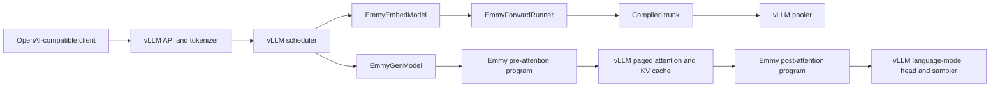
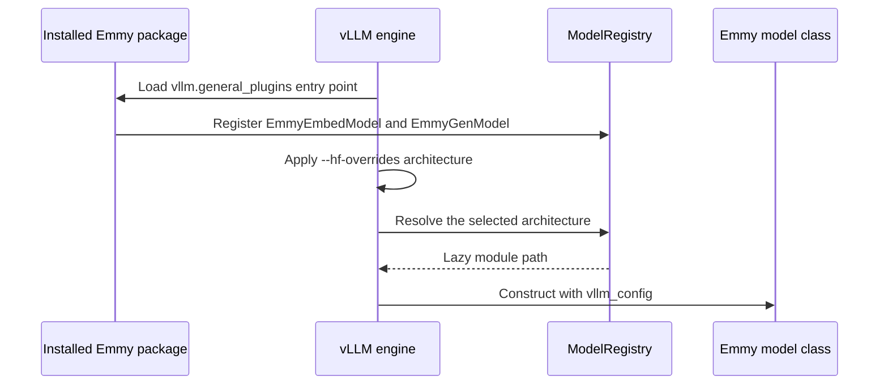
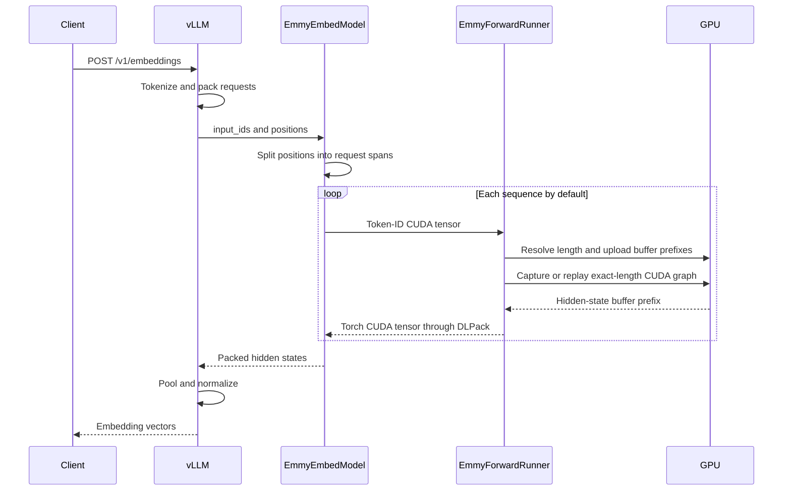

# Integrating Emmy with vLLM

Emmy and vLLM divide one model server between them. vLLM keeps the serving machinery that turns concurrent HTTP
requests into model work. Emmy supplies compiled CUDA programs for the transformer computation. The client still sees
an ordinary OpenAI-compatible API.

This chapter turns Lesson 13 of
[Learn Emmy from the Code](./project_course#lesson-13--bridge-compiled-programs-into-vllm-serving) into a hands-on
implementation guide. By the end, you should be able to:

- explain how vLLM discovers Emmy's out-of-tree model classes;
- trace embedding and text-generation requests across the vLLM–Emmy boundary;
- inspect the exact `vllm` commands produced by `emmy serve`;
- run a server, send a request, and compare it with stock vLLM; and
- distinguish compiler performance from integration and serving performance.

:::info What “integration” means here
Emmy does not fork vLLM or replace its HTTP server. It installs a vLLM plugin, selects an Emmy model architecture for
the same Hugging Face checkpoint, and delegates selected model computation to an Emmy runner.
:::

## Prerequisites

The command-only labs need the repository's normal development environment:

```bash
make setup
```

Actually starting either serving path needs Linux, a supported NVIDIA GPU, a compatible CUDA environment, and the
compile and serving extras:

```bash
pip install -e ".[compile,serving]"
```

The serving extra pins the supported vLLM release range. Treat `pyproject.toml` as the source of truth rather than
installing an arbitrary vLLM version. Model downloads may also require `HF_TOKEN`.

First boot is intentionally slow: Emmy may trace the model, run compiler passes, compile CUDA, and bind weights before
the vLLM health endpoint becomes ready. Warm cubin and execution-plan caches make later boots faster.

## 1. Start with the ownership boundary

The safest way to understand the integration is to ask who owns each responsibility.

| Responsibility | Embedding server | Generation server |
|---|---|---|
| HTTP and OpenAI-compatible endpoints | vLLM | vLLM |
| Tokenizer and request scheduler | vLLM | vLLM |
| Transformer trunk | Emmy | Emmy, split around attention |
| Attention | Emmy trunk | vLLM paged attention |
| KV cache | Not needed by the attention-free plugin | vLLM |
| Pooling | vLLM | Not applicable |
| Language-model head and logits | Not applicable | vLLM |
| Sampling | Not applicable | vLLM |
| CUDA program compilation and replay | Emmy | Emmy |

An **embedding** request runs a transformer over the whole input and reduces its token-level hidden states to one
vector. It does not generate one token at a time, so Emmy can own the entire transformer trunk.

Generation is different. Every decoder layer contains attention that must read and update a **KV cache**, the stored
keys and values from earlier tokens. vLLM's scheduler and paged-attention implementation already coordinate that cache
across concurrent requests. Emmy therefore compiles the computation on both sides of attention and leaves the
attention operation itself inside vLLM.



This boundary preserves vLLM's externally visible serving behavior while making the trunk implementation replaceable.
It also means end-to-end results measure more than Emmy kernels: scheduling, batching, pooling, attention, sampling,
and boundary transfers can all affect performance.

## 2. Follow plugin discovery

The integration begins before a model instance exists:

1. `pyproject.toml` publishes `emmy_serving = "emmy.serving:register"` in the
   `vllm.general_plugins` entry-point group.
2. vLLM loads that entry point when an engine process starts.
3. `emmy.serving.register()` registers two lazy architecture names with vLLM's `ModelRegistry`:
   `EmmyEmbedModel` and `EmmyGenModel`.
4. `emmy serve` passes an `--hf-overrides` value that replaces the checkpoint's advertised architecture with one of
   those names.
5. vLLM constructs the registered class while continuing to use the original repository's tokenizer, configuration,
   checkpoint, and pooling metadata.

The registrations use string paths. Importing `emmy.serving` therefore does not eagerly import vLLM, Torch, or CUDA.
The heavier module is imported only when vLLM actually chooses that model architecture.



### Read

Read these entry points in order:

1. `pyproject.toml`: `[project.entry-points."vllm.general_plugins"]`.
2. `emmy/serving/__init__.py`: `register`.
3. `emmy/commands/serve.py`: `build_serve_cmd`.
4. `emmy/serving/vllm_model.py`: `EmmyEmbedModel`.
5. `emmy/serving/vllm_model_gen.py`: `EmmyGenModel`.

### Lab — inspect discovery without starting a server

Ask Python's package metadata which vLLM plugins are installed:

```bash
./venv/bin/python -c \
  'from importlib.metadata import entry_points; print(*entry_points(group="vllm.general_plugins"), sep="\n")'
```

Look for an `emmy_serving` entry pointing to `emmy.serving:register`. Then use a dry run in the next section to prove
that the CLI selects one of the registered architecture names. The GPU integration tests exercise the real vLLM
registry later.

## 3. Understand what `emmy serve` adds

`emmy serve` is a command builder and lifecycle wrapper around `vllm serve`. Emmy-owned flags can appear before or
after the model name. Unrecognized flags pass through to vLLM. Tokens after a literal `--` always pass through
verbatim, which provides an escape hatch if a future vLLM flag collides with an Emmy flag.

Use `--dry-run` to see the generated command without importing vLLM, loading a model, or touching a GPU:

```bash
./venv/bin/emmy serve Qwen/Qwen3-Embedding-0.6B --dry-run
```

The embedding command includes the important integration choices:

```text
vllm serve Qwen/Qwen3-Embedding-0.6B \
  --runner pooling \
  --enforce-eager \
  --hf-overrides '{"architectures": ["EmmyEmbedModel"]}' \
  --max-model-len 4096 \
  --gpu-memory-utilization=0.9
```

`--runner pooling` selects vLLM's pooling shell. `--hf-overrides` selects the registered Emmy architecture.
`--enforce-eager` prevents vLLM from wrapping the embedding plugin in its own compilation or graph-capture path; the
Emmy runner already manages compiled programs and exact-length CUDA-graph replay.

The 4096-token default is Emmy's current dynamic-dimension cap. It is applied to both Emmy and stock commands so the
default A/B comparison uses the same maximum model length. A caller-supplied vLLM value wins.

Now inspect generation:

```bash
./venv/bin/emmy serve TinyLlama/TinyLlama-1.1B-Chat-v1.0 --generate --dry-run
```

The generated command instead selects:

- `--runner generate`;
- `EmmyGenModel`;
- fp16 across the Emmy–vLLM tensor seam;
- a bounded `--max-num-batched-tokens`; and
- vLLM whole-step decode CUDA graphs by default.

Unlike the embedding path, generation does not require `--enforce-eager`. Emmy's device programs detect outer stream
capture, so vLLM can capture a decode step containing Emmy pre/post programs, RoPE, paged attention, and the remaining
model work. Passing vLLM's own `--enforce-eager` opts out of that default. A caller-supplied `--compilation-config`
also wins.

:::tip Keep dry runs in reviews
The dry-run output is shell-pastable and exposes hidden defaults. Include it when reviewing an integration change so
flag routing and A/B symmetry are visible without requiring a GPU.
:::

### Stock mode

`--stock` removes the Emmy model override and plugin-specific execution flags:

```bash
./venv/bin/emmy serve Qwen/Qwen3-Embedding-0.6B --stock --dry-run
```

This is the baseline for answering “what did the Emmy integration change?” It uses the same wrapper defaults, such
as maximum model length, wherever those defaults must remain comparable.

## 4. Trace an embedding request

`EmmyEmbedModel` is an attention-free vLLM pooling model. It has no Torch parameters of its own because
`EmmyForwardRunner` loads and binds the checkpoint weights. Its `load_weights` method returns an empty set, so vLLM
does not read a second copy of the checkpoint into that wrapper.

At engine startup, `EmmyForwardRunner.create`:

1. loads the Hugging Face model trunk on the CPU;
2. wraps it so the output is token-level hidden states rather than a language-model head;
3. traces a symbolic sequence length;
4. compiles the graph through Emmy's CUDA backend;
5. binds parameters and buffers as compiled-program constants; and
6. allocates one capacity-sized buffer set for the configured maximum sequence length.

At request time, vLLM supplies packed one-dimensional token and position tensors. A position of zero marks the start
of a request. `split_spans` recovers the individual sequences.

For each sequence, the default runner:

1. shares Torch token IDs with cupy through DLPack;
2. resolves the symbolic `seq_len`;
3. uploads the real input prefix into the capacity buffers on the device;
4. builds or reuses a device causal mask for that length;
5. captures the whole compiled program once for that exact length, or replays its cached CUDA graph;
6. shares the real output prefix back with Torch through DLPack; and
7. returns hidden states to vLLM for pooling.



The output is cloned before the shared runner buffer is reused. That copy is deliberate: returning a view without
preserving it would let the next request overwrite data vLLM still needs.

### Optional embedding batching modes

The default compiles a symbolic sequence length with a batch capacity of one and runs packed requests one span at a
time. Two environment switches opt into one padded batch per scheduler step:

| Mode | Program shape | Padding behavior |
|---|---|---|
| `EMMY_SERVING_BATCHED=1` | Fixed batch capacity, symbolic sequence length | Pad to the longest sequence in this step |
| `EMMY_SERVING_STATIC=1` | Fixed batch capacity and fixed maximum length | Pad every step to the configured maximum |

The batch capacity comes from vLLM's `--max-num-seqs`; there is no separate Emmy batch-size flag. Static mode takes
precedence if both switches are set. Choose `--max-num-seqs` and `--max-model-len` deliberately because they determine
the buffer footprint and, in padded modes, the amount of wasted work.

## 5. Trace a generation step

`EmmyGenModel` is not attention-free. It creates one real vLLM `Attention` layer per decoder layer so vLLM can discover
the KV-cache requirements, allocate blocks, and run paged attention.

`EmmyGenRunner` splits each decoder layer into two compiled programs:

```text
hidden states
    │
    ▼
Emmy pre program ──► q, k, v
    │
    ▼
vLLM RoPE + paged attention ──► attention output
    │
    ▼
Emmy post program ──► next hidden states
```

The pre program includes the projections and normalization that produce unrotated query, key, and value tensors. vLLM
applies rotary position encoding and attention. The post program consumes attention output and the residual, then runs
the output projection, residual work, normalization, and MLP. After the last layer, Emmy runs final normalization and
vLLM applies the language-model head, logits processing, and sampling.

This split is why generation can retain vLLM's continuous batching and paged KV cache without forcing Emmy to
reimplement them.

### Decode and prefill take different paths

Generation has two important shapes:

- **prefill** processes many input tokens and populates the cache;
- **decode** usually advances active requests by one token each.

A program tuned for a wide prefill batch can be inefficient for the tiny matrix shapes common in decode. Emmy
therefore has static **decode twins** for small token counts and symbolic programs for other widths. Full chunked
prefill steps may use a separate static prefill twin. The exact choices and their environment controls live in
`emmy/serving/ARCHITECTURE.md`; they are performance mechanisms, not a change to the vLLM ownership boundary.

During vLLM's outer decode capture, Emmy issues the raw launch sequence rather than attempting a nested CUDA-graph
capture. vLLM's graph can then contain the entire decode step, including the Emmy programs and vLLM attention.

### Supported-model boundaries matter

The generation adapter is architecture-aware. For example, it builds per-layer attention and rotary metadata when a
model mixes local and global attention. It rejects unsupported structures such as the currently unwired uniform
sliding-window and dual-chunk configurations. A clean startup error is safer than producing plausible but incorrect
tokens.

Read `emmy/serving/ARCHITECTURE.md` before adding a new architecture. The important question is not merely whether
Hugging Face can load it; the model must also expose a sound split around vLLM attention.

## 6. Run the integration

### Embeddings

Start the server:

```bash
./venv/bin/emmy serve Qwen/Qwen3-Embedding-0.6B \
  --max-model-len 512 \
  --gpu-memory-utilization 0.8
```

Reducing the maximum length is useful for a first run because the attention scratch and capacity buffers grow with the
configured limit. Wait for `/health` to become ready, then send a request from another terminal:

```bash
curl http://localhost:8000/v1/embeddings \
  -H 'Content-Type: application/json' \
  -d '{
    "model": "Qwen/Qwen3-Embedding-0.6B",
    "input": [
      "GPU compilers are interesting",
      "Emmy compiles PyTorch"
    ]
  }'
```

The response should contain one embedding vector per input. Stop the server with Ctrl-C; without `--bench`,
`emmy serve` replaces itself with the vLLM process so signals reach the server directly.

### Generation

Use an ungated small model for the first smoke test:

```bash
./venv/bin/emmy serve TinyLlama/TinyLlama-1.1B-Chat-v1.0 \
  --generate \
  --max-model-len 512 \
  --max-num-seqs 4
```

Then query the completions endpoint:

```bash
curl http://localhost:8000/v1/completions \
  -H 'Content-Type: application/json' \
  -d '{
    "model": "TinyLlama/TinyLlama-1.1B-Chat-v1.0",
    "prompt": "The capital of France is",
    "max_tokens": 8,
    "temperature": 0
  }'
```

This request exercises vLLM's generation scheduler and KV cache, the Emmy pre/post layer programs, and the final vLLM
sampling path.

## 7. Validate correctness before performance

A server that returns HTTP 200 can still have a bad integration seam. Validate increasingly broad contracts:

### CPU-oriented contracts

```bash
./venv/bin/pytest \
  tests/serving/test_packed.py \
  tests/serving/test_serve_command.py -q
```

These tests cover packed-sequence splitting, flag routing, stock mode, generated commands, and benchmark lifecycle
logic without compiling a model.

### In-process GPU contract

```bash
./venv/bin/pytest tests/serving/test_vllm_plugin_gpu.py -m perf -v
```

This loads the embedding plugin through vLLM and compares several different-length texts with a Hugging Face eager
reference. It also exercises the exact-sequence-length CUDA-graph cache.

### Server-to-server embedding accuracy

Start an Emmy-backed endpoint and a stock endpoint on different ports, then run:

```bash
./venv/bin/python scripts/compare_embeddings.py \
  --a http://localhost:8000 \
  --b http://localhost:8001 \
  --model Qwen/Qwen3-Embedding-0.6B
```

The script compares pairwise cosine similarity. This is stronger than checking only response shape because it crosses
the full HTTP, tokenization, model, and pooling path.

For generation, use deterministic prompts and compare tokens or logits with a trusted eager or stock reference before
running throughput experiments. `scripts/validate_gemma4_serve.py` is an example of a sequential GPU accuracy gate for
the supported Gemma path.

## 8. Benchmark Emmy against stock vLLM

`--bench` turns the wrapper into a bounded lifecycle:

1. start the selected server as a subprocess;
2. poll `/health`;
3. run `vllm bench serve`;
4. print the benchmark result; and
5. stop the server, including when the benchmark fails.

Preview an embedding benchmark:

```bash
./venv/bin/emmy serve Qwen/Qwen3-Embedding-0.6B \
  --bench \
  --dry-run \
  --max-concurrency 4 \
  --num-prompts 32 \
  --random-input-len 128
```

Remove `--dry-run` for the Emmy measurement, then repeat the same command with `--stock`. Generation uses the
completions endpoint and adds an output length:

```bash
./venv/bin/emmy serve TinyLlama/TinyLlama-1.1B-Chat-v1.0 \
  --generate \
  --bench \
  --max-concurrency 4 \
  --num-prompts 32 \
  --random-input-len 128 \
  --random-output-len 32
```

Keep the model, input and output lengths, request count, concurrency, maximum model length, dtype, and hardware fixed
between the Emmy and stock lanes. Run repeated interleaved trials after warmup rather than one Emmy run followed by one
stock run. The dedicated [Benchmarking and Comparing Emmy](./benchmarking_emmy) chapter explains TTFT, TPOT,
throughput, tail latency, warmup, synchronization, and evidence capture.

:::warning Interpret the result at the right level
An end-to-end speed difference is not automatically a compiler-kernel difference. The embedding path's default
per-sequence execution, generation's Emmy–vLLM attention seam, batch shape, CUDA-graph coverage, and memory pressure
can dominate a server result. Use `emmy run --bench` when the question is specifically about compiled tensor programs.
:::

## 9. Diagnose startup and runtime failures

### `vllm` is not found

Install the serving extra into the same environment as Emmy:

```bash
pip install -e ".[compile,serving]"
```

`emmy serve` prefers the `vllm` executable next to the active Python interpreter, then falls back to `PATH`.

### The plugin architecture is unknown

Confirm that Emmy is installed, not merely present as an uninstalled checkout:

```bash
pip install -e ".[compile,serving]"
```

Then run the registration test. The entry point is installation metadata; vLLM cannot discover it from a source
directory alone.

### Startup appears stuck

Inspect the server log named by `emmy serve --bench`. First boot can include model download, tracing, compiler passes,
and CUDA compilation. The health wait allows up to 30 minutes for this reason. A warm boot should report a pack or
cubin-cache hit when those caches are configured and compatible.

### The model exceeds the sequence bound

The embedding runner currently rejects a maximum model length above 4096 even if the original checkpoint advertises a
larger context. Lower `--max-model-len`. Raising the compiler's dynamic bound requires reviewing symbolic shapes,
rotary buffers, scratch memory, and tests; it is not only a CLI change.

### The server runs out of GPU memory

Start with smaller values for `--max-model-len`, `--max-num-seqs`, and benchmark concurrency. Remember that vLLM's
memory profiler sees Torch allocations, while Emmy also holds cupy-backed buffers and weights. The generation wrapper
uses a different default utilization from stock because the KV-cache budget must account for those residents.

### Embeddings are correct but high-concurrency throughput is poor

Check whether the default one-sequence-at-a-time path or padded batching is running. Compare at concurrency one before
increasing load, inspect actual sequence-length variation, and separate kernel timings from server timings. Padding a
large batch capacity for short or mixed requests can waste more work than it saves.

## 10. Read the implementation without reading every file

Use this path for an implementation review:

1. `emmy/commands/serve.py`: flag ownership, command construction, process replacement, health polling, and one-shot
   benchmarking.
2. `emmy/serving/ARCHITECTURE.md`: invariants, current capabilities, constraints, caches, and test map.
3. `emmy/serving/__init__.py`: plugin hook and lazy model registration.
4. `emmy/serving/packed.py`: vLLM packed-layout boundary.
5. `emmy/serving/vllm_model.py`: embedding model protocol and pooling handoff.
6. `emmy/serving/runner.py`: full-trunk compile, binding, capacity buffers, DLPack, and exact-length graph replay.
7. `emmy/serving/vllm_model_gen.py`: vLLM attention, RoPE, KV-cache, head, and sampling ownership.
8. `emmy/serving/gen_runner.py`: attention-split programs and the decode/prefill execution regimes.
9. `tests/serving/`: the executable contracts for each boundary.

The architecture document is deliberately more detailed and more current than this course chapter. Use the chapter to
build a stable mental model; use the architecture document when changing the implementation.

## Checkpoint

Before moving on, you should be able to answer:

1. Why does `--hf-overrides` select an Emmy class without replacing the original model repository?
2. Why can Emmy own the whole embedding trunk but not the generation attention and KV-cache path?
3. Why does the embedding command use `--enforce-eager` while generation defaults to outer vLLM CUDA graphs?
4. What does DLPack remove from the serving boundary, and what small host touch remains in embeddings?
5. Why must an Emmy-versus-stock comparison keep wrapper and workload settings fixed?
6. Which test would you run first after changing plugin registration, packed spans, runner numerics, or HTTP serving?

If you can trace both request paths, produce and explain the dry-run commands, validate correctness, and design a fair
stock A/B, you understand the Emmy–vLLM integration at the level needed to extend it safely.
